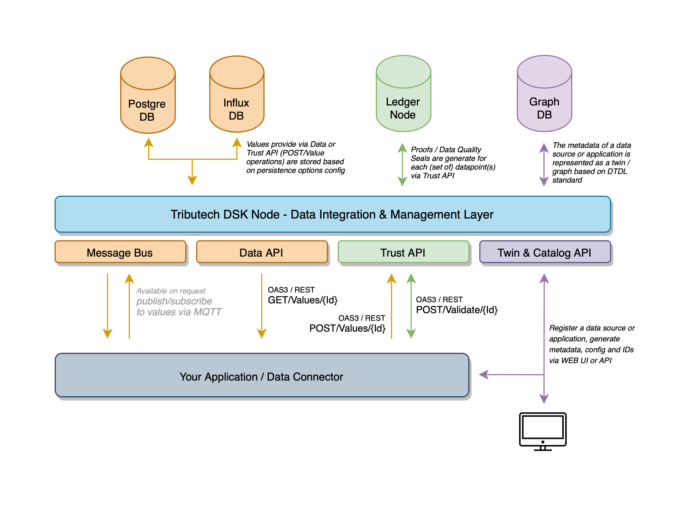
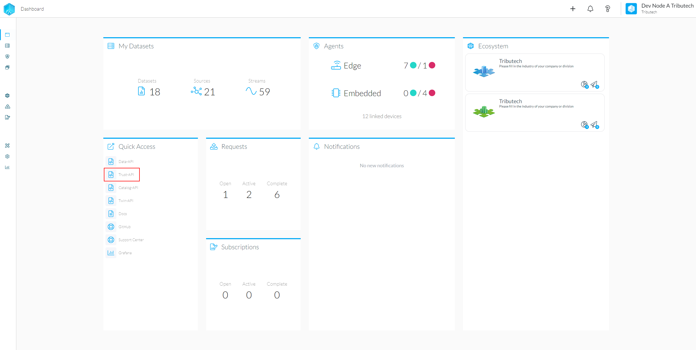
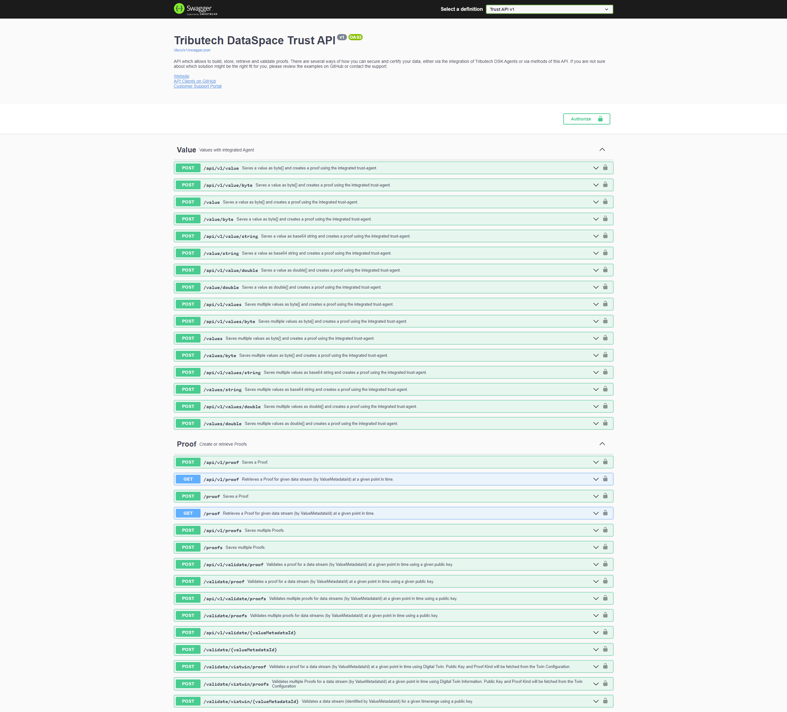

# Verify via API

To verify data in your applications you can use our Trust-API, as showcased in the following picture.

## Trust-API Specifications

The Trust-API specification is based on the Open-API 3 specification and can be found on the node dashboard.

:::info
Please note that all timestamps need to be provided in microseconds!
:::

## Client

The provided "OpenAPI" (Swagger) specification can be found in the top left, which can be used to generate a client for the API.
If C# is the programming language of choice, our already prepared client can be found here: **[Tributech Client](https://github.com/tributech-solutions/tributech-dsk-api-clients)**

# Examples

Depending on how strictly you want to execute the verification we offer multiple different endpoints.
The easiest method is to use the endpoints that contain "viatwin" in their name as these endpoints automatically grab all needed data for the verification such as key and proof kind from the stored twin models.

If you want to explicitly provide a public key that should be used for validation other endpoints have to be used.

## External verification

If you want to validate a single stream you need the stream id e.g. `5963c18f-8a91-4800-b98f-8619ce7bc7b5` using
this you can than use `/validate/viatwin/{valueMetadataId}`. This endpoint infers all needed data automatically so
you dont need to do anything else to verify the data. If you dont want to manually check the data without any inferring please follow the bulk verification example below.

## Bulk verification

For simplicity, the following section is centered around a single data stream. Repeat the steps for all the data streams that need to be verified. While the section can be followed manually, we strongly recommend executing the steps in an application using our [**clients**](https://github.com/tributech-solutions/tributech-dsk-api-clients).

### Get proof locations

On the Data-API, request the proof locations for the data stream that is being audited with the `/prooflocations/{valueMetadataId}` endpoint, which only requires the data stream ID.

    [
      {
        "valueMetadataId": "5963c18f-8a91-4800-b98f-8619ce7bc7b5",
        "lastTimestamp": "2022-05-17T13:40:41.021285+00:00",
        "createdAt": "2022-05-17T13:45:36.009237+00:00",
        "merkleTreeDepth": 5,
        "uri": "0x3ea96185941b8a552db606839d0b20406d76e85ebb4ab3532f09bd7e4b516028",
        "syncNr": 1,
        "size": 136,
        "validationResult": "Success",
        "validationTimestamp": "2022-05-24T08:16:58.054525+00:00"
      },
      {
        "valueMetadataId": "5963c18f-8a91-4800-b98f-8619ce7bc7b5",
        "lastTimestamp": "2022-05-17T13:43:21.041504+00:00",
        "createdAt": "2022-05-17T13:45:36.035378+00:00",
        "merkleTreeDepth": 4,
        "uri": "0x16adb2c08984906261985c84bb1c269abf4e2e9d9e4b0b8d94c03737c1c72d59",
        "syncNr": 2,
        "size": 136,
        "validationResult": "Success",
        "validationTimestamp": "2022-05-24T08:16:57.896715+00:00"
      }
    ]

The response will then list all the prooflocations which include the timestamps required to do a validation.

### Validate proofs

Next, at the Trust-API, validate the proofs with either the `/validate/proof` endpoint for a single proof or `/validate/proofs` endpoint for bulk validation.

Pass the data stream ID and the timestamp according to the previous prooflocation response.
The public key has to be provided in case the proof was created externally. For proofs that were directly inserted by the Trust-API endpoint, delete the "publicKey" field from the message body to instead use the default public key available on the Trust-API.

Evaluate the response to check if the validation was successful.

