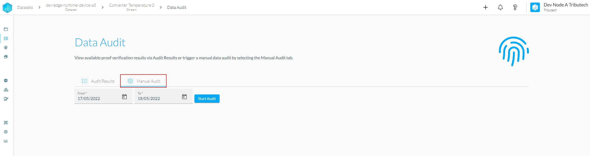
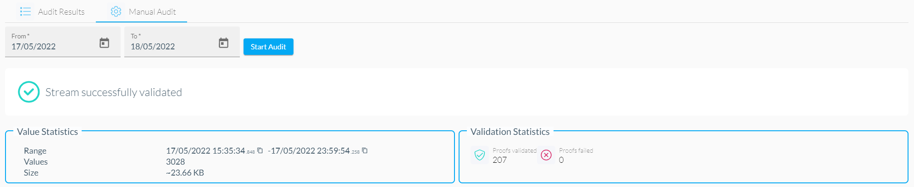

For streams that continuously produce data it would be quite hard to manually re-trigger validation for all proofs, so for this use-case we can utilize the "Manual Audit" section. You can navigate to it by using the tab control in the Data audit section.

In this section you can choose a timeframe that should be verified, by default the date with the first available data is inserted.
After choosing your desired timeframe you can press the "Start Audit" button to execute the job.

:::warning
Depending on your configuration and selected timeframe this process can take a long time, which is mainly affected by the number of proofs and the timeframe that should be evaluated. If processing takes to long, try to select a smaller time range and work your way forwards.
:::

