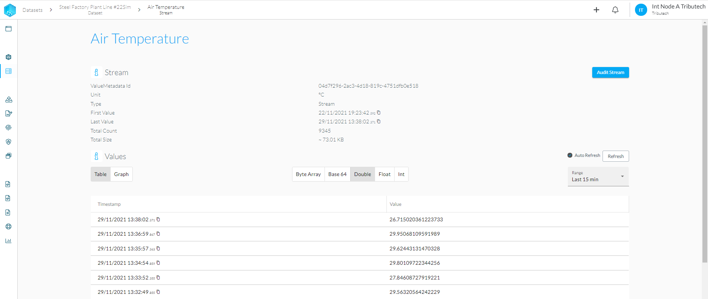
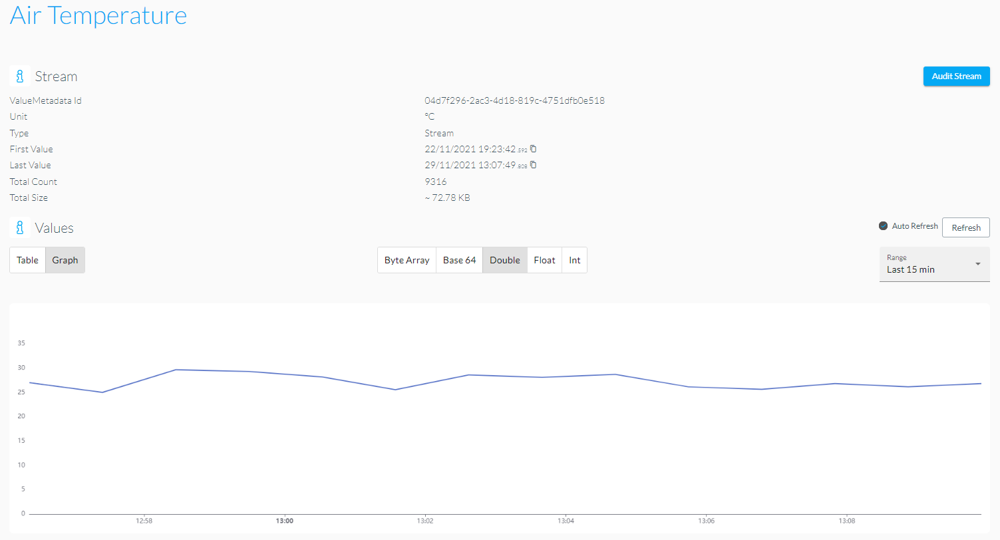

# Stream Explorer
The Stream Explorer can be accessed via our web portal and provides a more detailed view of a selected stream, including an automatically updating visualization of the stored datapoints. You can use the stream explorer to quickly validate the latest datapoints of a stream and display them via either graph (depending on data type) or table view. The following data types are suppored as list, graph or both views.

- ByteArray
- Base64
- Double
- Float
- Int
- CSV (enabled when unit field is named CSV)
- PDF (enabled when unit field is named PDF)

