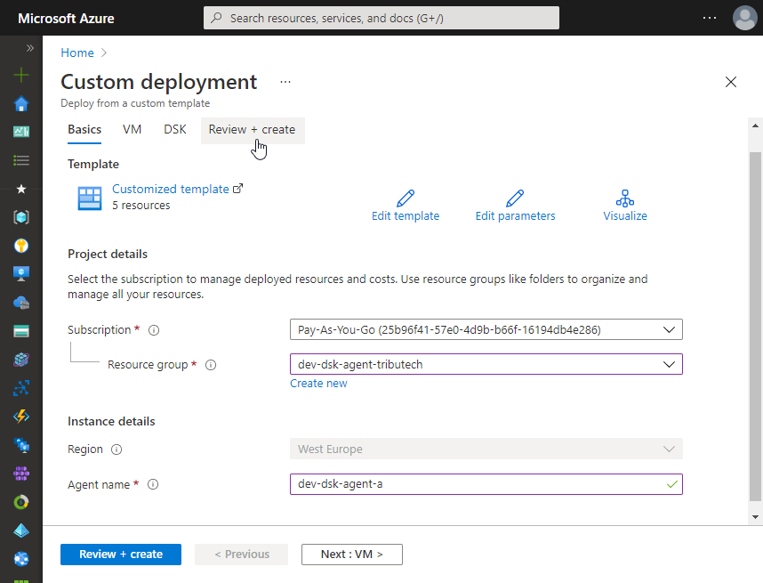
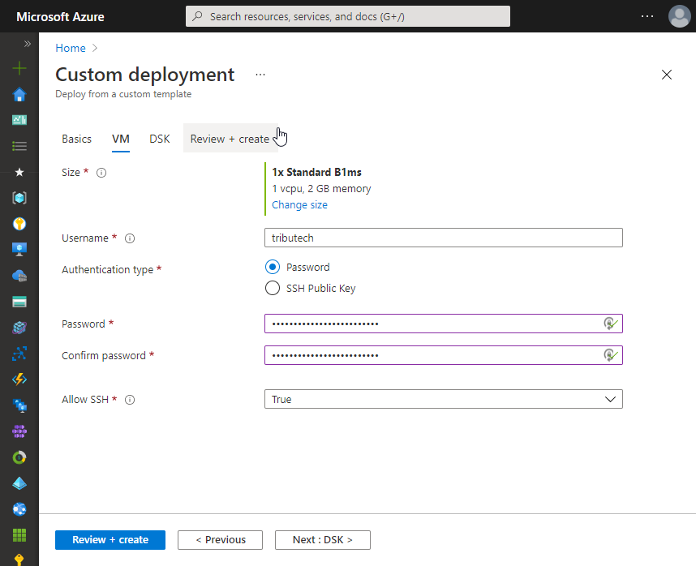
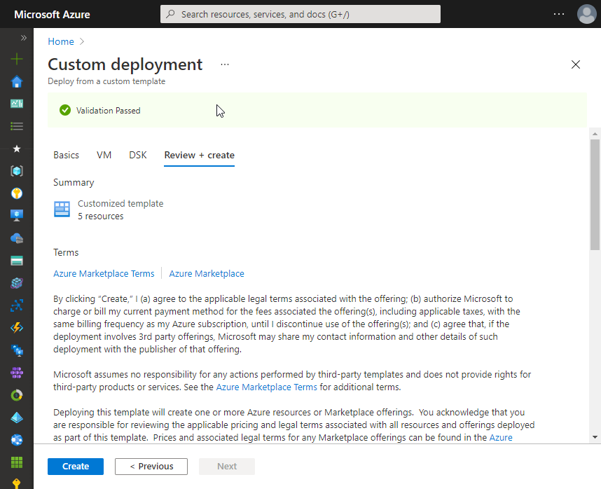
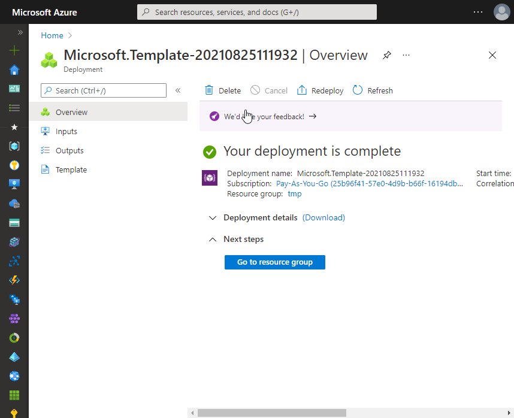
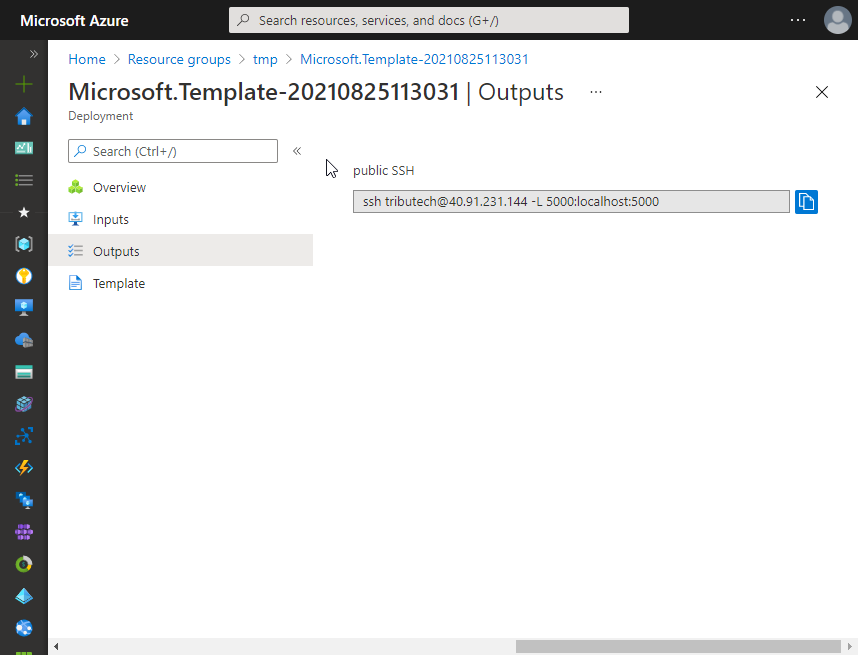

import ApiCredentials from '../../common/\_api-credentials.md';

Use the "Deploy to Azure" button directly below to create a Linux virtual machine on Azure with everything pre-installed/configured and the Tributech DSK Edge services up and running.
Preview the Azure resources that will be created with the "Visualize" button.  

- Select desired Azure Subscription/Resource Group/Region and define the name for the Agent related Azure resources (VM, Network security group,...). The Agent name must be unique within your Resource Group.
  
- Define virtual machine Size and authentication related properties.  
  The Size needs to meet our [**Hardware Requirements**](./overview.md#hardware-requirements). We recommend e.g. `Standard_B1ms` or `Standard_DS1_v2`.  
  SSH access allows to connect to the VM for [**management purposes**](./docker-compose.mdx#docker-compose-commands) and to support SSH tunneling/port forwarding used for connections to the DSK Agent from the Agent Companion (see [**Connect to Edge Agent**](../agent_companion.mdx#connect-to-edge-agent)).  
  
- Provide DSK related configuration:

  - To access the client secrets and some other information required in the next steps:  
    <ApiCredentials />
  - _DSK Agent id_: globally unique identifier (UUID) for the Agent
  - _DSK Hub name_: The name of the DSK Hub to which your DSK Node is connected.  
    (e.g. `your-hub` for `your-hub.dataspace-hub.com`)
    :::note
    On our [**Playground Ecosystem**](https://tributech.io/playground) this is `play` for `play.dataspace-hub.com`.
    :::
  - _DSK Node name_: The name of your DSK Node to which the DSK Agent will be linked.  
    (e.g. `your-node` for `your-node.dataspace-node.com`)
  - _Data-API client secret_: The client secret for the authentication at the Data-API of the DSK Node.
  - _Trust-API client secret_: The client secret for the authentication at the Trust-API of the DSK Node.
  - _Docker Registry Token (DSK Edge) name_: The name of the token used for authentication at the private Docker Registry hosting the DSK Agent Docker images. Default: `tributech-io-dsk-edge`.
  - _Docker Registry Token (DSK Edge) secret_: The access token for authentication at the private Docker Registry hosting the DSK Agent Docker images.
  - _Docker Image Tag_: The Docker Image tag defining the DSK Agent version to be deployed.
  - _Additional DSK Edge services_:
    - _None_: Only the main DSK Edge services (DSK Agent and mosquitto MQTT broker) will be deployed.
    - _DSK Edge Simulated Sensor_: Additionally deploy the [**DSK Edge Simulated Sensor**](./sources/simulated.mdx) service.
    - _OPC UA Source and Server/Simulator_: Additionally deploy the [**OPC UA Source and Server/Simulator**](./sources/opc-ua.mdx) service.

  

- Review terms and provided input and create the Azure resources.
  
- Successful deployment🎉.
  
- Output of the deployment showing sample command to connect to the VM using SSH incl. port forwarding for access to the DSK Agent (e.g. for the Agent Companion).
  
- You can now continue with [**connecting to, linking & configuring**](../agent_companion.mdx#agent-companion-connect) the DSK Edge Agent.
