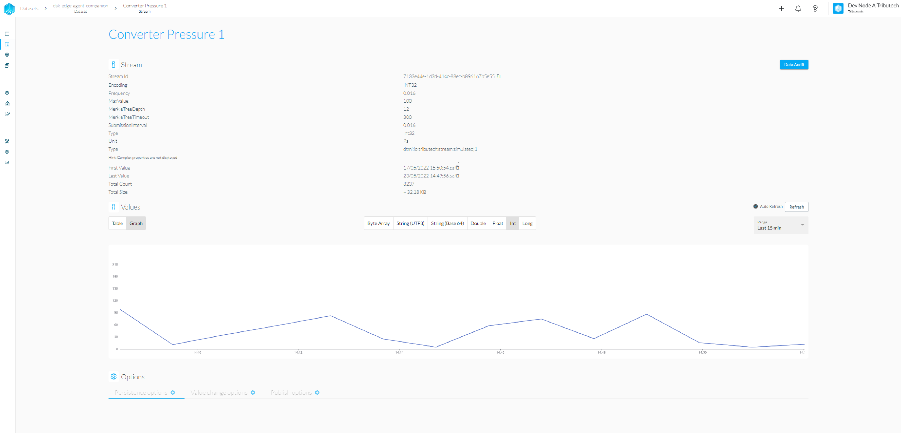
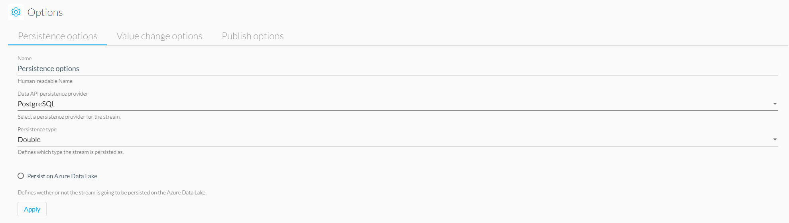
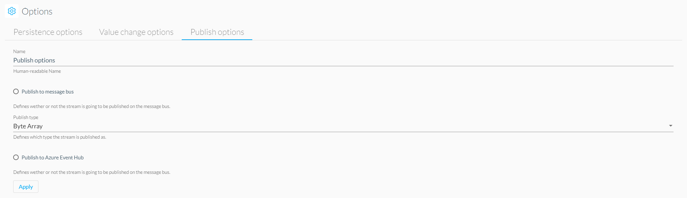
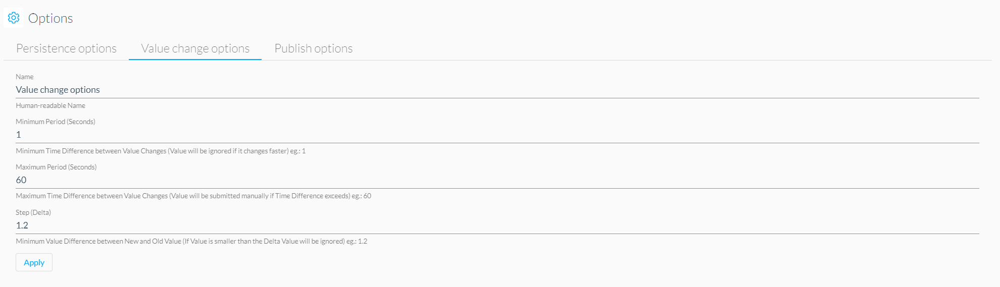

# Stream Explorer

The Stream Explorer can be accessed via our DSA and provides a more detailed view of a selected stream, including an automatically updating visualization of the stored datapoints.

## Explore Data

You can use the stream explorer to quickly validate the latest datapoints of a stream and display them via either graph (depending on data type) or table view. The following data types are supported as list, graph or both views.

- ByteArray
- String Base64
- String UTF8
- Double
- Float
- Int
- Long

**File Types**

- CSV (enabled when unit field is named CSV)
- PDF (enabled when unit field is named PDF)
- JSON (enabled when unit field is named JSON)

Usually the datatype will be set automatically based on the metadata of the stream. If you don't see any data you might want to select byte array to see the raw data that was inserted.

### Graph View

### Table View

## Stream Options

The stream explorer also offers the possibility to adapt the various options of a stream.

### Persistence

### Publish

### Value Change

