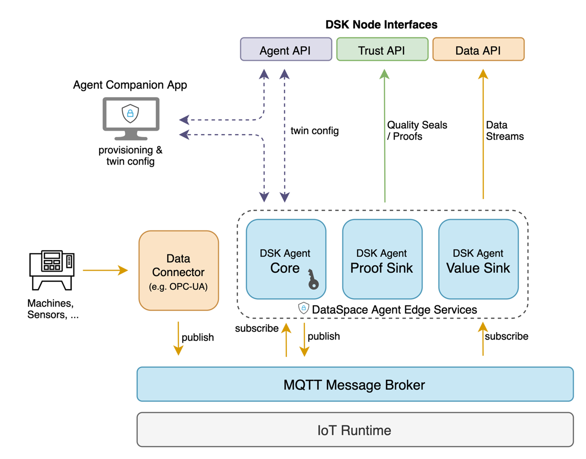
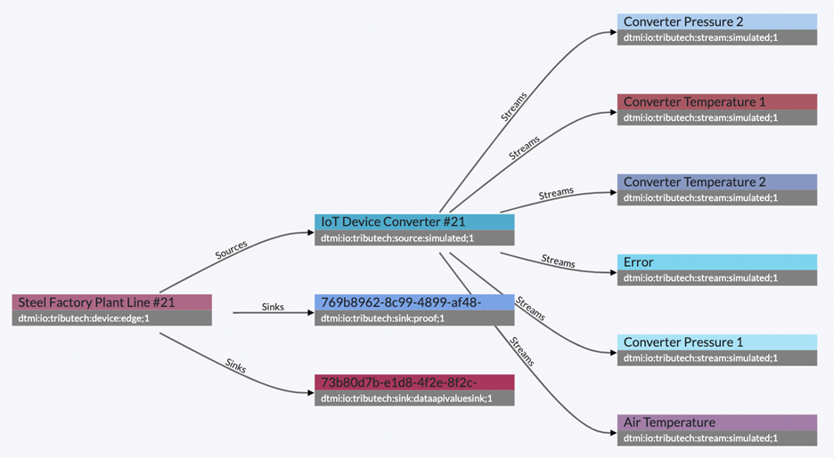

# Agent Architecture

In this section, we will have a more detailed look at our Agent's architecture and services. There are two different versions of Tributech Agents for edge (docker) and embedded (C library/hardware module) IoT devices. On this page, we use the docker-based version for edge devices as an example and outline the core concepts applying to both implementations.

## System & Service Architecture

The following figure provides an overview of the Agent services and the communication with Tributech Node APIs.

The Tributech Agent subscribes to available data streams on the message bus, generates data quality seals, transferers the data streams and quality seals to the Tributech Node middleware and maintains a digital twin based self-description that is also used for the configuration.

The core modules of the Tributech Agent are available as docker-compose application bundle that includes core services, sinks and a MQTT message broker. In addition to the core application bundle, the Agent supports integrations via data connectors (e.g. OPC-UA) and integrations into IoT runtimes of IoT device management platforms.

## Generation of Data Quality Seals 

To enable the verification of data integrity and authenticity between a data source and data consumers across different infrastructures, the Tributech Agent generates and stores verifiable data quality seals (also called proofs) in the blockchain-based trust layer.

For each datapoint or set of datapoints (depending on the configuration), the Agent creates a signed SHA 256 root hash that is transferred to the Trust API endpoint of a Node and stored on-chain. In addition, each proof / data quality seal includes a reference that points to the raw data that is stored off-chain in the data layer of a Tributech Node or an external storage system, per default transferred to the Data API endpoint.

## Self-description and Configuration

The configuration and self-description of each Agent is modelled as a digital twin, stored as a DTDL JSON file and synchronized with the agent management on the backend side. The configuration includes everything that is needed to configure a Tributech Agent, including connected sources and sinks.

## Secure Provisioning and Linking

To generate data quality seals, a Tributech Agent requires a cryptographic key pair. Therefore, our services provide a secure key provisioning and linking process for Agents that include:

- Authentication and logging of users that provision Tributech Agents
- Secure offline generation of key pairs (HSM or local storage)
- A signing challenge to link Agents
- A public key registry to store keys of provisioned Agents

Users can now link and provision an Agent directly from the Node's webinterface. For this process, a user needs to sign in to verify his permissions and track/log the provisioning activities within his identity. These steps protect the system against malicious parties that want to link an Agent or send corrupted/manipulated data.
