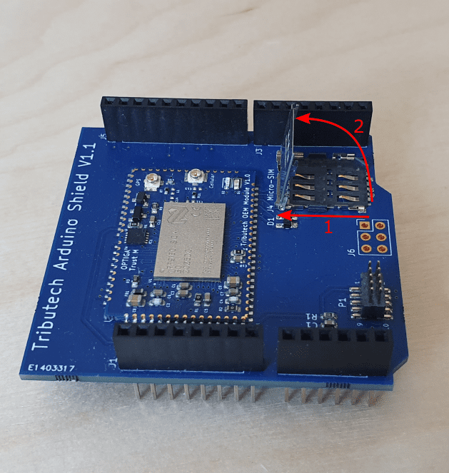
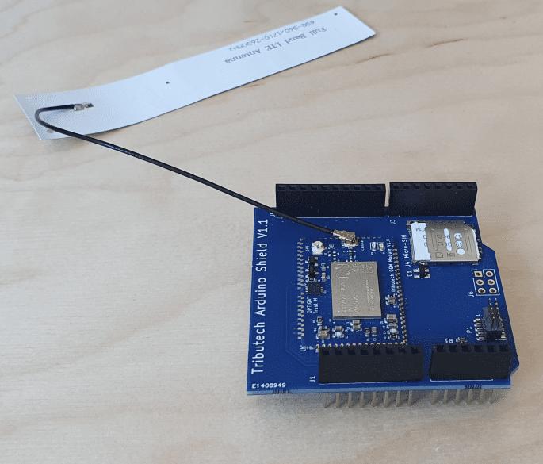
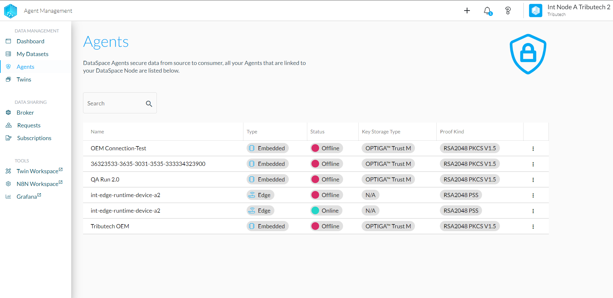
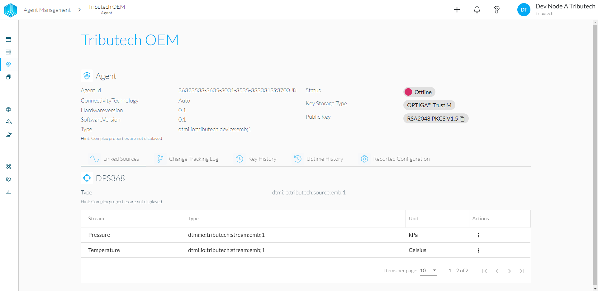
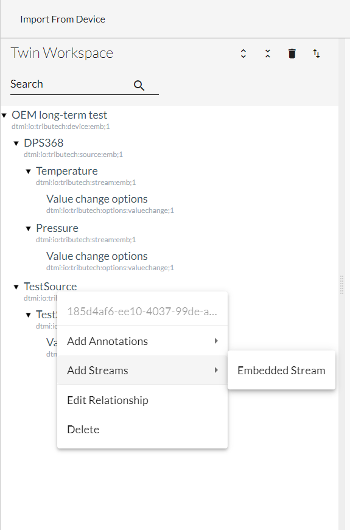
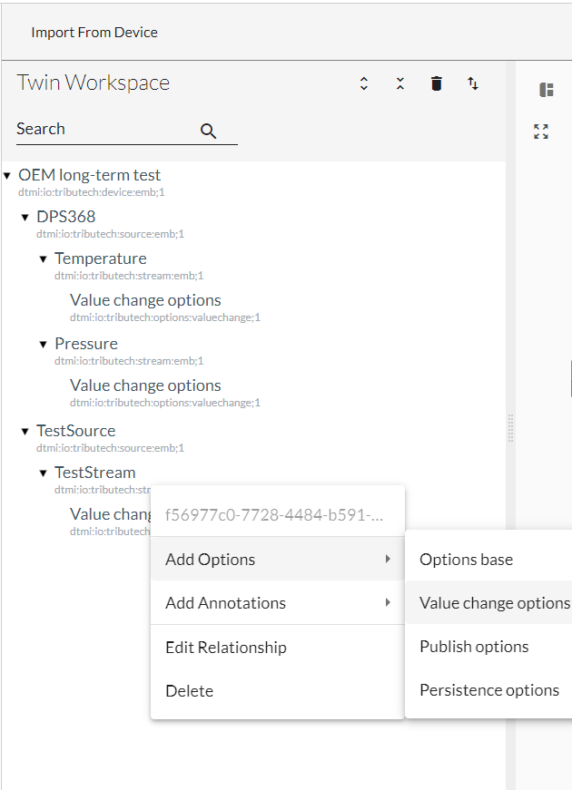

# Development Setup

## Prerequisites

- Tributech OEM Shield
- Antenna with U.FL connector (LTE CAT-M capable)
- micro LTE SIM card
- USB A to micro USB cable or 5V power adapter with micro USB
- Username and Password for Tributech Web portal access
- User specific development board
  - [nRF52840](https://github.com/tributech-solutions/tributech-oem-module-iot-kit-examples/tree/main/nRF52840-DK)
  - [XMC4700 Relax Kit](https://github.com/tributech-solutions/tributech-oem-module-iot-kit-examples/tree/main/IoT-KIT-Infineon-XMC47_RELAX_5V_AD_V1/XMC4700_USB_to_UART)
- User specific sensor

## Set Configuration

The following steps represent the general procedure to setup the "Tributech OEM Arduino Shield" sample kit:

1. Open the OEM SIM card socket, for this push the socket cover back and then tilt up the socket lit and insert a valid SIM card.

2. Connect the antenna to the Tributech OEM shield.

3. Connect the Tribtuech OEM shield with the chosen Development kit.
4. Connect the chosen sensor to the sample kit.

After the steps above the sample kit is ready to send data.

## Verify Communication

The verification of the connection and communication can be done in the Tributech web portal. The user has to access url of the node which is linked to their device and complete the login. The address always follows the following format:

  node-name.dataspace-node.com

The "node-name" is dependent on the node which is linked to the device. The node-name as well as the login credentials will be provided by Tributech via email. The main page of the web portal shows multiple sections all with their own information, but for the verification the user needs to look at the left-hand side an click on the "Agents" tap.

This tap lists all agents which are linked to the node. They are listed with the following information:

| Name | Type | Status | Key | Storage | Type | Proofkind |
| ---- | ---- | ------ | --- | ------- | ---- | --------- |

Name depicts the different names of the agents. Type lists the device type of the respective agents. Status shows if the agents is online or offline. Key Storage Type will show the user where the private keys are stored and ProofKind depicts which key format is used for the proof signatures.

Here the user has to select their own device and click on it. The names of the device will be provided by Tributech via email and will be depicted either on the device box or on the device itself. This will lead the user to the "Agent Management" page. An example of the agent management page is shown in the following picture:

Since the connectivity already is verified when the device is listed as online the next step is to verify the device communication. This can be done via clicking on the on of the listed streams. This action will show the stream information and it's associated values link in the picture below:

The stream values will be depicted in a graph or table format below the stream information.

## Get started with your project

### Setup Dev Environment

The dev environment setup depends on the development kit which is chosen by the user. At the moment two dev kits are supported by Tributech. The setups For their respective dev environments can be found here:

- [Infineon DAVE IDE](https://softwaretools.infineon.com/tools/com.ifx.tb.tool.daveide)
- [Nordic nRF Connect for Desktop](https://www.nordicsemi.com/Products/Development-tools/nRF-Connect-for-desktop)

### Configure OEM Module

The Tributech OEM shield only acknowledges values provided via UART which have a valid ValueMetadataId. These ValueMetadataIds are generated automatically when a new stream is added to the Twin configuration of the OEM shield. The Twin configuration is a electronic representation of a IoT-device, it contains the configuration parameters like metadata, configurations and conditions of the device and their different correlations to each other. Parts of this Twin configuration can be altered by the user like adding sources and streams to the configuration. Thus the user has to configure the OEM shield via the Data-Space-Admin. For more in depth information on device twins follow this link Twin "[Understand and use device twins in IoT Hub](https://docs.microsoft.com/en-us/azure/iot-hub/iot-hub-devguide-device-twins)".

The configuration is sent to the OEM shield via a MQTT connection which means the device has to be online for a configuration update. If the device is online a new tap can be seen in the Agent management page called "Configuration". This is depicted in the picture below:

When the configuration tap is accessed the first action is triggered and the configuration is pulled form the linked OEM shield. This configuration is then depicted on the webpage:

Depending on the location where the OEM shield is stationed and the LTE CAT-M connection the configuration pull can last several seconds. When the current configuration is shown in the web portal the user can start changing the configuration. The most important part of the configuration change is to add a custom stream. To be able to add a new stream first the user should add a new source. To add a new source right-click on the device name and choose "Add Source". Furthermore search for "Embedded Source" this is the only source which can be added to a OEM shield device all other sources will be ignored.

After the source is added the name of the source can be changed on the right-hand side. The changes have to be finalized by clicking on the "Apply" button on the bottom of the configuration. If the changes are done a stream can be added to the source. Again via right-clicking on the source a dropdown menu is shown. In this menu navigate to "Add Streams" and use the only available option "Embedded Stream". The configuration of the stream follows the same principle as the name change of the Source.

The last change which needs to be done is the addition of the "Value change options". Adding these options is shown in the following picture. The "value change options" consist of three values: PMIN, PMAX, ST. The PMIN value depicts the time frame which has to pass until a new value can be provided to the OEM in seconds. This value has to be at least 10 seconds. PMAX depicts the maximum time frame where no value is published by the OEM. If the user has at least supplied the OEM with at least one value the PMAX value will be activated. Afterwards if no value is supplied to the OEM in the PMAX specified time frame the last received value will be published by the OEM automatically. ST(step) is a threshold value. If the new value does not exceed last value + ST then the new value will not be published. 

With these changes the configuration can be send to the OEM shield via the "Apply Configuration" button.
