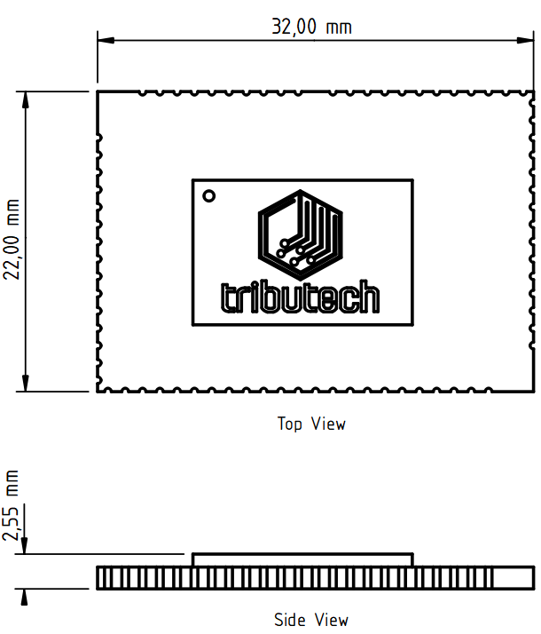
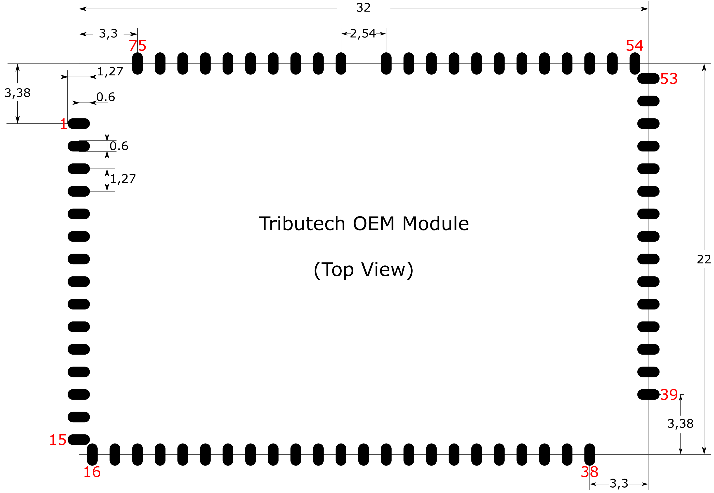
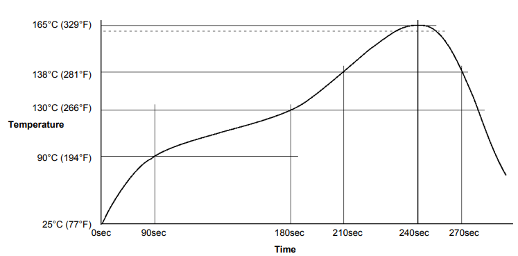
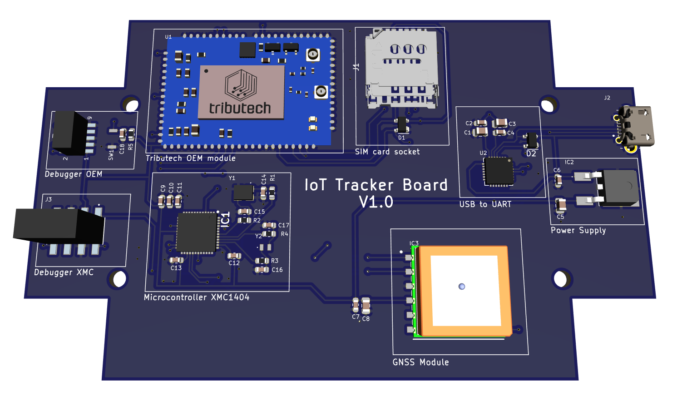

# Hardware Design Guideline

This document should help users and manufacturers to implement the system on a chip (SOC) “Tributech OEM module”. The given information is tailored to allow an easy incorporation of the module on manufacturer printed circuit boards. The document includes a recommended footprint, mechanical dimensions, placement and soldering guidelines. For further information or ambiguities please contact us at Tributech.

## Safety Information

To be able to work with the Tributech OEM module certain safety precautions must be adhered to throughout all phases of operation. 

- The user’s use case has to adhere to all local regulations and that the use case is allowed under these regulations. Also all local safety and environment regulations have to be upheld.
- The Tributech OEM module cannot be used in explosive or flammable environments. The use in such hazardous environment may lead to fire or explosion accidents.
- To ensure a proper operational state of the Tributech OEM module the product has to be powered by a stable voltage source and the wiring have to adhere to security precautions and fire regulations.
- To avoid ESD damage to the module or other components proper ESD handling procedures must be followed throughout the handling of the product.

## Pin Assignment

### Pin Definition
| Pin Name | Pin No. | I/O | Description | DC Characteristics | Comment |
|----|----|----|----|----|----|
| 1 | VDD | I | Main Power Supply | Vmax = 5.5V  Vmin = 3.0V  Vnom = 3.3V |  |
| 2 | VDD | I | Main Power Supply | Vmax = 5.5V  Vmin = 3.0V  Vnom = 3.3V |  |
| 3 | VDD | I | Main Power Supply | Vmax = 5.5V  Vmin = 3.0V  Vnom = 3.3V |  |
| 4-6 | Reserved | I/O |  |  | Do not connect. Reserved for future use. |
| 7 | GND | I |  |  | Ground |
| 8 | VDD_GPIO | I |  | Vmax = 3.9V  Vmin = 3.0V  Vnom = 3.3V | The voltage on this pin determines the logical voltage level of the I7O pins of the OEM module. |
| 9-13 | Reserved | I/O |  |  | Do not connect. Reserved for future use. |
| 14 | VDD | I | Main Power Supply | Vmax = 5.5V  Vmin = 3.0V  Vnom = 3.3V |  |
| 15 | VDD | I | Main Power Supply | Vmax = 5.5V  Vmin = 3.0V  Vnom = 3.3V |  |
| 16 | VDD | I | Main Power Supply | Vmax = 5.5V  Vmin = 3.0V  Vnom = 3.3V |  |
| 17-23 | Reserved | I/O |  |  | Do not connect. Reserved for future use. |
| 24 | Reset | I |  |  | Reset Pin of the Tributech OEM module. |
| 25-30 | Reserved | I/O |  |  | Do not connect. Reserved for future use. |
| 31-32 | GND | I |  |  | Ground |
| 33 | SIM_RST | I/O | Digital I/O |  | Ext. SIM card reset |
| 34 | SIM_DET | I/O | Digital I/O |  | Ext. SIM card detection |
| 35 | SIM_CLK | I/O | Digital I/O |  | Ext. SIM card clock signal |
| 36 | SIM_IO | I/O | Digital I/O |  | Ext. SIM card data signal |
| 37 | SIM_1V8 | I/O | Digital I/O |  | Ext. SIM card power supply |
| 38 | GND | I |  |  | Ground |
| 39 | GND | I |  |  | Ground |
| 40-43 | Reserved | I/O |  |  | Do not connect. Reserved for future use. |
| 44-60 | GND | I |  |  | Ground |
| 61-62 | Reserved | I/O |  |  | Do not connect. Reserved for future use. |
| 63-64 | VDD | I | Main Power Supply | Vmax = 5.5V  Vmin = 3.0V  Vnom = 3.3V |  |
| 65 | GND | I |  |  | Ground |
| 66-71 | Reserved | I/O |  |  | Do not connect. Reserved for future use. |
| 72 | GND | I |  |  | Ground |
| 73-74 | Reserved | I/O |  |  | Do not connect. Reserved for future use. |
| 75 | GND | I |  |  | Ground |

## PCB Design Guide
### Tributech OEM Module Placement

The Tributech OEM Module should, if possible, always be placed at the edge of the PCB. This is due to the antenna connection which has to be fastened to the Tributech OEM.

## Mechanical Dimensions and Recommended Footprint

### Dimensions

The dimensions are given in millimeters for the Tributech OEM module.

### Recommended Footprint
The dimensions are given in millimeters for the Tributech OEM module.

The Footprint is also available as a KiCad V6.0.7 library and can be found via this [Link (Tributech OEM module KiCad footprint.zip)](https://github.com/tributech-solutions/tributech-oem-module-iot-kit-examples/tree/main/Hardware%20reference%20design).

## Manufacturing and Packaging

### Packaging
The Tributech OEM module is provided in an ESD packaging with a self-sealing zipper. The recommended storage conditions for the module are: a temperature of 23±5 °C and a relative humidity of about 35%-60%.

### Manufacturing and Soldering
The soldering temperature of the OEM depends on two parts: the solder paste and the nRF9160. The absolute maximum reflow temperature is 230°C to avoid damage to the components of the system on a chip. If the manufactured PCB has components on the bottom and top side it is strongly recommended to first manufacture the side without the Tributech OEM module in order to minimize the reflow cycles for the module. 

## Tributech OEM Module Reference Design
The following [link (Tributech_OEM_Reference_Design_for_case.zip)](https://github.com/tributech-solutions/tributech-oem-module-iot-kit-examples/tree/main/Hardware%20reference%20design) leads to a reference design for the Tributech OEM module done in KiCad V6.0.7:

The reference design of the Tributech OEM module contains:
- Tributech OEM module
- SIM card socket
- Micro-controller XMC1404 from Infineon
- GNSS module L86 from Quectel
- USB to UART controller
- Power Supply 5V to 3.3V with 1A

