## Intro

The DSK ADS Source allows to connect to an Beckhoff ADS Server which can be used to receive or write values to it.  
It acts like an ADS Client in a Docker Setup and enables the forwarding of the Data to an DSK Stream via our DSK Edge Agent Service (`dsk-agent`).  

All values will be forwarded to an MQTT Broker which is connected to our ADS Source and our Edge Agent. Furthermore the client can give control over the single symbol paths:
- Which kind of datatype will be received from the symbol
- How and when to receive a value from the symbol
- Which symbol path to receive
- When it will be written to it.  (Optional) 
  
The write function (**Parameter**) is designed like an endless loop which will write the value when the configuration has been received and will do it every X seconds (see ADS Setup).

Read Function has two main functions : 
- **Cyclic Read**   
  - Client will poll every X seconds (see polling) for a new value
- **On Change**
  - ADS Server will notify the client when a value has changed (needs to be configured at server side too)

## ADS Setup 
- Open the [**Agent Companion**](../../setup/agent_companion), [**login**](../../setup/agent_companion#agent-companion-login) to the DSK Node and [**connect**](../../setup/agent_companion#agent-companion-connect) with the DSK Edge Agent
- Add Beckhoff ADS Source to your Agent
  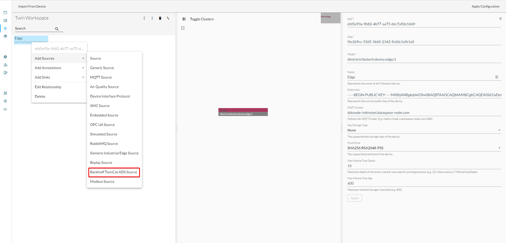
- **Configure following values**: 
  - Server AMS Net Id
    - AMS Net Id of the PLC ADS Server
  - ADS Port
    - Port of the PLC ADS Server
  - ADS Server IP Address
    - IP Address of the PLC ADS Server (needed for [**White List**](../../setup/agent/sources/ads#ManualSetup))
  - Client AMS Net Id
    - AMS Net Id of the ADS Source
  - InProcess Port
    - Should always be **48898**, only needs to be changed if the network configuration changes
  - Read Cycle Default Interval
    - Default read interval value for all cyclic streams, will only be overruled if defined in the stream itself
  - Configuration writing Cycle
    - Write function cycle time to write values to the server. Can not be overruled and is used for every parameter

  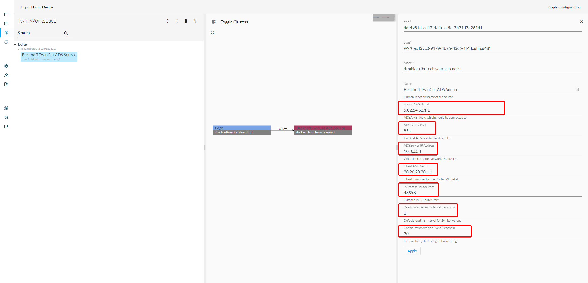

## ADS Stream Setup
- Add ADS Stream to the ADS Source 
  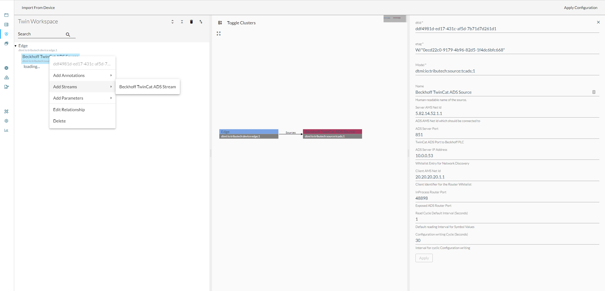

### On Change
- To change an ADS Stream to an OnChange Mode: Toggle the ReadMode to **On Change**
- Symbol path should point to the wanted symbol
- ADS Datatype should match with the underlying datatype
  

- value:
  - As displayed here, the value has not changed and will only display the initial value at subscribe.
  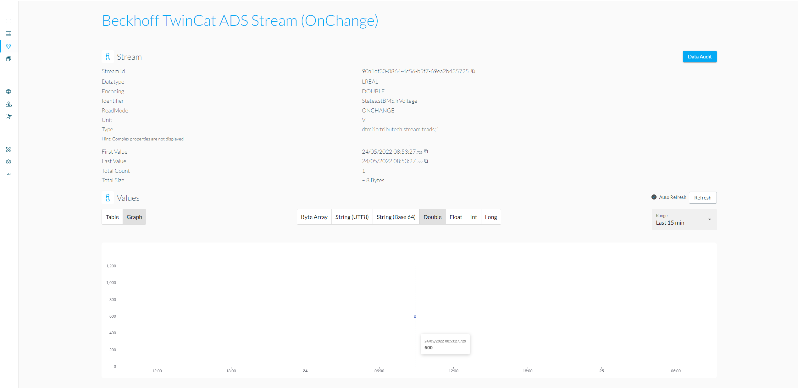

### Polling (Cyclic Read)
- To change an ADS Stream to an OnChange Mode: Toggle the ReadMode to **Cyclic Reading**
- Symbol path should point to the wanted symbol
- ADS Datatype should match with the underlying datatype
  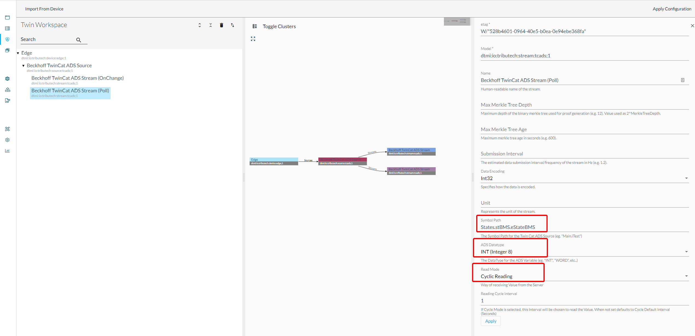

- values:
  - Configuration was set to 1 Second interval, so every 1 Second there will be a value submitted
  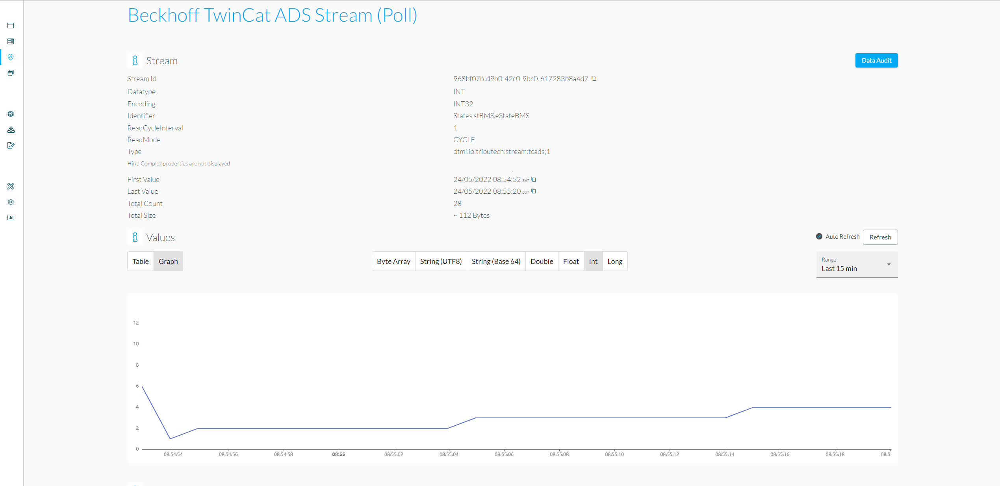

### On Change Options
- On Change Options should give you control how and when a data will be submitted. It keeps the last value which was received and compares them with the newly received value.  
  Below you see the description of the option values and which impact they will have.
  There is only one limitation, the Change Options will only work on **numeric values**.
- Can be used on every type of ADS Stream
  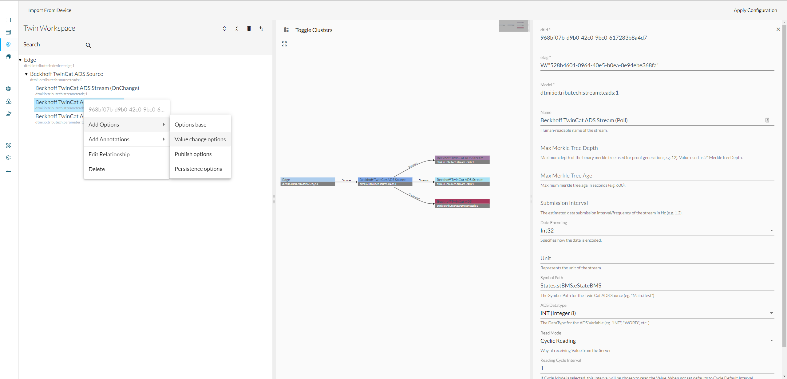

- **Description of the Option Fields**
  - Minimum Period (PMIN)
    - Sets the minimum frequency of a stream. It declares how much Time has to pass between the last submitted value and the newest value.
  - Maximum Period (PMAX)
    - Sets the maximum frequency of a stream. Declares the maximum Time beginning from the last submitted value. If it exceeds a manual read will be triggered and the value will be forwarded.
  - Step (Delta)
    - Maximum difference between two datapoints. If the delta between the old and new value is equal or exceeds the configured option, the value will be submitted.
  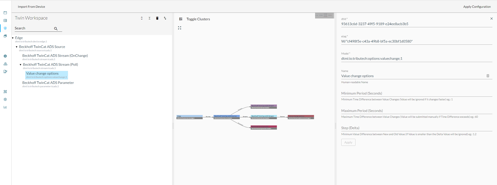

## ADS Parameter Setup
- To write values to the server add the ADS Parameter to the ADS Source
  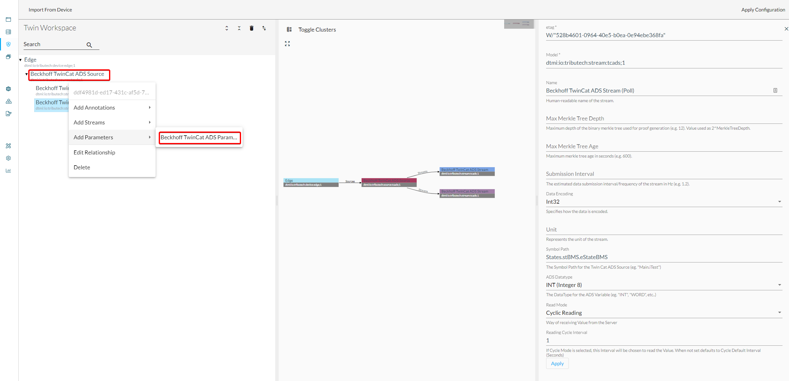

- Configure following values:
  - Symbol path to write to
  - Value which should be written to
  - ADS Datatype to support the underlying ADS Server datatype
  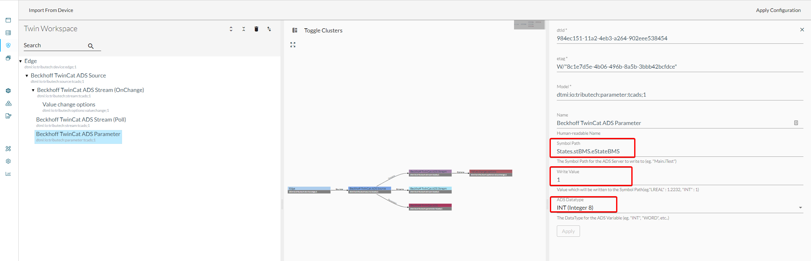

- In this example we write to the exact same stream which is configured to be polled.  
  We can see that the graph will be pulled down to the value 1 every 30 seconds. (server will increase the value by it self)
  
  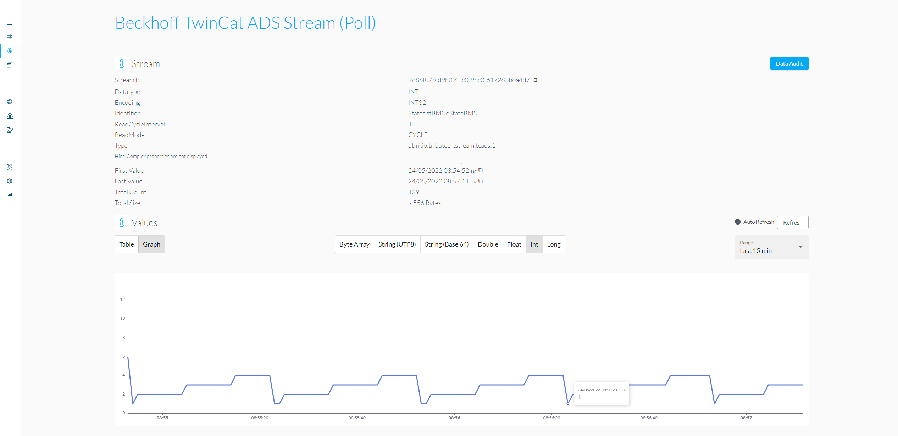
