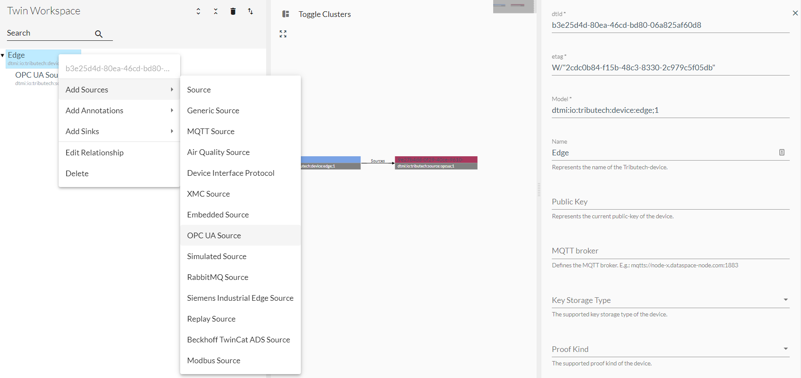
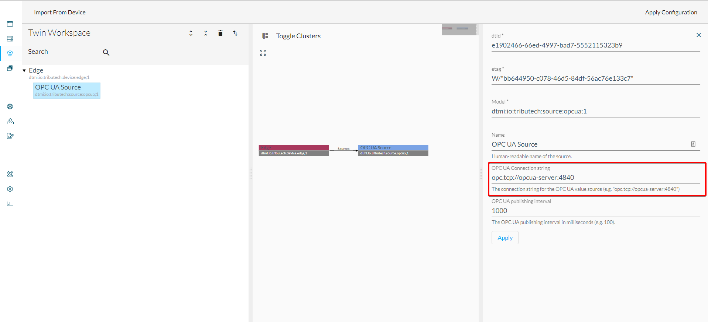
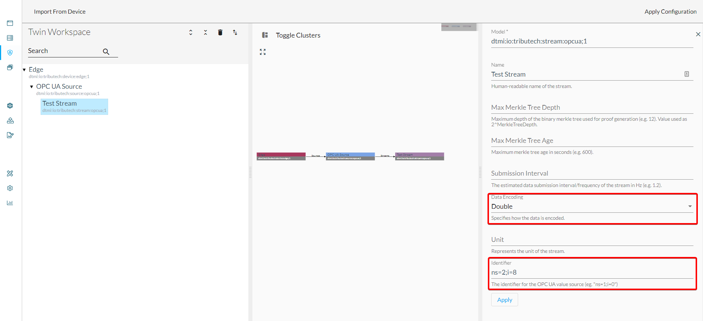
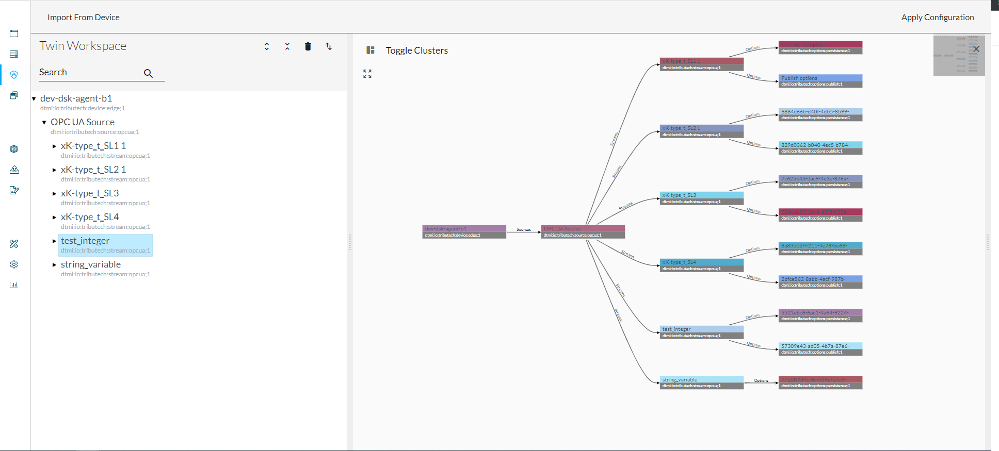
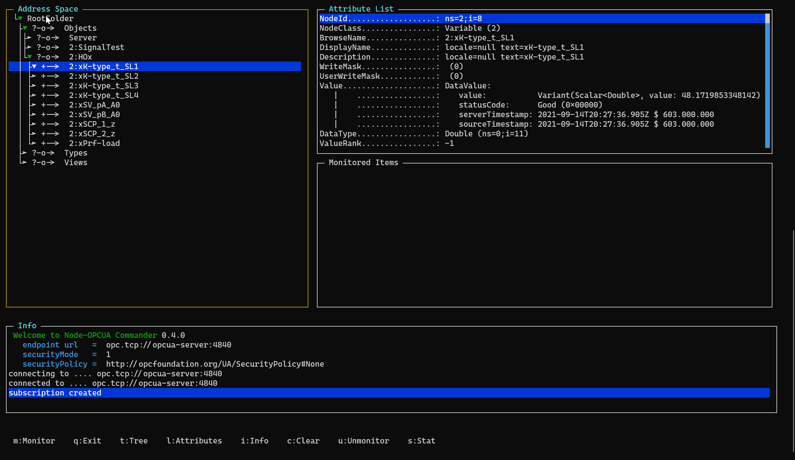

The OPC UA Source allows to connect to [**OPC Unified Architecture (UA)**](https://opcfoundation.org/about/opc-technologies/opc-ua/) based servers for data integration. The Tributech OPC UA Source act's as a OPC UA client and forwards the received data for a stream to the main Tributech Edge Agent service (`dsk-agent`) via our MQTT broker.  
If the [**Tributech OPC UA Source service (`opcua-source`)**](../../setup/agent/setup/docker-compose/source-setup.mdx#docker-compose-opc-ua-source) is deployed along with our Tributech Edge Agent services it can be configured based on twins with our [**Agent Companion**](../../setup/agent_companion) as described in the following:

- Open the [**Agent Companion**](../../setup/agent_companion), [**login**](../../setup/agent_companion#agent-companion-login) to the Tributech Node and [**connect**](../../setup/agent_companion#agent-companion-connect) with the DKS Edge Agent
- Add OPC UA Source and configure _OPC UA Connection string_
- 
  
- Add OPC UA Stream(s) and configure _OPC UA identifier_ (which defines the endpoint to which the stream will be connected)
  
- Full example (incl. persistence and publish options for the streams)
  
- Apply Configuration

## OPC UA debugging

The following sample commands demonstrate how you can debug an OPC UA server using a Docker container of the [**opcua-commander**](https://github.com/node-opcua/opcua-commander) tool.

```bash
# connect to host network and OPC UA server accessible on localhost port 4840
sudo docker run --rm -it --network host barta/opcua-commander opcua-commander -e opc.tcp://localhost:4840
# connect to docker bridge `edge-net` and access `opcua-server` service on port 4840
sudo docker run --rm -it --network tributech_edge-net barta/opcua-commander opcua-commander -e opc.tcp://opcua-server:4840
```


