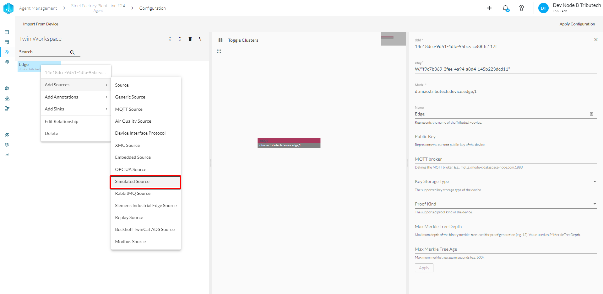
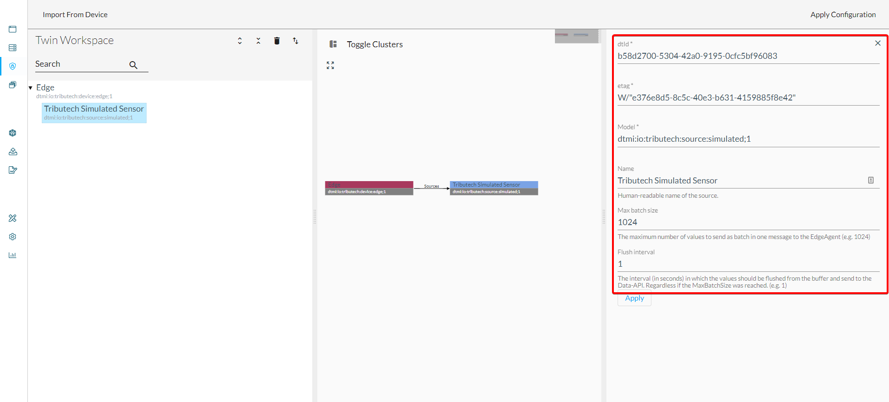
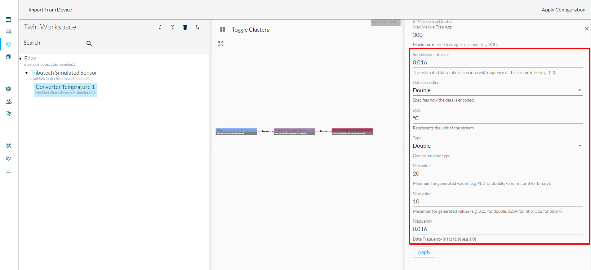

The Tributech Simulated Sensor/Source allows to simulate a data source on the edge side for testing purposes. The generated data for the streams is transmitted to the Tributech Edge Agent service (`dsk-agent`) via our MQTT broker.  
If the **Tributech Simulated Sensor/Source (`simulated-sensor`)** is deployed with [**Docker-Compose**](../../setup/agent/setup/docker-compose/source-setup.mdx#docker-compose-simulated-source) or [**Azure**](../../setup/agent/setup/azure/source-setup.mdx#azure-simulated-source) along with our DSK Edge Agent services, it can be configured based on twins with our [**Agent Companion**](../../setup/agent_companion) as described in the following:

- Open the [**Agent Companion**](../../setup/agent_companion), [**login**](../../setup/agent_companion#agent-companion-login) to the DSK Node and [**connect**](../../setup/agent_companion#agent-companion-connect) with the DKS Edge Agent
- Add Simulated Source
  
  
- Add Simulated Stream(s)  
  Various parameters for the simulated stream can be adapted but important are the _Type_ which defines the actual generated value type and the _Frequency_ which the amount of generated data.
  
- Apply Configuration
