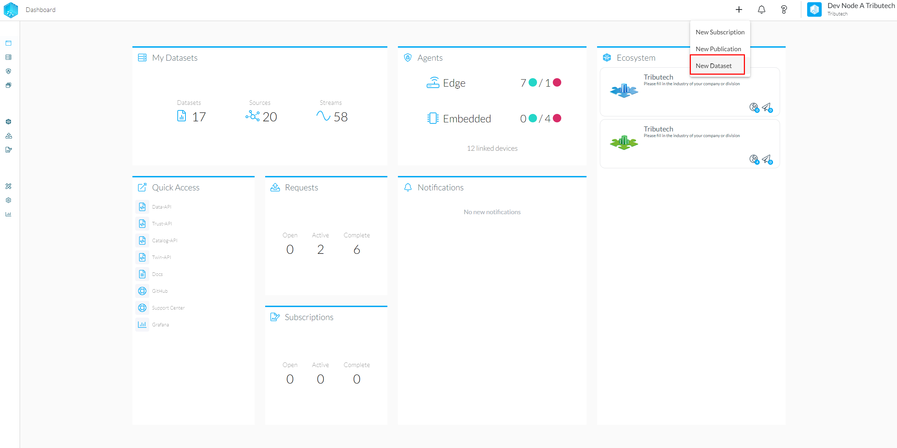
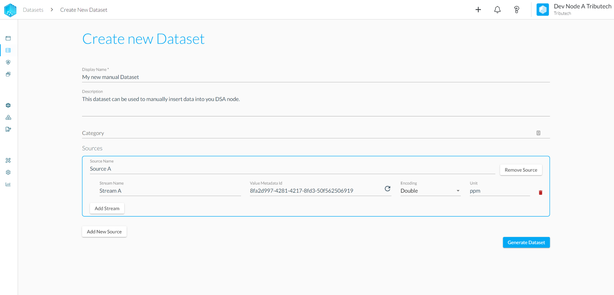
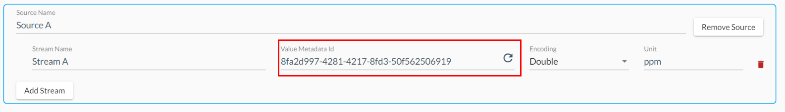

Manual Datasets are used to create an unsynced Dataset to manually insert data into, e.g. via our [**API integration**](../rest.md).

## Create a Dataset

To create a Dataset, connect to your node, click the "+" symbol and select "New Dataset".

Fill in the required information, which will be shown to data consumers during the subscription process and add as many data sources and streams as needed. The IDs are required to publish data so write them down or come back to the Dataset whenever they are needed.

The most important field here is the Value Metadata Id that is the identifier for your stream and is needed to insert data into the stream.

Using the Encoding Field you can annotate the kind of data that is inserted into the stream, which helps the [**Stream Explorer**](../../consume_data/streamexplorer.md) to correctly display the data. If you are unsure about what data you insert choose the "Byte Array" encoding.

It is also possible to share files using a stream, for this we have added some special handling that currently supports:

- CSV
- PDF
- JSON

When one of those types is inserted as the Unit of a stream alongside the "Byte Array" encoding the [**Stream Explorer**](../../consume_data/streamexplorer.md) will correctly interpret the data as the corresponding file type.

Once you are done, hit "Generate Dataset" to finish the creation process. The Dataset should now be visible in "My Datasets".

