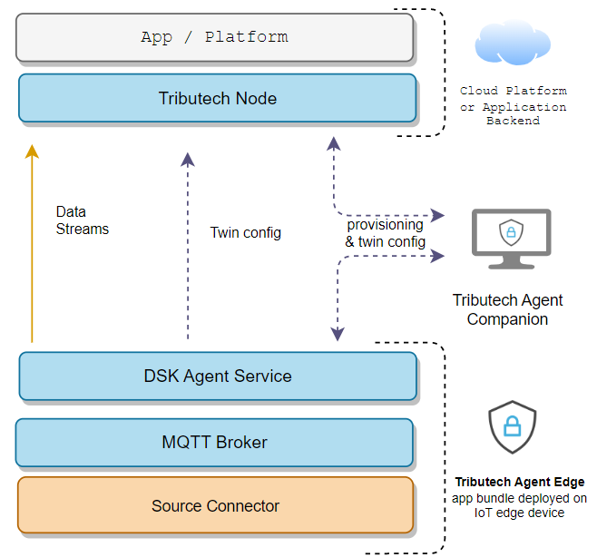

# Overview
After deploying the [**Tributech Node**](../node.md), in the first part as a central platform of the system, we can now focus on the Tributech Edge Agents. This agents can later be linked with the [**Tributech Agent Companion**](../agent_companion.mdx) to a [**Tributech Node**](../node.md) and configured.

The Tributech Agent Edge setup consists of the main DSK Agent Service (`dsk-agent`) and (optional) services like the MQTT broker (`eclipse-mosquitto`, for the communication on the edge) and/or for connecting external data sources (`opcua-source`, `simulated-sensor`,..). 

In the following section we will focus on the setup of the software-based Tributech Agent Edge ([**Docker-Compose**](./setup/docker-compose/docker-compose-setup.mdx)/[**Azure**](./setup/azure/azure-setup.mdx)) 
and external data sources ([**Docker-Compose**](./setup/docker-compose/source-setup.mdx)/[**Azure**](./setup/azure/source-setup.mdx)).

