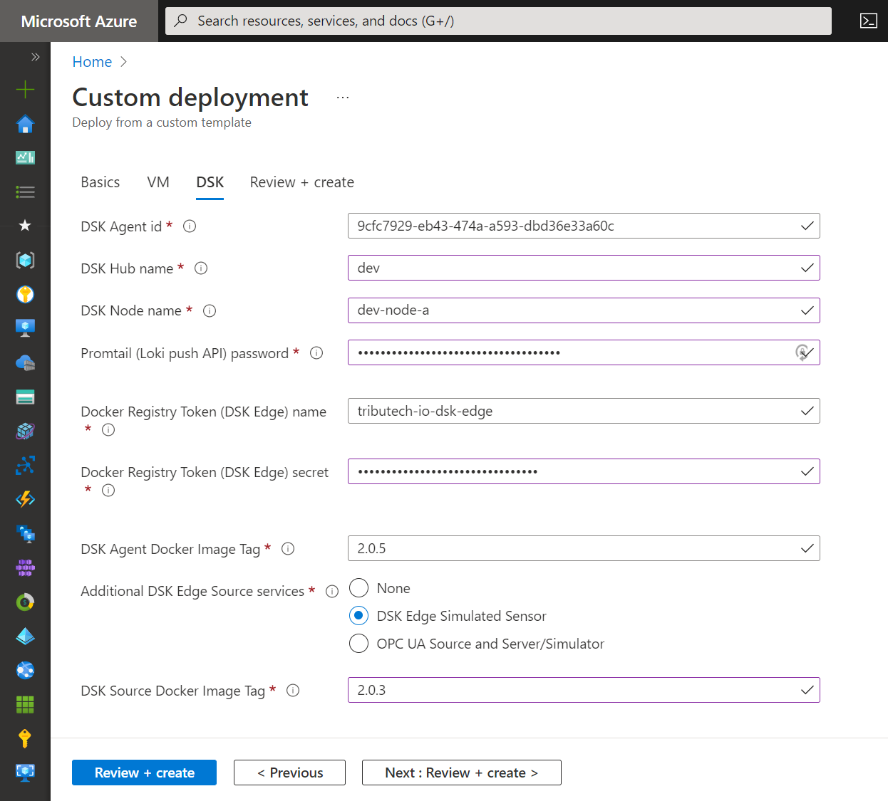
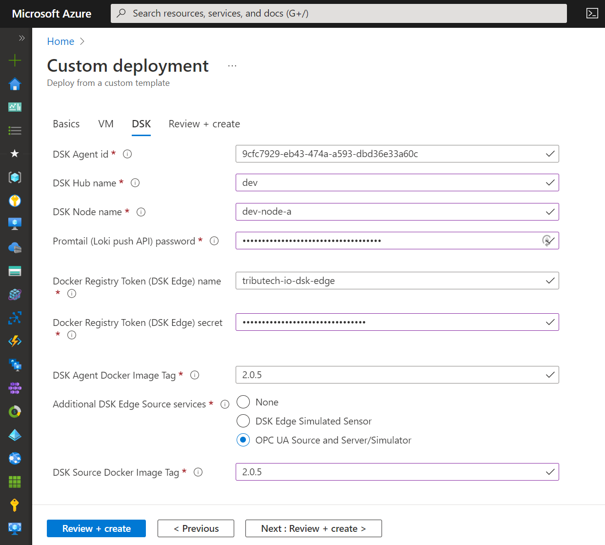

import CodeBlock from '@theme/CodeBlock';
import DskAgentDockerComposeOpcua from '!!raw-loader!../../../../deployments/dsk-agent/opcua/docker-compose.override.yml';

## Simulated Source {#azure-simulated-source}

The Tributech Edge Simulated Sensor allows to simulate a data source on the edge side for testing purposes. The generated data for the streams is transmitted to the Tributech Agent via our MQTT broker.

During the [**automated setup**](./azure-setup#agent-automated-setup) of the Tributech Agent you can select to additionally deploy the Tributech Edge Simulated Sensor for test data generation.

Afterwards you can continue with [**connecting to, linking & configuring**](../../../agent_companion.mdx#agent-companion-connect) the Tributech Edge Agent and the [**Simulated Sensor/Source**](../../../../provide_data/iot/simulated.md).

## OPC UA Source {#azure-opc-ua-source}
The Tributech OPC UA Source allows to connect to [**OPC Unified Architecture (UA)**](https://opcfoundation.org/about/opc-technologies/opc-ua/) based servers for data integration. The OPC UA Source act's as a OPC UA client and forwards the received data for a stream to the Tributech Agent via our MQTT broker.
During the [**automated setup**](./azure-setup#agent-automated-setup) of the Tributech Agent you can select to additionally deploy the Tributech OPC UA Source and OPC UA server/simulator for demonstration of such an integration.

Afterwards you can continue with [**connecting to, linking & configuring**](../../../agent_companion.mdx#agent-companion-connect) the Tributech Edge Agent and the [**OPC UA Source**](../../../../provide_data/iot/opc-ua.md).

