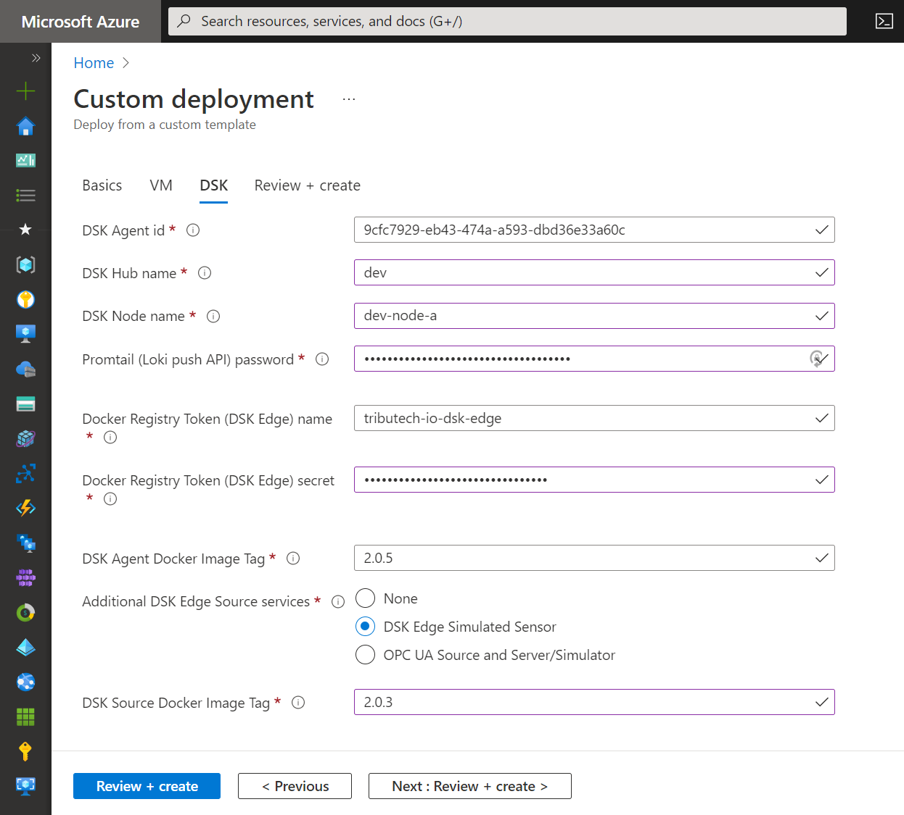

import CodeBlock from '@theme/CodeBlock';
import DskAgentDockerComposeSimulatedSensor from '!!raw-loader!../../../deployments/dsk-agent/simulated-sensor/docker-compose.override.yml';

The Tributech Edge Simulated Sensor allows to simulate a data source on the edge side for testing purposes. The generated data for the streams is transmitted to the Tributech Agent via our MQTT broker.

## Automated setup

During the [**automated setup**](../docker-compose#agent-automated-setup) of the Tributech Agent you can select to additionally deploy the Tributech Edge Simulated Sensor for test data generation.



Afterwards you can continue with [**connecting to, linking & configuring**](../../agent_companion.mdx#agent-companion-connect) the Tributech Edge Agent and the [**Simulated Sensor/Source**](../../../provide_data/iot/simulated.md).

## Manual setup

For the manual setup of the Tributech Edge Simulated Sensor (`simulated-sensor`) we need the main [**DSK Edge services**](../docker-compose#agent-manual-setup) as a basis.

* Copy the [`docker-compose.override.yml`](../../../deployments/dsk-agent/simulated-sensor/docker-compose.override.yml) file.
(see also [**Docker doc - Understanding multiple Compose files**](https://docs.docker.com/compose/extends/#understanding-multiple-compose-files))
<CodeBlock className="language-yml" title="docker-compose.override.yml">{DskAgentDockerComposeSimulatedSensor}</CodeBlock>

* Startup all Edge services including the Simulated Sensor (will automatically retrieve the Docker images).
    ```bash
    docker-compose up -d
    ```
* You can now continue with [**connecting to, linking & configuring**](../../agent_companion.mdx#agent-companion-connect) the Tributech Edge Agent and the [**Simulated Sensor/Source**](../../../provide_data/iot/simulated.md).
