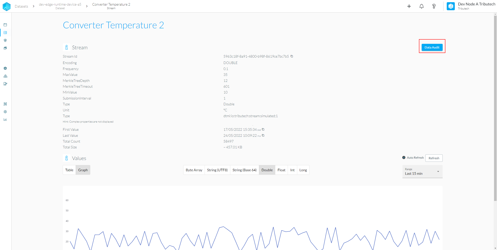
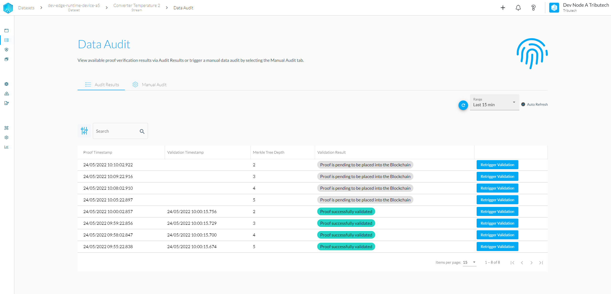
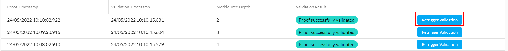

To display the audit results of a specific stream you need to first navigate to the details of the stream. Afterwards press the "Data Audit" button in the top right corner.

Now you should see the following table. If you do not see any data in the table, please increase the timeframe selection from 15min to something bigger to load all stored proofs for your stream. By default, proofs are not evaluated automatically. To learn more about automatic validation please contact us.

By pressing the "Retrigger Validation" buttons in the table you can manually trigger the verification for a single proof.

You can check if everything worked as expected if the "Validation Timestamp" is updated and the "Validation Result" gets set.
