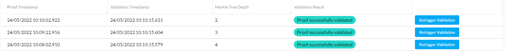

# Verify Data Overview

The possibility to verify data is at the core of the DSK, as each data stream can be verified independently. To do this we create something comparable to fingerprints for each data stream. These fingerprints are stored on a secure and independent layer and can also be verified by other parties when data gets shared.

There are multiple options to verify data in your DSK node. Depending on your needs you can choose between the multiple options.

## Audit Results

The quickest method to verify your data is to verify specific fingerprints. Head over to the [**Audit Results section**](audit_results.md) to learn how to use it.

## Manually Verify A Stream

To learn how you can verify a bigger timeframe of a stream please follow the [**Manual Audit section**](manual_audit.md) to learn how to use it.

## Automatically Verify Streams

We also offer an experimental opt-in method that allows to continually verify incoming proofs. Please contact us, if you want this feature to be enabled on your Tributech Node.

## Verify via API

It is also possible to integrate the verification in your existing applications by utilizing our Trust-API, for details and examples please visit the [**API section**](api.mdx).
