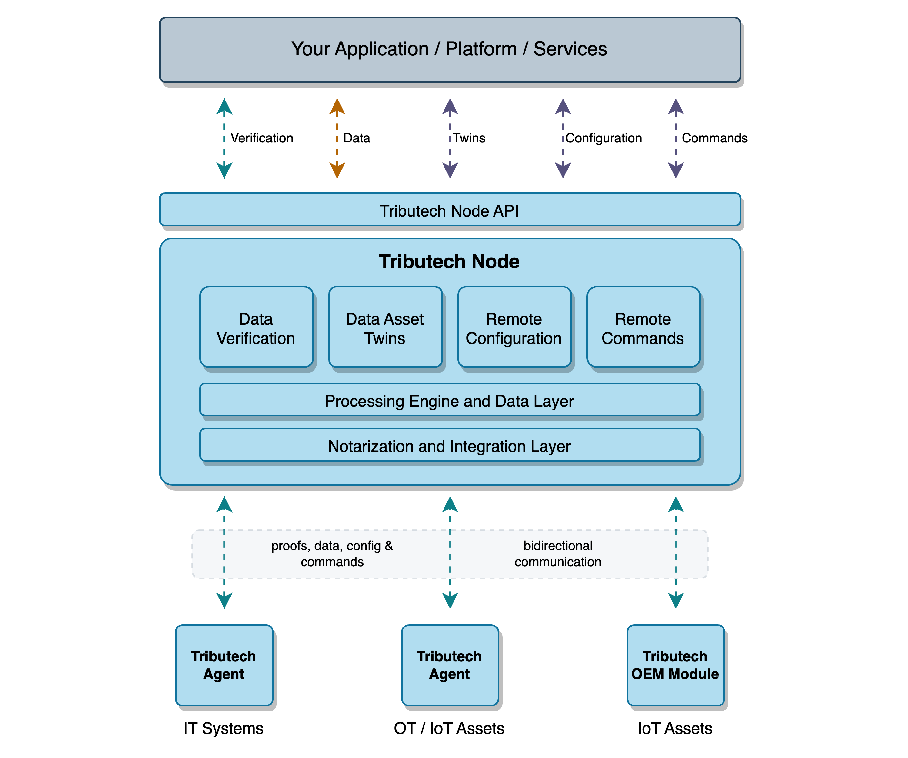

# Introduction

Welcome to our official documentation page!

Tributech's platform provides a solution for secure data integration from any source, ensuring data integrity and authenticity throughout the whole data lifetime. Our platform helps you simplify the complexity of integrating various data sources while maintaining the highest level of security to protect your data against cybersecurity threats and system failures.

## Platform Features

The following list provides an overview of the most important platform features.

| Feature    | Description                                                                                   |
| --------- | ---------------------------------------------------------------------------------------------  |
| Data integrity protection      | Securing your data integrity by creating cryptographic proofs at that allow you to verify data integrity and authenticity between source and destination.  |
| Data tampering detection    | Detection of any poisoned / tampered data caused by cybersecurity incidents or system failures through automated data verification processes. The verification results and tamper alerts can be integrated into your SIEM/SOAR via API or via webhooks.         |
| Data integration | The platform provides comperhensive set of data integration options ranging from IoT, OT to IT, enabling the secure data integration for any data source. In addition to the platform's open interfaces, industry protocols like e.g. MQTT, OPC-UA, ADS or UART are supported.     |
| Data middleware | The data middleware provides a powerful data processing engine that is able to stream data between source and destination in near real time. Furthermore, the middleware also includes a warm storage to persist historical data. A powerful master data management based on the DTDL standard provides a uniform description of each connected data source.        |
| Remote configuration  | Remote configurations allow you to manage and update the configuration parameters of any connected data source (e.g. sensor, machine, building, server, ...) via the platform dashboard or API.        |
| Remote commands | Remote commands allow you to perform actions (e.g. trigger, on/off, set value, ...) on any connected data source (e.g. sensor, machine, building, server, ...) via the platform dashboard or API in near real-time.        |

## Platform Architecture

The Tributech platform is available as a SaaS or PaaS solution and offers integration options for IT systems, OT infrastructure and IoT gateways or devices. The following diagram provides an overview of the platform's architecture.

## Quick Links

- To learn how to integrate IT/OT/IoT data sources via the Tributech Agent, visit the [overview](./tributech_agent/overview.md) page or start directly with our [quick start guide](./tributech_agent/quickstart.mdx).
- To learn more about the platform REST and webhook event interface visit the [API integration](./tributech_node/API_integration.md) page.
- Visit the [API usage](./tributech_node/API_usage.md) page for the most common use case examples.
- Visit the OEM Module [overview](./oem_module/overview.md) page to learn more about the integration into embedded IoT devices.

