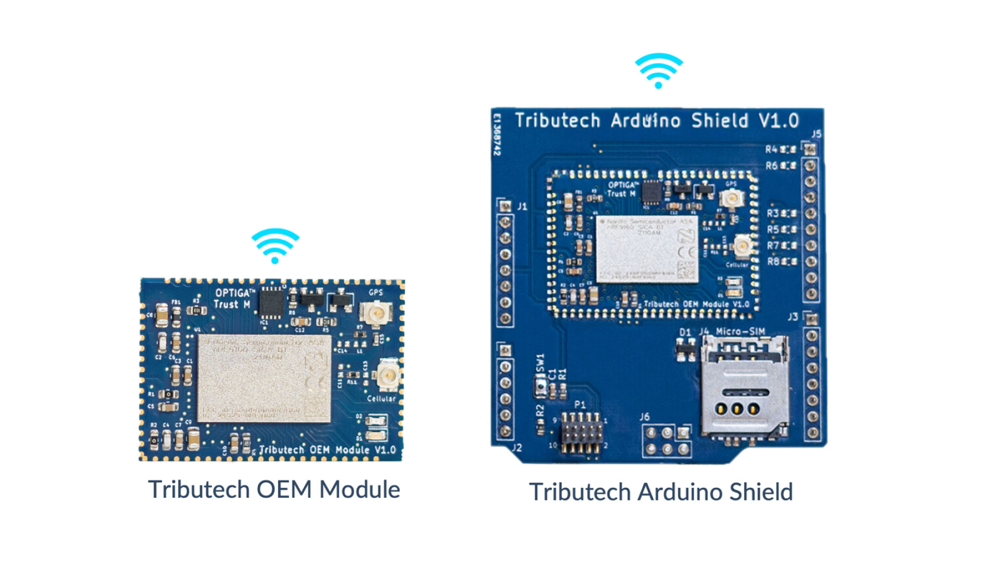
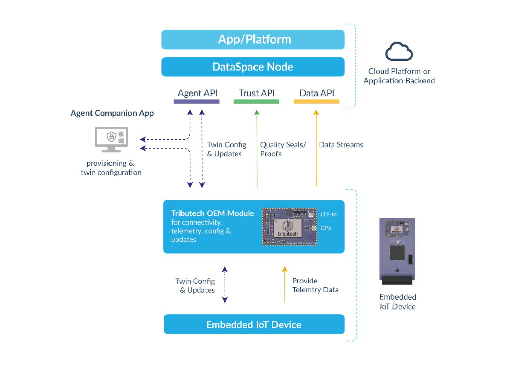
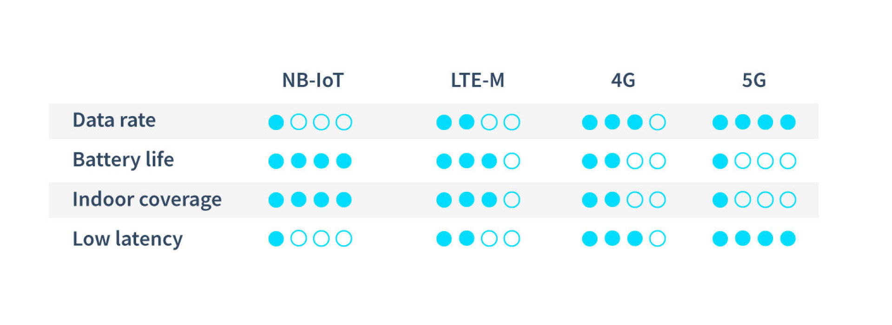

# Overview

This documentation provides the hardware and software specifications of the Tributech OEM Module for embedded IoT devices.
The miniaturized 32 x 22 x 3 mm IoT module is packaged as a system-on-module (SoM) that includes Nordic Semiconductor low-power nRF9160 SiP with integrated LTE-M/NB IoT modem, a GPS sensor, eSIM and Infineon Technologies high-end OPTIGA™ Trust M hardware security module. Together with Tributech’s IoT and data platform middleware, it provides all core functionalities of an IoT device like managing telemetry data, configurations, updates, provisioning, and security. Beside these core functionalities, the platform includes unique features like blockchain-based data verification, digital twin-based configuration and data management as well as built-in data sharing.
This allows builders to design embedded IoT devices that are perfectly optimized (in terms of interfaces, form factor and costs) for their use cases without the need to take care of all the complexity of a connectivity and data management platform. 

## Hardware Modules

For the development of embedded IoT devices we offer two hardware variants. The Tributech OEM Module itself, which can be directly integrated into the PCB hardware design as a SoM and an Arduino Shield for prototyping. The shield can be used with all popular hardware development platforms like Arduino Uno, STM32 Nucelo, Infineon XMC Relax Kit and more.  

## Software Stack

The software stack consists of the OEM Module firmware and an middleware that includes connectivity services, device management, IoT data management, digital twin workspace, data verification services and more.
On the device side, the OEM module provides a UART interface for exchanging configurations, providing telemetry data and performing updates. This allows developers to focus on firmware development for data pre-processing and sensor/interface integration, as all complexity is abstracted via an easy-to-use interface.
On the middleware / backend side, the captured data can be consumed via APIs, a message broker or stream explorer. The configuration- and device-management is available through the web portal and APIs.

## Connectivity

The Tributech OEM module includes a multimode LTE-M/NB-IoT modem with GNSS and is certified for global operation. The availability of these connectivity standards has already reached global scale. The current status of the network rollout can be checked via GSMA's Mobile IoT Deployment Map.

[https://www.gsma.com/iot/deployment-map/](https://www.gsma.com/iot/deployment-map/) 

LTE-M and NB-IoT were designed for IoT applications that use low to medium data rates, need to be low cost, operate in hard-to-reach places, or require long battery life. With these properties, they are suitable for many sensing and monitoring applications in the mobile sector, but also for many stationary applications in the area of smart building, smart infrastructure, or smart factory. The following graphic provides an overview about the differences between the cellular connectivity standards.

