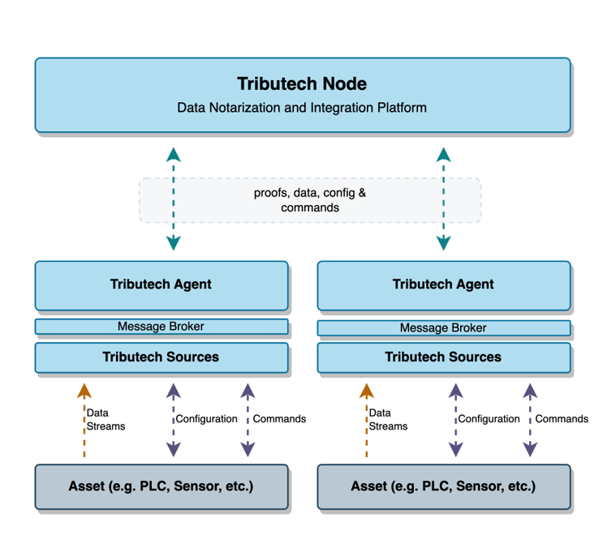

# Tributech Agent

The Tributech Agents are responsible for securing the data collected by Tributech Sources (officially supported protocols) or custom sources implemented based on our specification. Agents also provide a secure bidirectional communication channel between the Tributech Node platform and Tributech Agent which enables not only the secure gathering of data points and proofs, but also the issuing of commands back to the connected environment. 

## QuickStart

The Tributech [QuickStart guide](./quickstart.mdx) entails a short tutorial how to setup a Tributech Agent with a [Simulated Source](./sources/simulated_source.mdx) in a [Docker Compose](https://docs.docker.com/compose/) environment. It also covers how a user establish a link between the Tributech Agent and the Tributech Node. After the Source configuration it guides the user through their very first verification of their gathered and notarized data points. 

## Supported Sources

The supported Tributech Sources give the user a wide variety of endpoints with which the customers are able to connect their data sources to a Tributech Node. The following table shows the available Source Types and their corresponding setup guides. If those Sources don’t meet your requirements there is also the possibility to implement [Custom Source](./source_integration.md) and handle the data integration by yourself.

| Source    | Guide                                                                                          |
| --------- | ---------------------------------------------------------------------------------------------  |
| MQTT      | The [**MQTT Source Guide**](./sources/mqtt_source.mdx) integrates data provided via [MQTT](https://docs.oasis-open.org/mqtt/mqtt/v5.0/mqtt-v5.0.html).  |
| OPC-UA    | The [**OPC-UA Source Guide**](./sources/opcua_source.mdx) integrates data provided by an OPC-UA conform interface.       |
| Beckhoff ADS | The [**ADS Source Guide**](./sources/ads_source.mdx) integrates data provided by an Beckhoff ADS PLC Server.    |
| Simulated Sensor | The [**Simulated Source Guide**](./sources/simulated_source.mdx) integrates data provided by test sources generating random data.        |
| REST  | The [**REST Source Guide**](./sources/rest_source.mdx) integrates data provided via [HTTP APIs](https://swagger.io/specification/).        |

## Agent Deployment

Our Agent is a Docker service with a broker and a source. As mentioned the Agent is a docker service and can be combined with any Docker orchestration service like [Docker Compose](https://docs.docker.com/compose/) or IoT device management platforms like [Azure IoT Edge Runtime](https://learn.microsoft.com/en-us/azure/iot-edge/iot-edge-runtime?view=iotedge-1.4). The general Integration of our Agent is described in the section [Agent Integration](./agent_integration.mdx).