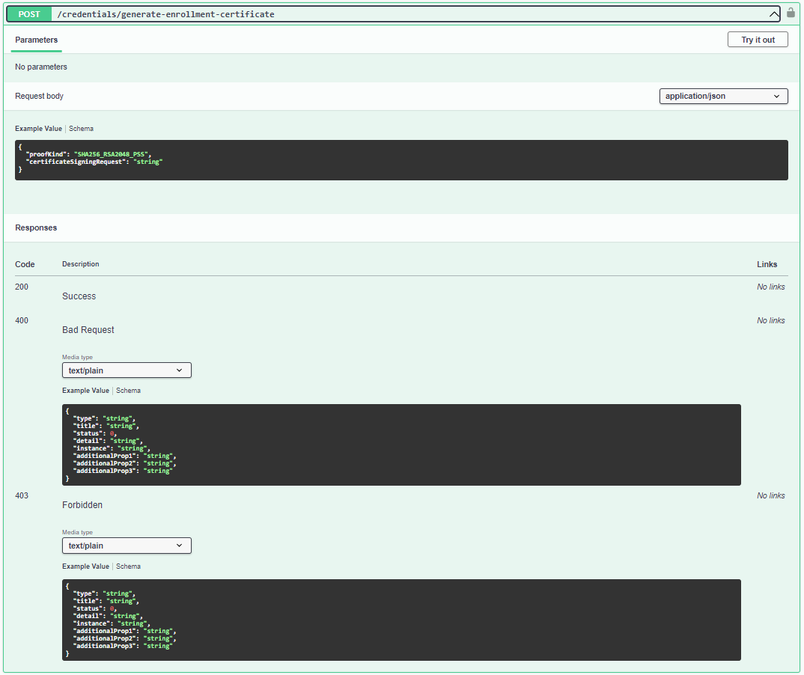
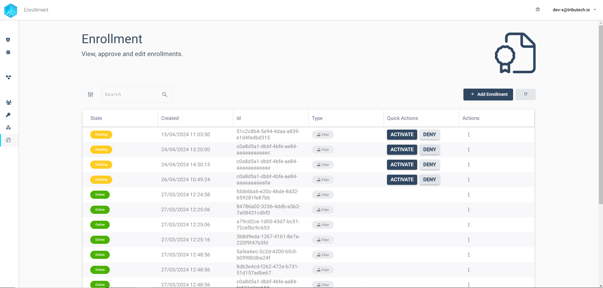
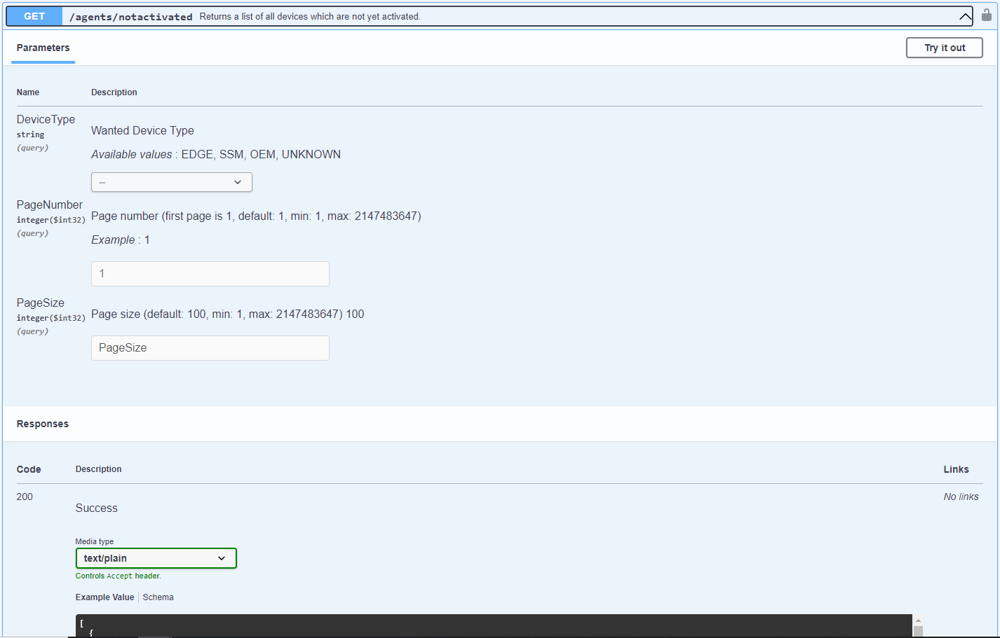
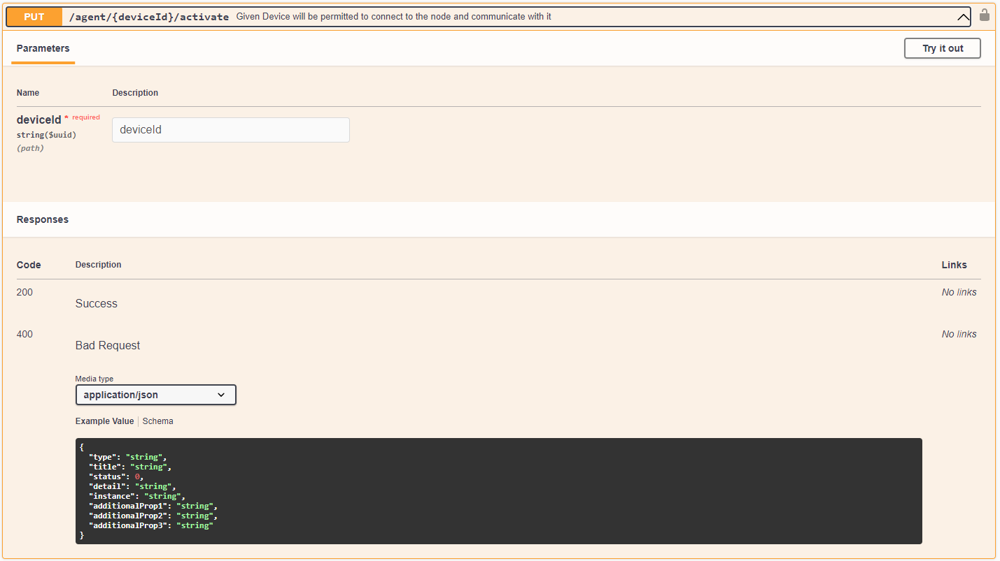
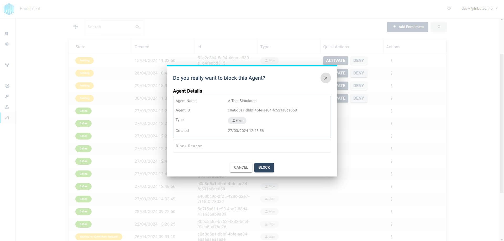
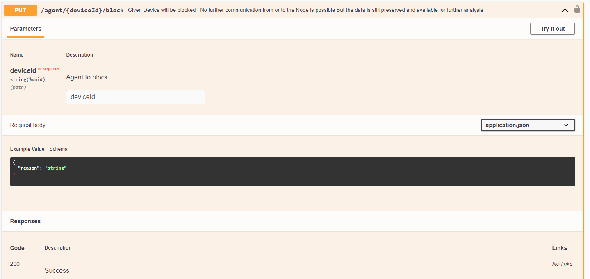
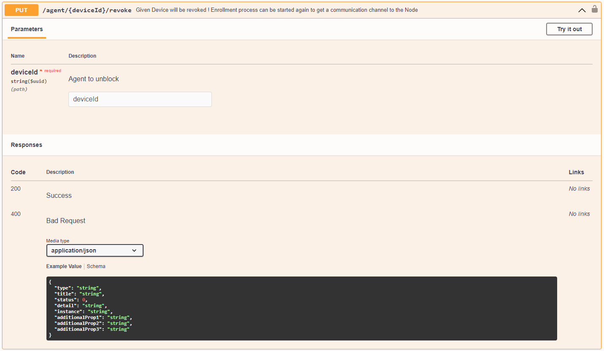
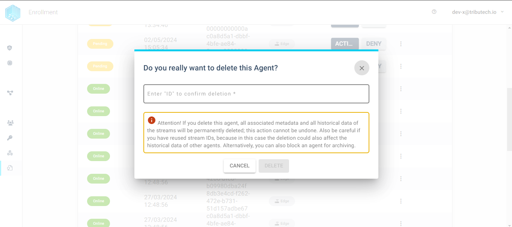
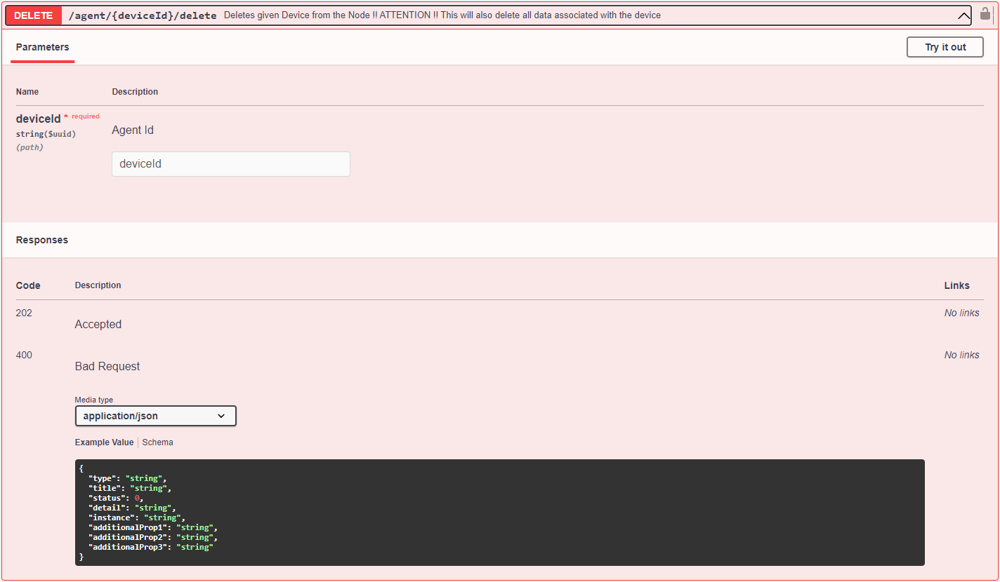

import CodeBlock from '@theme/CodeBlock';
import SourceDockerCompose from '!!raw-loader!./examples/agent-management/docker-compose.yml';
import SourceEnvDirectory from '!!raw-loader!./examples/agent-management/env-directory';
import SourceEnvUrl from '!!raw-loader!./examples/agent-management/env-url';

## Enrollment Workflow
Each Tributech Agent must be connected to a Tributech Node to be fully functional. This workflow starts with the Tributech Agent and ends in the Tributech Node UI or in the Tributech API. In the following section we describe how this enrollment workflow works and where the user needs to enter information.

### Generate Agent Certificate
The first step in connecting an agent to a Tributech node is to set the node URL in the Docker configuration. This can be achieved by adding or changing the environment variable **EdgeDeviceOptions__NodeUrl**. The second step is to generate a certificate that needs to be implemented in the agent to be able to connect to the Tributech node.

<CodeBlock className="language-plain" title=".env section">{SourceEnvUrl}</CodeBlock>

<CodeBlock className="language-yml" title="docker-compose.yml section">{SourceDockerCompose}</CodeBlock>

#### UI Certificate generation
The certificate can be generated in the Tributech UI Enrollment section. There the user must click on `+ Add Enrollment`.

This action leads to the following window, which contains all the information the user needs to create the certificate.

The certificate can be downloaded by the user after a `certificate signing request` (csr) has been uploaded to the Tributech node. To generate the required csr file, a script for the different operating systems (OS) can be downloaded. The Linux OS script also works for the Mac OS. Both scripts and a detailed description of how to use each script can also be found in the public [Tributech Enrollment git repository](https://github.com/tributech-solutions/tributech-enrollment). The script generates three different files. The csr file contains information such as the common name, organization, country, etc. to generate a unique certificate. The second generated file is the `enrollment.key`. This key is the users private key. This file should never be deleted or shared! The third file `enrollment.cnf` can be ignored.

The user must then upload the certificate signing request file via the upload field in the Tributech user interface. This in turn unlocks the download button in the window containing the user agent's certificate. The downloaded certificate must now be implemented in the agent.

#### API Certificate generation
The agent certificate can also be created using the Tributech API. The general workflow remains the same, but the UI elements are replaced by the API functions and commands.

The first step is again the creation of a csr file with the [Tributech Enrollment Script](https://github.com/tributech-solutions/tributech-enrollment). Using the script with the “-j” suffix also outputs the script as a CSR json string that can be used directly in the API call shown below.

The API endpoint `credentials/generate-enrollment-certificate` provides the user with a certificate in the form of a string upon successful use. This can be used in the next step if the certificate is to be integrated into the agent.

### Tributech Agent Certificate Integration
The three files that are now in the user's possession must be transferred to the agent if they were not created directly on the agent. The folder containing the certificate and the keys must be referenced on the agent by setting the environment variable **EnrollmentOptions__Directory**. This variable must be set in the **.env** file and in the **docker compose.yml** file.

<CodeBlock className="language-plain" title=".env section">{SourceEnvDirectory}</CodeBlock>

<CodeBlock className="language-yml" title="docker-compose.yml section">{SourceDockerCompose}</CodeBlock>

### Tributech Agent Activation
If the integration of the agent certificate has been performed correctly and the node URL has been set, the agent should be able to connect to the node. In this process, the integrated certificate is used to connect to the Tributech backend, where a device-specific certificate is generated for the agent. This device-specific certificate is then used to connect to the Tributech node. The agent will attempt to connect to the Tributech node at regular intervals until it is activated by a user.

When the lifetime of the device-specific certificate is about 3/4, a process is automatically triggered by the agent to request a new certificate. This process runs in the background. If the device is not active when the device-specific certificate expires, a new certificate is requested by the Tributech agent and the activation process must be repeated.

#### UI Agent Activation
Activating the Tributech agent is the simplest action in the enrollment process. The user must access the Tributech node and call up the `Enrollment` section.

The list can be sorted and filtered by the user, but by default all non-activated agents should be at the top. The first step is to search for the user-specific agent and find it in the list. Then simply click on `Activate` in the same column as the desired Tributech agent and confirm the activation of the agent in the pop-up window to connect the agent to a Tributech node.

#### API Agent Activation
Activating a Tributech agent via the Tributech API has an additional requirement that is necessary for success. The user must know the device ID of the Tributech agent, otherwise it is not possible to activate the agent. If the name of the Tributech agent is known, the user can determine the agent ID with the API endpoint `/agents/notactivated`. This command will return all agents that are waiting to be activated by a user.

Once the Tributech agent ID has been recorded, it can be used in the API endpoint `/agent/{deviceId}/activate`. The Tributech agent ID must be specified here in order to activate a specific agent.

Similar to the Tributech UI agent activation, this completes the registration process of an agent, but the next sections explain general agent management such as locking/unlocking and deleting agents.

## Agent management functions
In addition to the enrollment process, several agent management functions have been implemented in the Tributech UI and API. The next sections show how to lock and unlock an agent and how to delete an agent and what these functions do in the background.

### Agent Blocking & Unblocking
When a Tributech agent is blocked, all sources, streams and their data remain in the database, but the agent can no longer connect to the Tributech node. The agent can be unblocked at any time, creating a fully functional agent whose data is still stored. This function can also be used if an agent has been compromised and needs to be cut off from the node.

#### UI Block & Unblock Agent
Blocking in the Tributech UI can be done in the Enrollment section. For this feature locate the agent got to it's action column. The burger menu of each agent should  hold the `Block` action. When clicking on this action the following window will be shown:

The user is also able to write a short `Block reason` before blocking the agent which can help other users to distinguish why an agent was blocked in the first place, but the `block reason` is optional.

Unblocking an agent runs along the same lines of blocking the agent. The `Unblock` option is only shown if the agetn is in the `Blocked` State. The option can be also found in the action menu similar to the `Block` action.

#### API Block & Unblock Agent
A Tributech agent can also be blocked and unlocked via the API. Each action has its own API endpoint. The block enpoint needs to be supplied with the device id and a optional block reason string.

The `Unblock` endpoint only needs the devide id of the agent, also the endpoint is called revoke in the backend.

### Agent Deleting
Deleting an agent in the Tributech environment not only deletes the agent entry, but also cleans the database of all its sources, streams and data points, but it is still possible to connect the agent to the node after a clean. When an agent is deleted with this feature it is not possible to get the deleted data back. This featuer is used when the data of a Tributech agent is not needed anymore and the agent is needed for another project.

#### UI Delete Agent

To delete an agent in the user interface, the user must go to the enrollment section of the Tributech user interface and search for the desired Tributech agent. There is a “Delete” option in the agent's burger menu. This action calls up the modal for deleting the agent. In this modal, the user must enter the agent ID to ensure that the correct agent is deleted. Once the agent ID has been entered, the “Delete” button is activated and the user can delete the agent from the node and the database.

#### API Delete Agent

To delete an agent via the API, the user must use the delete agent endpoint. This endpoint must be provided with the agent ID so that the function can be executed.

