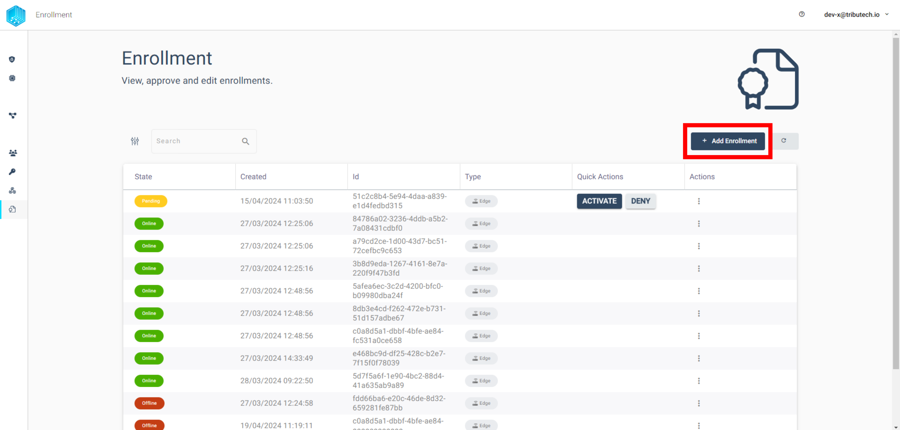
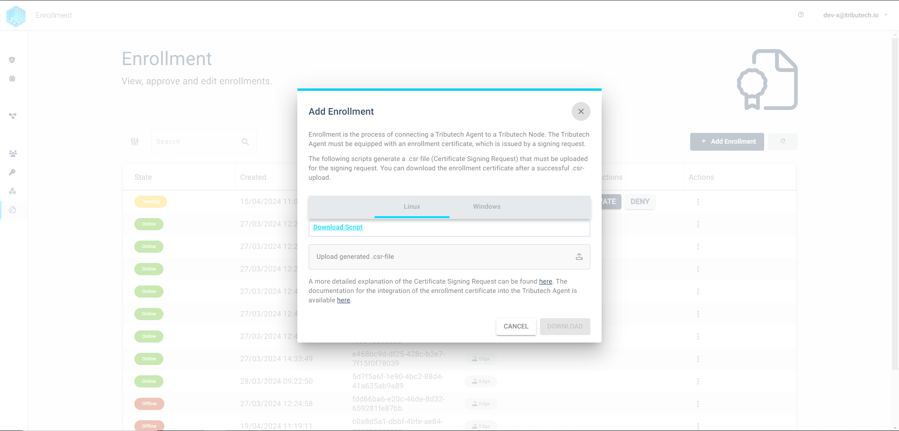
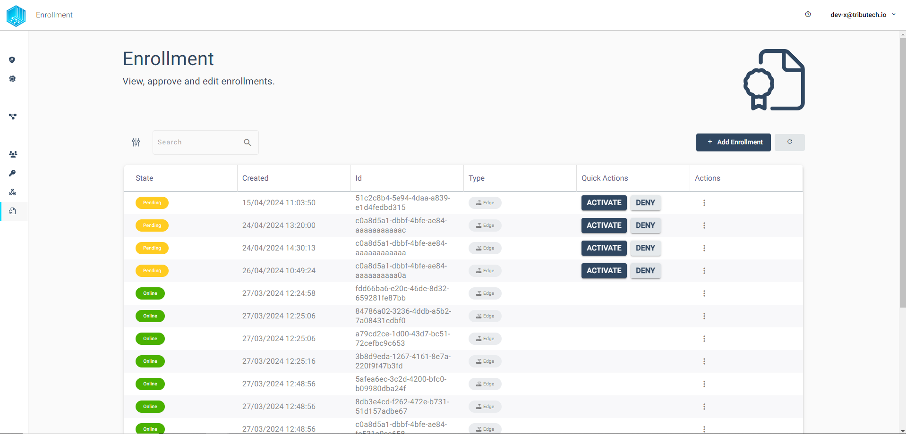

import CodeBlock from '@theme/CodeBlock';
import SourceDockerCompose from '!!raw-loader!./examples/agent-management/docker-compose.yml';
import SourceEnvDirectory from '!!raw-loader!./examples/agent-management/env-directory';
import SourceEnvUrl from '!!raw-loader!./examples/agent-management/env-url';

## Enrollment Workflow
Each Tributech Agent must be connected to a Tributech Node to be fully functional. This workflow starts with the Tributech Agent and ends in the Tributech Node UI or in the Tributech API. In the following section we describe how this enrollment workflow works and where the user needs to enter information.
To be able to understand the enrollment process the should know some of the terminology and the process of the enrollment.

The first step of the enrollment process is to generate a CSR (Certificate Signing Request) file using the scripts provided by Tributech. With this file, the user can request an "enrollment certificate" in the Tributech UI enrollment environment. This certificate allows the Tributech agent to automatically connect to the enrollment port of the Tributech node.

Before the agent can use the “enrollment certificate”, the user must transfer it to the Tributech agent and set the certificate location and node URL in the agent configuration. The node connection allows the Tributech agent to request the “agent certificate”, which is unique for each agent. With this certificate, the agent constantly sends an activation request that must be accepted by the user in the Tributech UI Enrollment section via the "Activate" agent function. This will allow theagent to connect to the Tribteuch Node with the specified agent certificate. Since each "agent certificate" is unique to each agent it is also possible to block specific agents.

The "agent certificate" also has an expiry date. When approximately 3/4 of the lifetime of the "Agent Certificate" is reached, the agent triggers an automatic request for a new "Agent Certificate" with a new expiry date. For example, if the agent was offline and the "agent certificate" has expired, the process falls back to the "registration certificate" and the user must reactivate the agent in the registration environment.

### Generate Agent Certificate
The first step in connecting an agent to a Tributech node is to set the node URL in the Docker configuration. This can be achieved by adding or changing the environment variable “**EdgeDeviceOptions__NodeUrl**”. The second step is to generate a certificate that needs to be implemented in the agent to be able to connect to the Tributech node.

<CodeBlock className="language-plain" title=".env section">{SourceEnvUrl}</CodeBlock>

<CodeBlock className="language-yml" title="docker-compose.yml section">{SourceDockerCompose}</CodeBlock>

#### Certificate generation
The certificate can be generated in the Tributech UI Enrollment section. There the user must click on “+ Add Enrollment”.

This action leads to the following window, which contains all the information the user needs to create the certificate.

The certificate can be downloaded by the user after a “certificate signing request” (csr) has been uploaded to the Tributech node. To generate the required *.csr file, a script for the different operating systems (OS) can be downloaded. The Linux OS script also works for the Mac OS. Both scripts and a detailed description of how to use each script can also be found in the public [Tributech Enrollment git repository](https://github.com/tributech-solutions/tributech-enrollment). The script generates three different files. The *.csr file contains information such as the common name, organization, country, etc. to generate a unique certificate. The second generated file is the "enrollment.key". This key is the users private key. This file should never be deleted or shared! The third file "enrollment.cnf" can be ignored.

The user must then upload the certificate signing request file via the upload field in the Tributech user interface. This in turn unlocks the download button in the window containing the user agent's certificate. The downloaded certificate must now be implemented in the agent.

### Tributech Agent Certificate Integration
The three files that are now in the user's possession must be transferred to the agent if they were not created directly on the agent. The folder containing the certificate and the keys must be referenced on the agent by setting the environment variable “**EnrollmentOptions__Directory**”. This variable must be set in the "**.env**" file and in the “**docker compose.yml**” file.

<CodeBlock className="language-plain" title=".env section">{SourceEnvDirectory}</CodeBlock>

<CodeBlock className="language-yml" title="docker-compose.yml section">{SourceDockerCompose}</CodeBlock>

### Tributech Agent Activation
If the integration of the agent certificate has been performed correctly and the node URL has been set, the agent should be able to connect to the node. In this process, the integrated certificate is used to connect to the Tributech backend, where a device-specific certificate is generated for the agent. This device-specific certificate is then used to connect to the Tributech node. The agent will attempt to connect to the Tributech node at regular intervals until it is activated by a user.

When the lifetime of the device-specific certificate is about 3/4, a process is automatically triggered by the agent to request a new certificate. This process runs in the background. If the device is not active when the device-specific certificate expires, a new certificate is requested by the Tributech agent and the activation process must be repeated.

#### Agent Activation
Activating the Tributech agent is the simplest action in the enrollment process. The user must access the Tributech node and call up the “Enrollment” section.

The list can be sorted and filtered by the user, but by default all non-activated agents should be at the top. The first step is to search for the user-specific agent and find it in the list. Then simply click on “Activate” in the same column as the desired Tributech agent and confirm the activation of the agent in the pop-up window to connect the agent to a Tributech node.

TODO: Lukas Tech Magic section overhaul.

