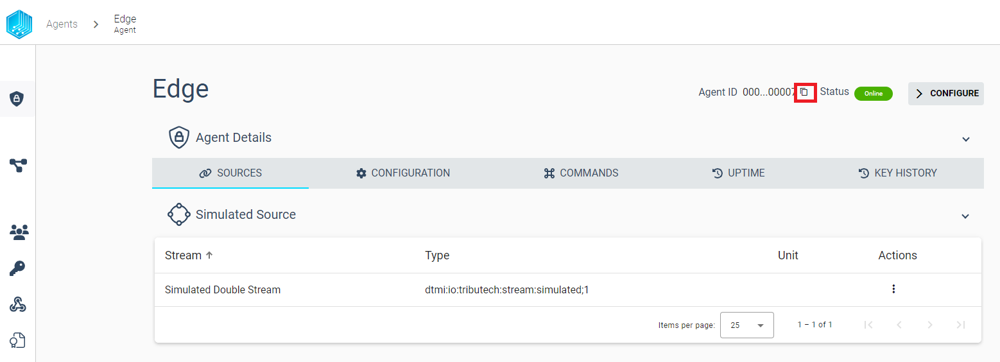
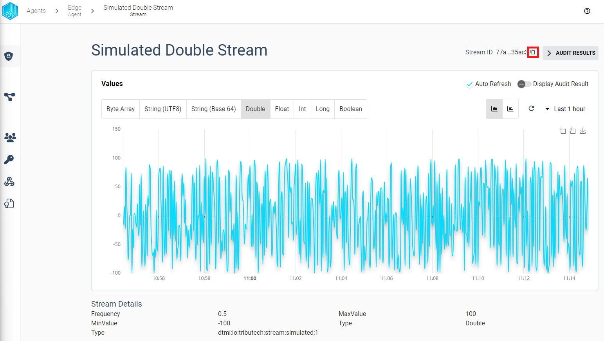
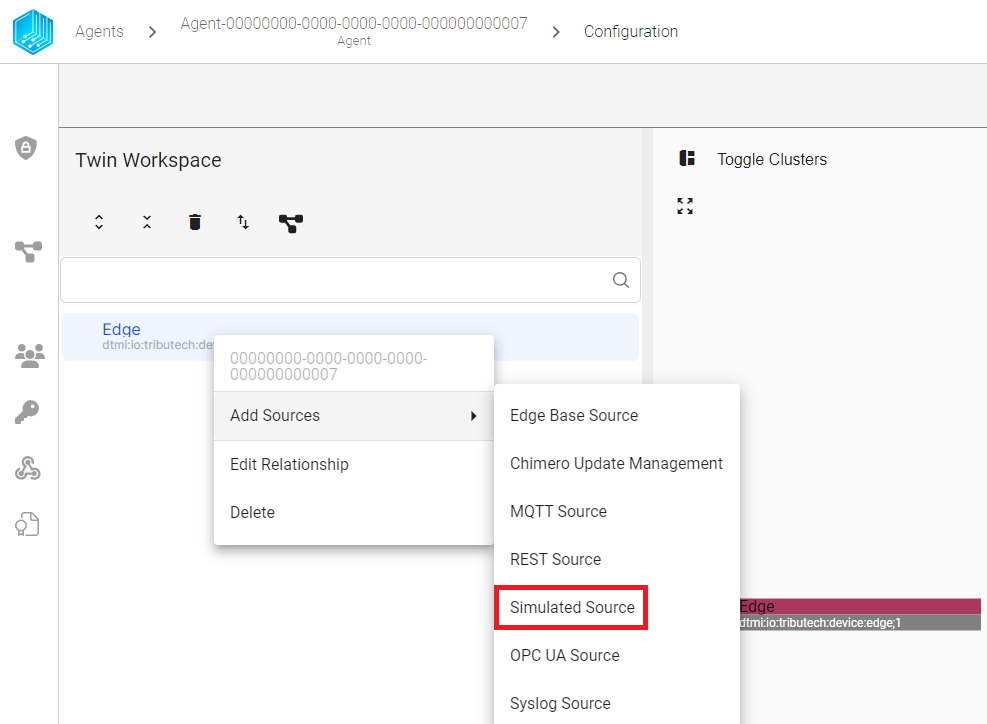
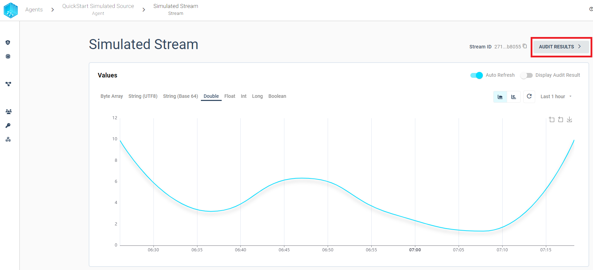
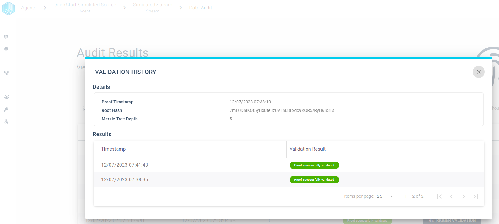

import CodeBlock from '@theme/CodeBlock';
import SourceDockerCompose from '!!raw-loader!./examples/agent/docker-compose-agent-integration.yml';
import DockerComposeVolumesExample from '!!raw-loader!./examples/agent-management/docker-compose-volumes-example.yml';

In the following section we describe how configurate and navigate the Tributech Agent via the Tributech Node UI.
This requires an successful [Setup](setup.mdx) and a completed [activation](../tributech_node/agent_management.mdx) with a corresponding [Tributech Node](../tributech_node/overview.md).

## Searching for an Agent

The first step is to find the correct Tributech Agent in the agents section. We get to the agents section either
via the initial login or navigating the sidebar to the agents icon.

In this overview we can either filter agents with the `Agents ID` (from the [Setup](setup.mdx)) or with partial name.

Its also possible to filter agent for state or type values:

## Searching for a Stream

## Get the Agent Id
Agents can be referenced either by name or Id. An Agent Id is a GUID (Globally Unique Identifier) that is assigned to a Tributech Agent on startup (see [Setup](setup.mdx#environment-configuration)) and will never change. When interacting with the [Tributech Node API](../tributech_node/API_usage.md) its required for many operations to specify which Tributech Agent will be interacting with.
The Agent Id can also be used in [agents section](#searching-for-an-agent) to find a specific agent or in the [Tributech Node Agent Management](../tributech_node/agent_management.mdx). Therefore, we want to show where to find the Agent Id in the Tributech UI without the need to access the Edge Device:

- In the agent section

- In the agent details (can be access by clicking the agent entry in the agent section overview table)

## Get a Stream Id
Collected data is always bound to a data stream. A data stream is a unique collection of information which has can be identified by a GUID (Globally Unique Identifier). With the StreamId values and proofs can be accessed via the [Tributech Node API](../tributech_node/API_usage.md) and [Webhook Events](../tributech_node/Webhook_integration.md) interprated. Streams contain multiple properties like name, type, unit ... but only the StreamId is used to access a specific stream.
To find the StreamId for a specific stream we need to access the agent details (can be access by clicking the agent entry in the agent section overview table) where we find all streams associated with an Triubtech Agent.

- In the agent details (can be access by clicking the agent entry in the agent section overview table)

- In the stream details (can be access by selecting a stream in the agent details overview)

## Configuring an Agent
After finding an activated the Tributech Agent (see [Setup](setup.mdx)) we can configure the settings of an Tributech Agent
by changes its Twin settings. A Twin can be used to change properties of the Triubtech Agent include naming, merkle deepth etc or managing relationships and settings of [Triubtech Sources](source_integration.md). The starting point for all this operations is the 
`Twin Workspace` and we show in this section how to adjust Tributech Agent settings. The details on how to configure specific Sources can be found in the corresponding [Triubtech Sources](source_integration.md) overview. To get to the `Twin Workspace` we can either by:

- selecting `Configure Agent` in the `actions context menu`.
    

- Simply click the entry in the `Agents` section followed by `CONFIGURE` in the Agent details

    

In the configuration we see on top of the entries for the `dtmi:io:tributech:device:edge;1` a entry with `dtId`. This field will always contain the `Agent ID` (the same from agents overview context menu).

We can give this Tribteuch Agent a new name which will be displayed in the Agent Overview and will make finding this agent easier because its easier to remember than a GUID. 

:warning: The changes only takes effect when click `SAVE IN WORKSPACE` followed by `APPLY CONFIGURATION`.

## Adding data to an Agent
We have currently named our Tributech Agent but will not receive and data because we require a [Tribtech Source](source_integration.md) to send data. We can add our [Simulated Tributech Source](sources/simulated_source.mdx) which we set up in our `docker-compose.yml` file by right clicking the `dtmi:io:tributech:device:edge;1` entry on the left side of the Twin Workspace.

We now made the Tributech Agent aware of a connection between itself and a [Simulated Tributech Source](sources/simulated_source.mdx). Now we need to setup the properties of the [Simulated Tributech Source](sources/simulated_source.mdx) in order to generate data.

To add a configuration a samle data stream to the [Simulated Tributech Source](sources/simulated_source.mdx) we add a 
a new `Simulated Stream` to the Simulated Source by rigth clicking the `dtmi:io:tributech:stream:simulated;1` entry

A simulated stream means a continues flow of data that will be produced randomly by the [Simulated Tributech Source](sources/simulated_source.mdx) with a specific type of data (double, long, integer,..). We adjust the default template properties:

- **Name**: `Simulated Double Stream` is used to identify the stream in the Agent Details overview
- **Data Encoding**: `Double` used in the display of values in the Tributech Node UI
- **Type**: `Double` used to generate data.
- **Min Value**: `-100` will be the smallest generated value
- **Max Value**: `100` will be the largest generated value
- **Frequency**: `0.5` means every 2 second a new values is generated (Time interval = 1 / Data Frequency)

:warning: The changes only takes effect when click `SAVE IN WORKSPACE` followed by `APPLY CONFIGURATION`.

After successfully executing `APPLY CONFIGURATION` we can now go back to the `Agent details` by clicking the Agent Name in breadcrumbbar.

The newly created `Simulated Double Stream` is now available. For more information on how to add different sources visit [Triubtech Source Integration](source_integration.md) or configure a [Simulated Triubtech Source](source_integration.md) visit the corresponding sites.

By selecting the `Simulated Double Stream` we can directly go into a review of the received data.

By hovering over the data points we see the concret values and if the `Validation` was successful or not.
We can choose to view all audit result for the current time frame either by enabling the swith to `Display Audit Result` or in a separate table view by choosing the top most button `AUDIT RESULTS`.

This concludes the basic setup guide, for more information regarding Tributech Sources visit [Source Integration](source_integration.md) or 

## Verify data
In order to detect [data tampering](https://www.tributech.io/blog/cybersecurity-threat-data-tampering) we provide the possibility to audit each stream individually and quickly find failed validations. We can either use graph a to visually find problems or a table to filter proofs with predefined filters. We will describe both options in the following sections.

### Validation Graph
The Validation Graph can be displayed by clicking ***Display Audit Result*** and contains three different colors:

- ***gray*** - validation is pending
- ***green*** - validation was successful
- ***red*** - validation was not successful

### Validation Table

In Order to view every created proof with its validation history in table format we can use the `AUDIT RESULTS` button from the stream overview:

The audit results table view provides the possibility to filter the audit results based on the validation result. We can use the filter to quickly find failed validations and inspect the validation history for a given proof.
We want to highlight some features to quickly get started with the audit:

- Overview - Display all created proofs in timespan sorted by Proof Timestamp
    

- Filter - Limit the displayed audit results based on the validation result
    

    

- Retrigger - Validation can be triggered manually and the table view will always display the latest validation result for any proof.

    

- History - By selecting a proof row we can inspect the validation history for each proof.

    
