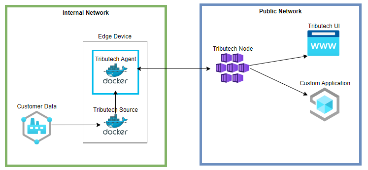

# Tributech Agent

The Tributech Agent is responsible for securing the data collected by Tributech Sources and sending the collected data to a [Tributech Node](../tributech_node/overview.md) where it can be inspected and verified via the Tributech UI.
Agents also provide a secure bidirectional communication channel between the Tributech Node platform and Tributech Agent which enables not only the secure gathering of data points and proofs, but also the issuing of commands back to the connected [Tributech Sources](source_integration.md). 

:::info The diagram illustrates our default setup, for more infos visit [Deployment](../tributech_node/overview.md#deployment)
:::

We provide differnt types of [Tributech Sources](source_integration.md) for the most commonly used communication protocols.

| Source    | Guide                                                                                          |
| --------- | ---------------------------------------------------------------------------------------------  |
| MQTT      | The [**MQTT Source Guide**](./sources/mqtt_source.mdx) integrates data provided via [MQTT](https://docs.oasis-open.org/mqtt/mqtt/v5.0/mqtt-v5.0.html).  |
| OPC-UA    | The [**OPC-UA Source Guide**](./sources/opcua_source.mdx) integrates data provided by an OPC-UA conform interface.       |
| Beckhoff ADS | The [**ADS Source Guide**](./sources/ads_source.mdx) integrates data provided by an Beckhoff ADS PLC Server.    |
| Simulated Sensor | The [**Simulated Source Guide**](./sources/simulated_source.mdx) integrates data provided by test sources generating random data.        |
| REST  | The [**REST Source Guide**](./sources/rest_source.mdx) integrates data provided via [HTTP APIs](https://swagger.io/specification/).        |

If those Sources don’t meet your requirements there is also the possibility to implement [Custom Source](./source_integration.md) and handle the data integration by yourself.

## Requirements
In Order to test our Tributech Platform we provide a private azure container registry access to our Tributech Agent and [Sources](source_integration.md). In [Requirements](requirements.mdx) we define hard- and software requirements and show how to
gain access to the Tributech container images.

## Quickstart

The Tributech [Quickstart guide](./quickstart.mdx) contains a short tutorial on how to setup and configure a Tributech Agent with a [Simulated Source](./sources/simulated_source.mdx) in a [Docker Compose](https://docs.docker.com/compose/) environment. 
This guide will show the user with a simple example how randomly generated data on an edge device can be
gathered, notarized and verified in the [Tributech Node](../tributech_node/overview.md) UI.

## Setup
An Tributech Agent is the link inbetween the customer data and the persistence storage in a [Tributech Node](../tributech_node/overview.md).
In the [Setup guide](setup.mdx) we will show the different ways to configure a Tributech Agent. This includes authentication and connection with a [Tributech Node](../tributech_node/overview.md) as well as a process based description of what the purpose of the Tributech Agent is. 

Our Agent is a Docker service with a broker and a source. As mentioned the Agent is a docker service and can be combined with any Docker orchestration service like [Docker Compose](https://docs.docker.com/compose/) or IoT device management platforms like [Azure IoT Edge Runtime](https://learn.microsoft.com/en-us/azure/iot-edge/iot-edge-runtime?view=iotedge-1.4). The general Integration of our Agent is described in the section [Setup](setup.mdx/).

