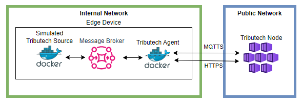
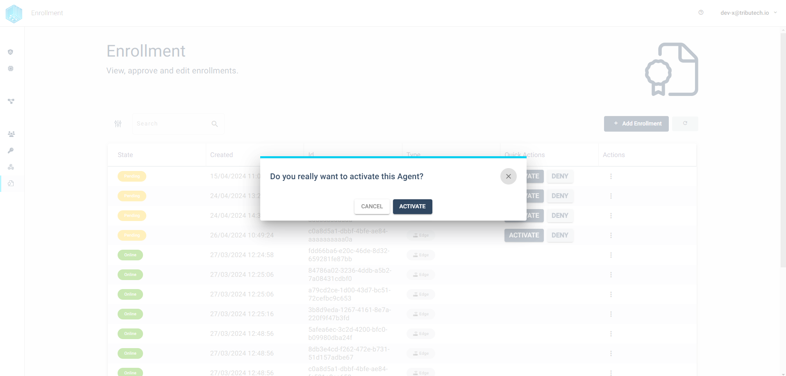

import CodeBlock from '@theme/CodeBlock';
import SourceDockerCompose from '!!raw-loader!./examples/agent/docker-compose-quickstart.yml';
import DockerLogin from '!!raw-loader!./examples/docker/docker-login-cmd';
import EnvSample from '!!raw-loader!./examples/agent-management/agent-service-sample-values-quickstart.yml';

In this QuickStart Guide we give a shortened overview on how to setup a Tributech Agent with a [Simulated Source](./sources/simulated_source.mdx) and connect it to a Tributech Node to display the random generated data.
For a more detailed description on how to setup the Tributech Agent visit [Setup](./setup.mdx).

## Requirements
In Order to link a Tributech Agent to a Tributech node we need the following:

- Access to an existing [Tributech Node](../tributech_node/overview.md)
- Access to an environment with [Docker Compose](https://docs.docker.com/compose/), which meets the [Tributech Agent Requirements](requirements.mdx)

:warning: We will use different Container Images and configurations in our examples for the quick start compared to the [Setup](setup.mdx) documentation. Please use a new empty folder for the files to prevent any configuration mix up.

## Docker-Compose Up
We start by setting up the docker-compose environment for the Tributech Agent and Tributech Simulated Source as follows:
- ***Authenticate docker*** to retrieve the relevant docker images from the private [Tributech Docker Registry](./requirements.mdx#docker-login).

    <CodeBlock className="bash" title="terminal">{DockerLogin}</CodeBlock>   

- Setup the ***docker-compose.yml*** file by creating a `docker-compose.yml` file with the following content (adjustments required):

    <CodeBlock className="language-yml" title="docker-compose.yml">{SourceDockerCompose}</CodeBlock>

    Replace the placeholder values for `EdgeDeviceOptions__AgentID` with a [GUID](https://www.ietf.org/rfc/rfc4122.txt) for the agent unique Id thats not used by any other agent connected to the Node and the `EdgeDeviceOptions__NodeUrl` points to the [Triubtech Node](../tributech_node/overview.md) Url, for example

    <CodeBlock className="language-plain" title="env specific settings">{EnvSample}</CodeBlock>
    
 - ***Startup*** the environment

    <CodeBlock className="bash" title="terminal">
        docker-compose up -d
    </CodeBlock>

- ***Validate*** that all containers are running. The output should return that every container is in the state `Up`
    <CodeBlock className="bash" title="terminal">
        docker-compose ps
    </CodeBlock>

## Activate Agent

After starting the Tributech Agent we need to accept the Agent in the Tributech Node in order to receive data. For this we need to go to the Enrollment section of the Tributech Node and search for our agent.
The Agent should be in the top most entries of the list and should be in the "Pending" state. Clicking on the ***Activate*** button is enough to enrole the agent on the Tributech Node.

## Source Configuration
The previous steps established the communication between a Tributech Agent and a Tributech Node. Next we will setup a [Tributech Source](source_integration.md) to provide data for the Tributech Agent. The Tributech Agent will then be used to send the data to the Tributech Node. In the following section we complete our Tributech Agent QuickStart Setup by configuring a simple double stream for the [Tributech Simulated Source](sources/simulated_source.mdx) (The Agent name depends on the value of the `EdgeDeviceOptions__AgentID` agent environment variable defined in the previous section).

Next we need to configure the Agent to receive data for the Tributech Simulated Source we defined in the docker-compose setup:

We have prepared a Simulated Source configuration containing a double data stream, save the following [TwinConfiguration Template File](examples/agent-source/quick-start.json) locally and import it in the Agent Configuration:

After successfully importing the `TwinConfiguration Template File` click the `APPLY CONFIGURATION` Button in the top right corner to persist the changes.

We can now select the Simulated Stream of our newly configured `QuickStart Simulated Source` Agent

The Stream generates a new data point between 1 and 10 every second.

## Verify
In order to detect [data tampering](https://www.tributech.io/blog/cybersecurity-threat-data-tampering) we provide the possibility to audit each stream proofs individually. We provide the two possibilities to view the audit results:

- A Graph view, which displays pending validation in grey, successful validations in green and failed in red.
    

- A Table view, which includes a list of all proofs. For each proof the validation can be retriggered with a button click or display the history of validations by selecting a table entry.
    

    

This completes the QuickStart, for a more detailed guide and information about the audit process visit [Stream Verification](../tributech_node/agent/verification.mdx). For more information on how to add other types of Tributech Sources visit [Source Integration](source_integration.md).
