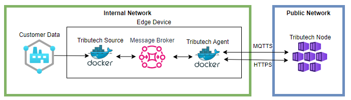
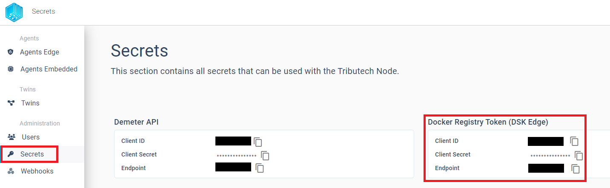

import CodeBlock from '@theme/CodeBlock';
import SourceDockerCompose from '!!raw-loader!./examples/agent/docker-compose-agent-integration.yml';

In the following section we describe the hard- and software requirements to run a [Tributech Agent](overview.md) and a [Tributech Source](source_integration.md) on a edge device. An edge device serves as an endpoint on the network, bridging the gap between the [Tributech Node](../tributech_node/overview.md) and the real world (here representated as Customer Data). 

We will show how to gain access to the private Tributech Docker Images and what requirements need to be satisfied to 
send Customer Data to a running [Tributech Node](../tributech_node/overview.md).

:warning: ***Access to a running Tributech Node Instance is required***
 
 If you have any questions regarding infrastructure requirements, please talk to your contact person at Tributech or create a support ticket.

## Edge Device Requirements

First we need to setup an environment that supports running [Docker Containers](https://www.docker.com/resources/what-container/)
in order to start the private Tributech Docker Images for the [Tributech Agent](overview.md) and a [Tributech Source](source_integration.md) on the edge device, e.g. [Linux](https://docs.docker.com/desktop/install/linux-install/).

Additional to the Docker Runtime requirements the environment must meet the following hardware and software requirements:

#### Hardware Requirements
The following table shows the recommended minimum hardware requirements for the overall system.

| Type | Minimum Requirement              | Additional Information |
| :--- | :------------------------------- | :--------------------- |
| CPU  | 1 Core (x86-64 / ARM 32/64) or more | The minimum requirements for small and medium workloads.  |
| RAM  | 1 GB                             | The minimum requirements for small and medium workloads. |
| Storage | 221 MB | A typical setup requires around 500MB consisting of the Tributech Agent = 221 MB, the Tributech Source = 227 MB and the Mosquitto broker = 11,6 MB. |

Dependended on the frequency of data processing the requirements will increase and requirements may be different dependend on the [Tributech Source](source_integration.md) used. The following table shows an example for a Tributech Agent with one simulated source.

|Value per second|CPU load(1 core 2.2GHz)|RAM|
| :------------- | :-------------------- |:- |
| 1              | 0,54%                 | 103,1MB|
| 10             | 2,45%                 | 112,2MB|
| 100            | 13,55%                | 129MB|

#### Software Requirements

| Type    | Requirement  | Additional Information |
| :------ | :----------- | :--------------------- |
| OS | Any current Linux Distribution | We recommend to select a managed solution from an IoT device or infrastructure provider which also takes care of operating system updates for example a vendor like [Welotec](https://www.welotec.com/). |
| Runtime | Any current Docker environment | We recommend a managed solution for docker container orchestration e.g.: [Azure IoT Edge Runtime](https://azure.microsoft.com/de-de/products/iot-edge) |
| File System | any suppoerted docker file system  | The user/instance which runs the docker containers must have read and write permission for the volume where the docker containers are situated.  |

#### Network requirements
In the following Table we provide an overview of the required port for the communication between 
Tributech Node (public network) to the Tributech Agent (private network) (see [Overview](../introduction.md)).
This communication will take place via a public accessable network.

:warning: All of this ports are required for a Tributech Agent

|Port|Protocol|From|To|direction|Information|
| :------ | :----------- | :----------- |  :----------- |:----------- | :--------------------- |
|443|HTTPS|Tributech Agent/Source| Azure Container Registry | Outbound | Access to the private Azure Container Registry containing [Tributech Docker Images](#docker-login)|
|1883|MQTTS|Tributech Agent|Tributech Node|Outbound|Communication protocol used between Tributech Agent and Node. MQTTS is the secure version of the MQTT protocol using TLS.|

#### Tributech Agent Source Requirements
For the Tributech Agent Source we require dependend on the source different ports. Its important to note
that those ports need only be exposed in a private network between the customer data location and the edge device.

:warning: No Source requires access to a public network.

|Port|Protocol|From|To|direction|Source|
| :------ | :----------- | :----------- |  :----------- |:----------- | :--------------------- |
|5000|HTTP|Customer|Tributech Source|Inbound|[Tributech REST Source](./sources/rest_source.mdx)|
|1883|HTTP|Customer|Tributech Source|Inbound|[Tributech MQTT Source](./sources/mqtt_source.mdx)|
|62541|TCP|Customer|Tributech Source|Outbound|[Tributech OPCUA Source](./sources/opcua_source.mdx)|
|48898|ADS|Customer|Tributech Source|Outbound|[Tributech ADS Source](./sources/ads_source.mdx)|
|851|ADS|Customer|Tributech Source|Outbound|[Tributech ADS Source](./sources/ads_source.mdx)|

#### Container environment
In our examples we use the [**Docker Engine**](https://docs.docker.com/engine/) and [**Docker Compose**](https://docs.docker.com/compose/) for the management/orchestration of the Docker services on an Ubuntu x86 system, for other systems visit the [official docker documentation](https://docs.docker.com/engine/install). 

The [Tributech Agent](overview.md) and [Tributech Sources](source_integration.md) support the following architectures
- ARM 32/64
- x86/x64

##### Docker login

In Order to gain access to the private Azure Container Registry we must visit the `Tributech Node Secrets section`
and use the information provided in the `Docker Registry Token` to authenticate.

:warning: ***Access to a running Tributech Node Instance is required***

In order to gain access to the Tributech Agent docker image we need to provide docker with the credentials to access the private Tributech Docker Registry. The authentication information can be found in the `Secrets` section of the Tributech Node.

We use in our example a docker environment with docker docker compose container orchestration.
In this case the following command provides docker with the required permissions to access the private Tributech Container Images,
for more information on docker authentication visit [docker login](https://docs.docker.com/engine/reference/commandline/login/).