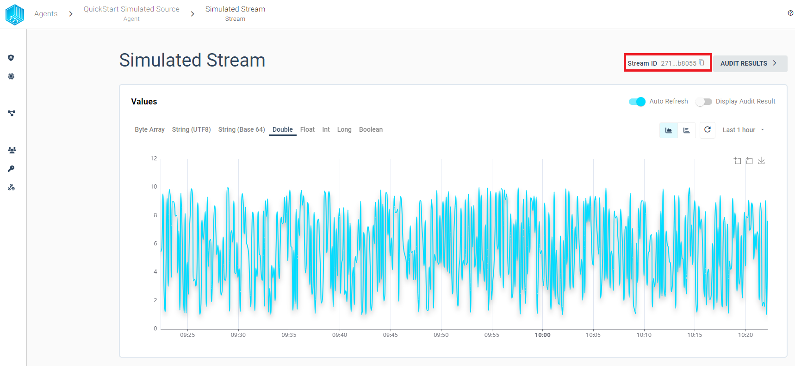
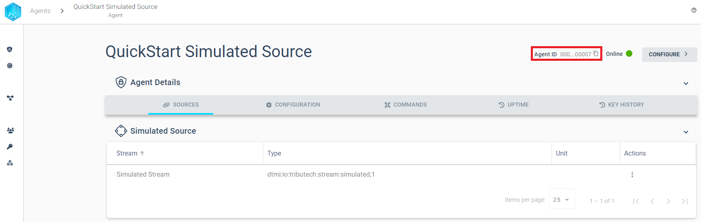
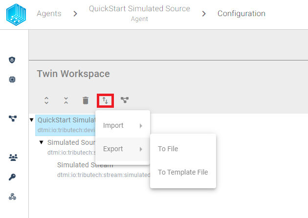
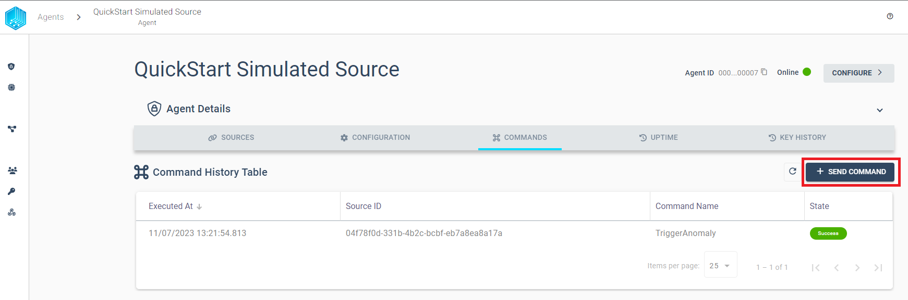
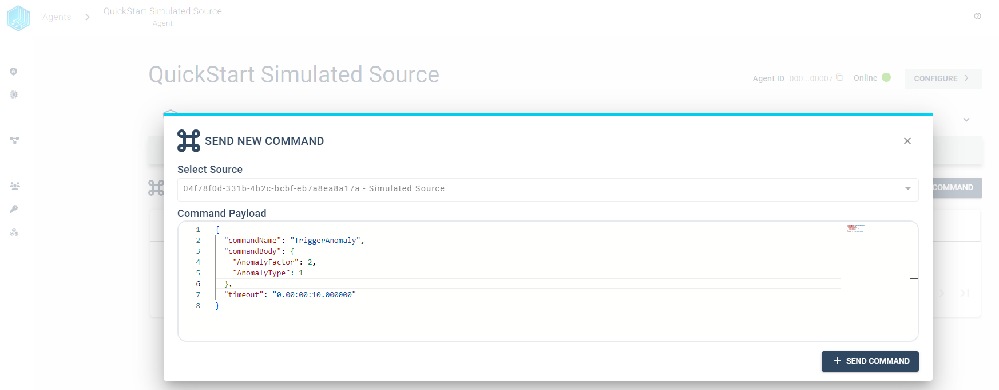
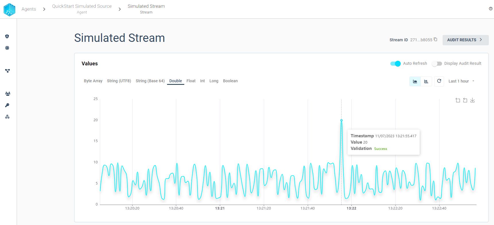
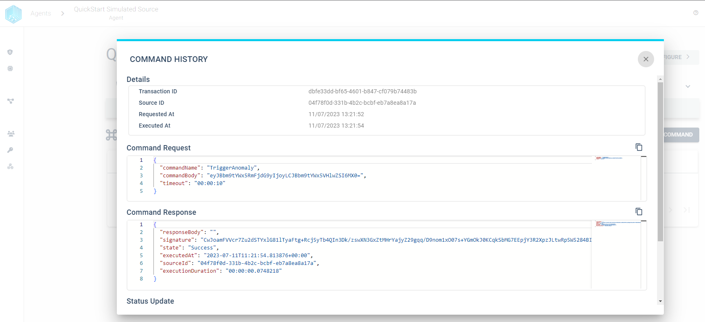
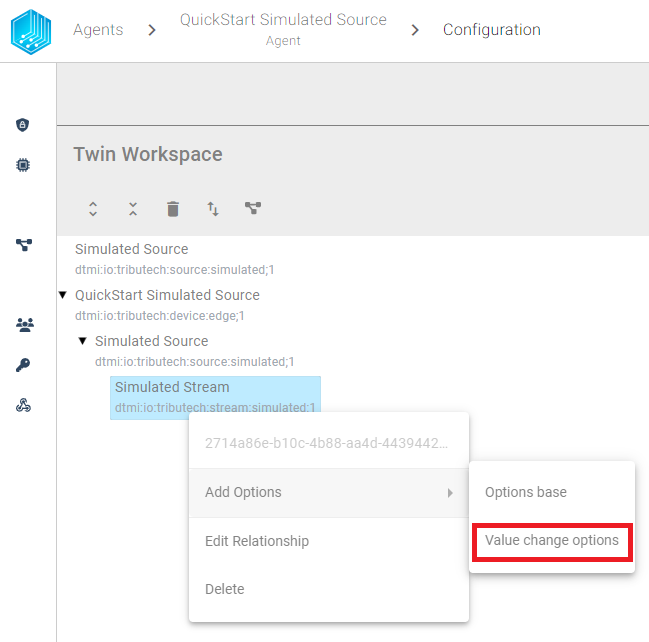
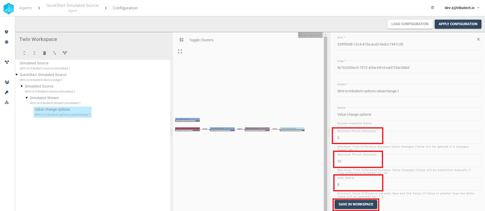

## Source Definition

The Tributech Agent service supports the integration of external data sources with the help of Tributech Sources. In the following section we describe the general properties of Tributech Source and how they are used.

For a detailed guide on how to use the different sources visit:

| Source    | Guide                                                                                          |
| --------- | ---------------------------------------------------------------------------------------------  |
| MQTT      | The [**MQTT Source Guide**](./sources/mqtt_source.mdx) integrates data provided via [MQTT](https://docs.oasis-open.org/mqtt/mqtt/v5.0/mqtt-v5.0.html).  |
| OPC-UA    | The [**OPC-UA Source Guide**](./sources/opcua_source.mdx) integrates data provided by an OPC-UA conform interface.       |
| Beckhoff ADS | The [**ADS Source Guide**](./sources/ads_source.mdx) integrates data provided by an Beckhoff ADS PLC Server.    |
| Simulated Sensor | The [**Simulated Source Guide**](./sources/simulated_source.mdx) integrates data provided by test sources generating random data.        |
| REST  | The [**REST Source Guide**](./sources/rest_source.mdx) integrates data provided via [HTTP APIs](https://swagger.io/specification/).        |

In order to add sources to an linked Tributech Agent we need to select the `CONFIGURE` button every agent contains:


There is an another way for advanced users to configure an Tributech Agent, which we will describe in a later section (see [Twin Models](#twin-model)).

### Custom Sources

It is possible to implement custom source and handle the data integration yourself by implementing a client that sends a predefined json payload to a predefined MQTT Topic of the Tributech Agent.
We show all requirements for a successful custom source integration based on the [QuickStart Simulated Source](quickstart.mdx) in this section.

#### Gain ***access*** to the Tributech Agent  

First, we need access to the same MessageBroker the Tributech Agent uses. We can expose the port of the message broker inside the docker environment (see [Docker Networking](https://docs.docker.com/compose/networking/)) by changing the service mosquitto-server-simulated (complete update [docker-compose.yml](./examples/agent/docker-compose-mqtt-port.yml)):

```yaml
    mosquitto-server-simulated:
        image: eclipse-mosquitto:${MQTT_TAG:-latest}
        networks:
        - simulated-net
        ports: 
        - '1883:1883' # MQTT
        - '127.0.0.1:9001:9001' # web-socket
        restart: unless-stopped
```

#### ***Data Structure***  

Secondly, the Tributech Node requires a certain payload structure in order to have all relevant information 
for processing data. An example of valid json data for the Tributech Agent is shown in the following fragment:

```json
    [
        {
            "DataStreamID":"7d19fe9a-a01f-486d-9140-59ed4255835c",
            "Timestamp":"2023-07-12T08:17:52.790354+00:00",
            "Value":"gV57FU1ScB+n4g=="
        }
    ]
```

The json payload contains the following fields:

- The ***DataStreamID*** is a unique identifier for streams and can be copied from the top right corner of a stream:
   
- The ***Timestamp*** is a an [ISO 8601-1:2019](https://www.iso.org/iso-8601-date-and-time-format.html) formatted string
- The ***Value*** is a Base64-encoded raw-bytes of the actual value. 
      For the data encoding and conversion to other formats we use the industry standards as implemented by the [**.NET Framework BitConverter**](https://docs.microsoft.com/en-us/dotnet/api/system.bitconverter?view=net-5.0).
      The code fragment shows how the different types are converted into a byte array:

```csharp
using System;
using System.Text;
                
public class Program
{
    public static void Main()
    {
        Console.WriteLine(Convert.ToBase64String(GetBytes(2.3d)));
    }
    
    public static byte[] GetBytes<T>(T value)
    {
        if (value == null)
        {
            return Array.Empty<byte>();
        }

        return value switch
        {
            byte[] tValue => tValue,
            byte tValue => new [] { tValue },
            short tValue => BitConverter.GetBytes(tValue),
            ushort tValue => BitConverter.GetBytes(tValue),
            float tValue => BitConverter.GetBytes(tValue),
            double tValue => BitConverter.GetBytes(tValue),
            uint tValue => BitConverter.GetBytes(tValue),
            int tValue => BitConverter.GetBytes(tValue),
            long tValue => BitConverter.GetBytes(tValue),
            ulong tValue => BitConverter.GetBytes(tValue),
            bool tValue => BitConverter.GetBytes(tValue),
            string tValue => string.IsNullOrWhiteSpace(tValue)
                ? Array.Empty<byte>()
                : Encoding.UTF8.GetBytes(tValue),
            _ => throw new ArgumentOutOfRangeException(nameof(value), "Type is not supported")
        };
    }
}
```
    


####  ***Send data***

By sending the previously described json payload to Topic endpoint `edge/{agent-id}/value/ValueSource` you can provide the data to the Tributech Agent directly. The Agent-Id can be found in the right top corner of an agent:



Note you can use tools like [MQTT Explorer](https://mqtt-explorer.com/) to send the data to the Tributech Agent Topic.

## Twin Model

The configuration of all Tributech Source is based on [Digital Twins](https://azure.microsoft.com/en-us/products/digital-twins). The best way to see how sources are configured is to export existing configuration, e.g. [QuickStart Configuration](quickstart.mdx):



We support two different exports:

- ***To File***: Exports the current workspace Twin configuration to a json file.
- ***To Template File***: Exports the current workspace Twin configuration to a json file and replaces the unique ***dtId's*** for all elements with placeholder.

We also support three different types of imports:

- ***From File***: Import Twin configuration into the current workspace from a json file (same format as ***Export - To File***).
- ***From Text***: Import a json formatted text containing a ***digitalTwinsGraph***, e.g. part of the ***Export - To File*** (the value of the property ***digitalTwinsGraph***)
- ***From Template File***: Import Twin configuration into the current workspace from a json file and replaces ***dtId's*** placeholders with unique id's  (same format like ***Export - To Template File***)

Note: The Twin Model can also be set directly for the Tributech Sources by submitting the value of the property ***digitalTwinsGraph*** to the MessageBroker of the Tributech Source and the topic `__edge/{agent-id}/twin/SetTwin__` (see the following Screenshot). However, we recommend this only for advanced users because an invalid twin config can render the Tributech Source non-operational.


## Commands

The Tributech Node is capable of sending commands to some Tributech Sources to control their behaviour.
Commands can be send with one button in the  `COMMANDS` tab of an specific agent, e.g. Send command to [QuickStart Simulated Source](quickstart.mdx) 



With the following payload we trigger an anomaly, in the simulated source, that changes the next generated value to double the maximum value of the simulated stream, i.e. 20 based on the [QuickStart Simulated Source](quickstart.mdx). A simulated source example: 



When we switch back to the `SOURCES` tab and select our `Simulated Stream` we see the anomaly with value 20.



We can also inspect the result of the source command by selecting the execution in the `COMMANDS` tab and select execution time.



## Value Change Options

All Tributech Sources support `Value Change Options` (`VCO`) that can be used to apply additional adjustments to Streams, if the `Stream Data Encoding` is set. If `VCO` can not be applied the data is submitted to the Tributech Agent without changes. In the following example we assume that a [QuickStart Simulated Source](quickstart.mdx) is set up, an describe the `VCO` behavior based on a double stream defined in a simulated source. 

We first need to add the `VCO` to the stream by right clicking the `Simulated Stream`



The value change options consist of three properties that can be set for a stream. We can either set all options or a subset of them.



The properties change the data stream the following way based on the values from the screenshot:
- ***Minimum Period (Seconds)*** - defines the period in which additional values are discarded, i.e. if data is sent faster than 5 seconds then it will be discarded and the next submitted value is the value that arrives after 5sec. 
- ***Maximum Period (Seconds)*** - defines the period after which the last successful submitted value is resend, i.e. if no value was received in the last 10sec or all values have been filtered by other VCO then the last successful value will be resubmitted. 
- ***Step (Delta)*** - defines the minimum difference between values to be submitted, the change is always compared to the last successful submitted value, i.e. if the double values 1, 2, 5, 8, 9, 11, 14 are received by the Tributech Source only 1 and 9 will be submitted.

Note: The ***Minimum Period (Seconds)***, ***Maximum Period (Seconds)*** handling is the same for all Sources and Stream Data Encodings and will not be described further. However, the handling of ***Step (Delta)*** may differ between the Tributech Sources and Stream Data Encodings and will therefor be explained in each Source separately, i.e. [MQTT Source VCO](./sources/mqtt_source.mdx#value-change-options),
[OPC-UA Source VCO](./sources/opcua_source.mdx#value-change-options),
[ADS Source VCO](./sources/ads_source.mdx#value-change-options),
[Simulated Source VCO](./sources/simulated_source.mdx#value-change-options),
[REST Source VCO](./sources/rest_source.mdx#value-change-options).