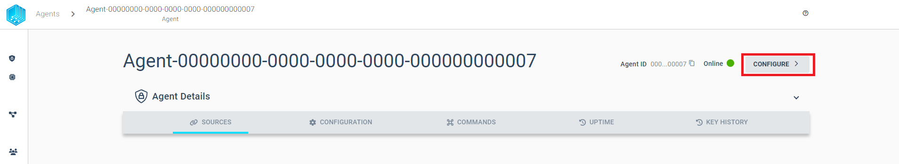
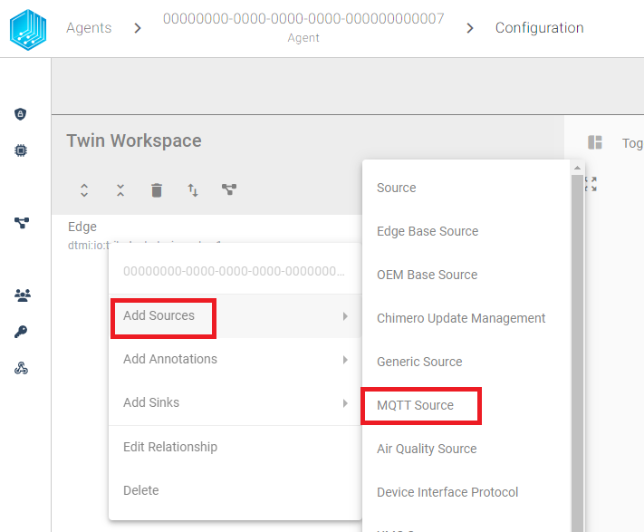
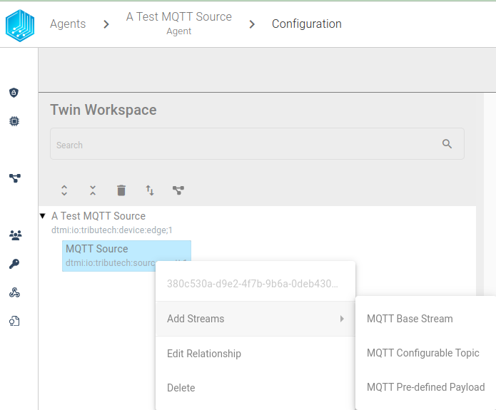
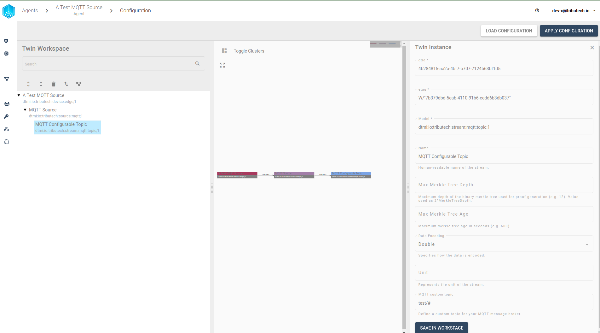
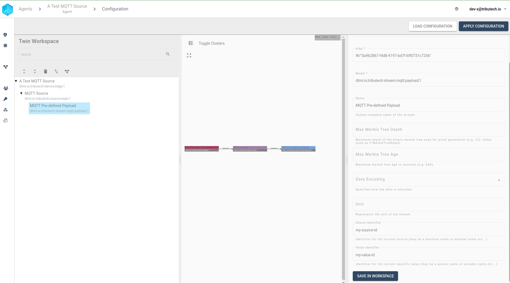
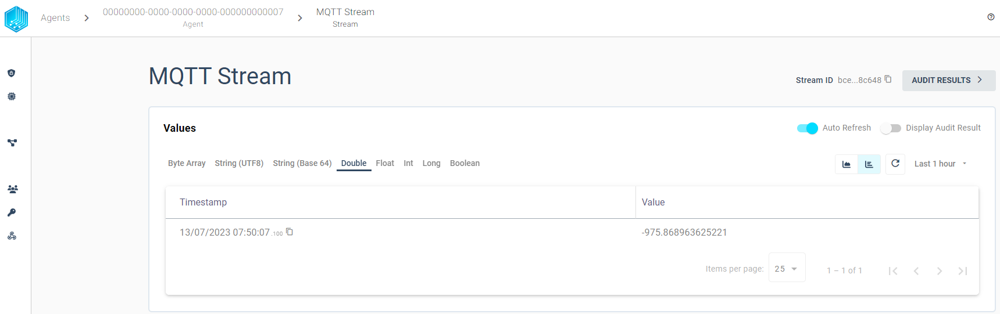
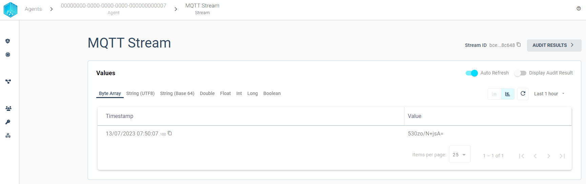
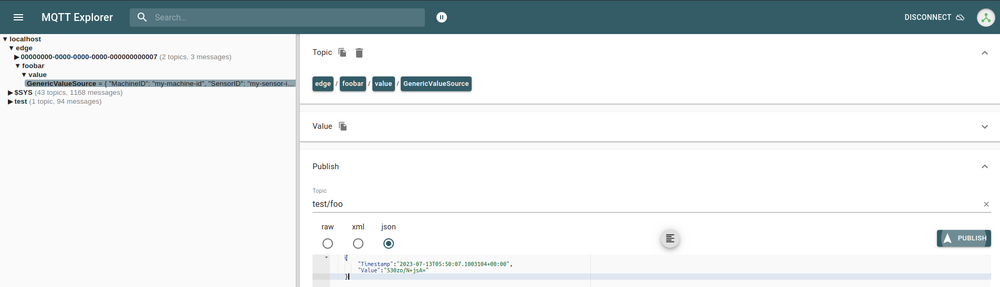
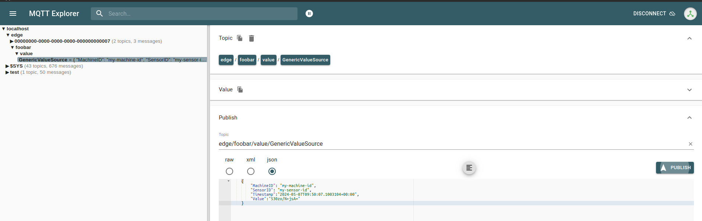
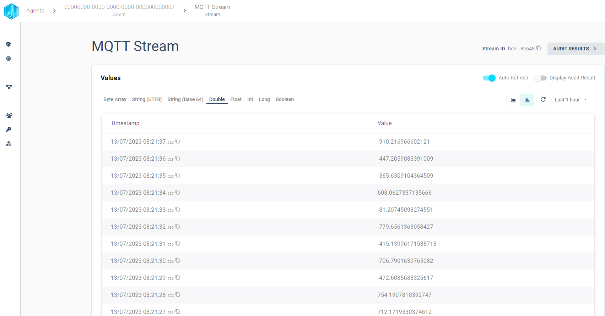

import CodeBlock from '@theme/CodeBlock';
import SourceDockerCompose from '!!raw-loader!../examples/agent-source/mqtt/docker-compose.yml';
import SourceEnv from '!!raw-loader!../examples/agent-source/mqtt/env';
import SoourceDockerComposeMock from '!!raw-loader!../examples/agent-source/mqtt/docker-compose.override.yml';

The Tributech Agent supports the integration of external data sources using the [**MQTT messaging protocol**](https://mqtt.org/) with the  Tributech MQTT Source. The MQTT Source itself is configured via the Twin Configuration and will be described in the following sections.

## Setup
The Tributech MQTT Source image can be started without any dependencies but will not be functional without a valid Twin Configuration or MessageBroker connect to the Tributech Agent. The TwinConfiguration can be provided via the Tributech Node (recommended) or MessageBroker (see [Source Integration](../source_integration#twin-model)). The MQTT Source will automatically connect to the Tributech Agent if the Tributech Agent is running and the MQTT Source is configured with the correct MessageBroker settings.

In the following part we will describe the setup of a Tributech MQTT Source.

 - Setup the ***docker environment*** by creating a `.env` file with the following content and replace the placeholder values with your values:

<CodeBlock className="language-plain" title=".env">{SourceEnv}</CodeBlock>

- Setup the ***docker-compose.yml*** file by creating a `docker-compose.yml` file with the following content in the same folder as the  `.env` file:

<CodeBlock className="language-yml" title="docker-compose.yml">{SourceDockerCompose}</CodeBlock>

## Configuration
After setting up the Tributech MQTT Source we need to activate it in the Tributech Node (see [QuickStart](../quickstart.mdx#link-agent)) and configure the TwinConfiguration.



We can now add by right clicking the Device Edge entry a new MQTT Source.



After right clicking on the MQTT Source entry we can add a new MQTT Stream.




We have two possible choice
- **MQTT Configurable Topic Stream**: A stream with a custom topic that supports wildcards for the MQTT Topic, e.g. `test/#` or `test/+/TEMP`
- **MQTT Pre-defined Payload**: A stream with a predefined payload keypair that will be used as an identifier and be sent to a common MQTT Topic


### Configurable Topic Stream

In this section we configure a Stream that is linked to a freely customizable MQTT Topic. The following example shows how to setup a stream for a double value with the display name MQTT Stream and the MQTT Topic `xxo`. For custom topics, two wildcards are supported:

- A `#` character represents a complete sub-tree of the hierarchy and thus must be the last character in a subscription topic string, such as `test/#`. This will match any topic starting with `test/`, such as `test/1/TEMP` and `test/2/HUMIDITY`.

- A `+` character represents a single level of the hierarchy and is used between delimiters. For example, `test/+/TEMP` will match `test/1/TEMP` and `test/2/TEMP`.

We can save the settings by clicking on the `SAVE IN WORKSPACE` button in the bottom.



We can repeat this process for all required streams for the MQTT Source. An important note is that the MQTT Source will only work when there are no overlapping topics, i.e. `test/#` and `test/+/TEMP` are not allowed to be configured for the same MQTT Source.

After we have configured the MQTT Source we can apply the configuration to the Tributech Agent by clicking on the `APPLY CONFIGURATION` button in the top right corner.

This completes the configuration of the MQTT Source and we can now send data to the MQTT Source either via an MQTT Client Application like [MQTTX](https://mqttx.app/), [MQTT Explorer](http://mqtt-explorer.com/) or with our [Tributech MQTT MockClient](#mockclient). The Tributech MQTT Source MockClient is currently only for testing purposes and works only in combination with our Tributech MQTT Source.


### Pre-defined Payload Stream

In this section we configure a Stream that is linked to a predefined payload keypair. The difference to the Topic Stream is that this Stream will not be linked to a custom MQTT Topic but to a common MQTT Topic. The following example shows how to setup a stream for a double value with the keypair `my-source-id` and `my-source-id` as stream identifier. The MQTT Topic is set per default to `edge/+/value/GenericValueSource`. For payload streams, two identifier are supported and need to be unique for each stream. The following keypairs are:



We can now send data to the MQTT Source either via an MQTT Client Application like [MQTTX](https://mqttx.app/), [MQTT Explorer](http://mqtt-explorer.com/) or with our [Tributech MQTT MockClient](#mockclient) to the common MQTT Topic `edge/+/value/GenericValueSource`. The Tributech MQTT Source MockClient is currently only for testing purposes and works only in combination with our Tributech MQTT Source.


### Value Change Options
The basic handling of Value Change Options (VCO) can be found in [Source Integration](../source_integration.md#value-change-options). This section contains the concrete handling of the ***Step (Delta)*** for the simulated source. The following list contains the description for each supported ***Stream Data Encoding*** where ***X*** represents the value for ***Step (Delta)***:

- ***Double***, ***Int32***, ***Long***, ***Float***: defines the minimum difference between values to be submitted, the change is always compared to the last successful submitted value, e.g. if ***X***= 3 if the double values 1, 2, 5, 8, 10, 11, 14 are received by the Tributech Source only 1, 5, 8, 11, 14 will be submitted.
- ***Byte Array***: will only be submitted if the current and last submitted value are not equal
- ***String UTF 8***: will only be submitted if the current and last submitted value are not equal
- ***Boolean***: will only be submitted if the current and last submitted value are not equal


## Providing Data
In the following section we want to outline two different ways to provide data to the MQTT Source. The first way is to use the [**MQTT Explorer**](http://mqtt-explorer.com/) to send data to the MQTT Source. The second way is to use the MQTT MockClient to send data to the MQTT Source. In our example we can access the MQTT MessageBroker on port 1833 (need to match your `mosquitto-server-mqtt` service in the [`docker-compose.yml`](../examples/agent-source/mqtt/docker-compose.yml)).

### MQTT Explorer
With the [**MQTT Explorer**](http://mqtt-explorer.com/) we can directly send json payload to a specific topic. The MQTT Explorer can connect to the MessageBroker on port 1833 (need to match your `mosquitto-server-mqtt` service in the `docker-compose.yml`).

The MQTT Source will now receive the data, process it and send it to the Tributech Agent. The Tributech Agent will forward the data to the Tributech Node where with can inspect the values. We can follow this data flow on the left hand side of the MQTT Explorer by observing which topics receive data, i.e. `edge/{agent-id}/value/ValueSource` is our Tributech Agent.
The data can be viewed in the Tributech Node by clicking on the `MQTT Stream`.

Per default we will show directly the `Stream Data Encoding` datatype tab with the timestamp and value.


 We can switch to the `Byte Array` tab to see the data we have submitted.
The value and timestamp (in UTC) are displayed and match our submitted data.



#### Sending Configurable Topic Stream Example
The example will submit the following payload data to the MQTT Source previously configured in [Setup](#Setup) :

```json
    {
        "Timestamp":"2023-07-13T05:50:07.1003104+00:00",
        "Value":"530zo/N+jsA="
    }
```

**It must be mentioned here that the value in the above json structure is a base64 encoded value. Every value that is sent to the Tributech agent must be encoded so that it can be used by the agent. First the value must be converted to a byte array and then the byte array must be base64 encoded.**

The timestamp can also be changed to fit all specific time zones, this can be done with the last part in the timestamp, here the time difference can be added, for example: «Timestamp»:«2023-07-13T05:50:07.1003104+02:00». It is important that the timestamp also contains microseconds. These can be zeros, but the microseconds are crucial for the timestamp to be processed by the system.

We can post the data to the MQTT Source by clicking on the `Publish` button in the top right corner.



#### Sending Pre-defined Payload Stream Example
The example will submit the following payload data to the MQTT Source previously configured in [Setup](#Setup) :

```json
    {
        "MachineID": "my-machine-id",
        "SensorID": "my-sensor-id",
        "Timestamp":"2023-07-13T05:50:07.1003104+00:00",
        "Value":"530zo/N+jsA="
    }
```




### MockClient
We provide an additional `docker-compose.override.yml` below to include a MockClient. This setup can be used to send data to the MQTT Source without external tools. The MockClient is only for testing purposes and should not be used in production. In order to start the the MockClient with the Tributech MQTT Source copy the `docker-compose.override.yml` file in the same folder as the `docker-compose.yml` before using the `docker-compose up` command.

The following configuration shows how to setup the MockClient and send data to the MQTT Source for double stream. This example can be extended by adding new entries with an increasing index for the `MockOptions__Streams__{index}__StreamEncoding` environment variables. The following example shows how to add a Configurable Topic and Pre-defined Payload Stream the a MockClient:

<CodeBlock className="language-yml" title="docker-compose.override.yml">{SoourceDockerComposeMock}</CodeBlock>

After starting the MockClient we can see the data in the Tributech Node Stream we set up before in the configure section.



#### Modify docker-compose.override.yml
We can adjust the data generation to our needs by modifying the `docker-compose.override.yml` file, see [Docker](https://docs.docker.com/compose/) for details on how to setup the environment for docker-compose.

Dependend on which type of stream we want to send we can adjust the following environment variables either we need to set the `MockOptions__Streams__{index}__Topic` for the Configurable Topic Stream or `MockOptions__Streams__{index}__MachineID` and `MockOptions__Streams__{index}__SensorID` for the Pre-defined Payload Stream. The following example shows how to add a second stream to the MockClient:

```yaml
    ...
    environment:
      ...
      # Stream 1
      - MockOptions__Streams__0__Topic=xxo/foo
      - MockOptions__Streams__0__StreamEncoding=3 # double

      # Stream 2
      - MockOptions__Streams__1__MachineID=my-machine-id
      - MockOptions__Streams__1__SensorID=my-sensor-id
      - MockOptions__Streams__1__StreamEncoding=3 # double
      ...
```

We have some common settings for both streams that need to be set in the `environment` variables to change the stream generation behaviour:

- __StreamEncoding__: Sets the datatype which will be generated based on a numeric value:

  | Value | Datatype |
  |----------|----------|
  | 1        | byte-array     |
  | 2        | float     |
  | 3        | double     |
  | 4        | int     |
  | 5        | long     |
  | 6        | string_utf8     |
  | 8        | boolean     |

- __Interval__: The interval (default 10sec) in which the values are generated in TimeSpan format, e.g. 00:00:05 for 5 seconds, see [Microsoft](https://learn.microsoft.com/en-us/dotnet/standard/base-types/standard-timespan-format-strings) for details on TimeSpan format
- __MinValue__ (default 5): The minimum value that can be generated (for bytearrays and string this is the length of the array/string, default 1)
- __MaxValue__ (default 25): The max value that can be generated (for bytearrays and string this is the length of the array/string)

In Order to add more streams the environment `MockOptions` setting can be adjusted based on the AppSettings.json configuration capabilities, see [Microsoft](https://learn.microsoft.com/en-us/aspnet/core/fundamentals/configuration/?view=aspnetcore-7.0) for details on how to setup the environment variables. The following setup shows how to add a second stream float stream to the MockClient:

```yaml
    ...
    environment:
      ...
      # Stream 1
      - MockOptions__Streams__0__Topic=xxo/foo
      - MockOptions__Streams__0__StreamEncoding=3 # double

      # Stream 2
      - MockOptions__Streams__0__Topic=xxo/foo
      - MockOptions__Streams__0__StreamEncoding=2 # float
      ...
```


