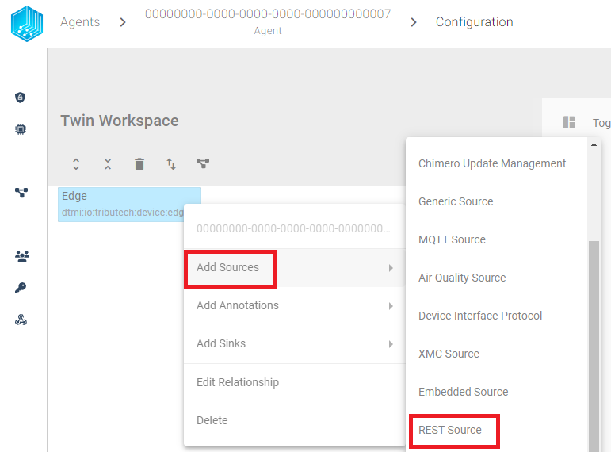
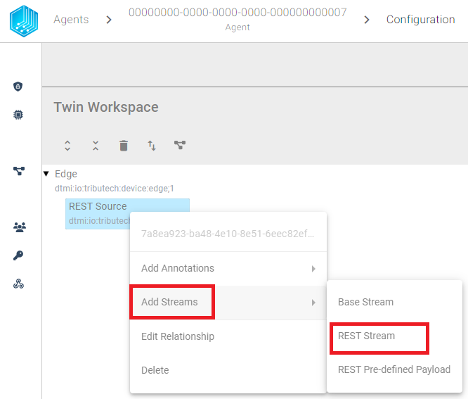
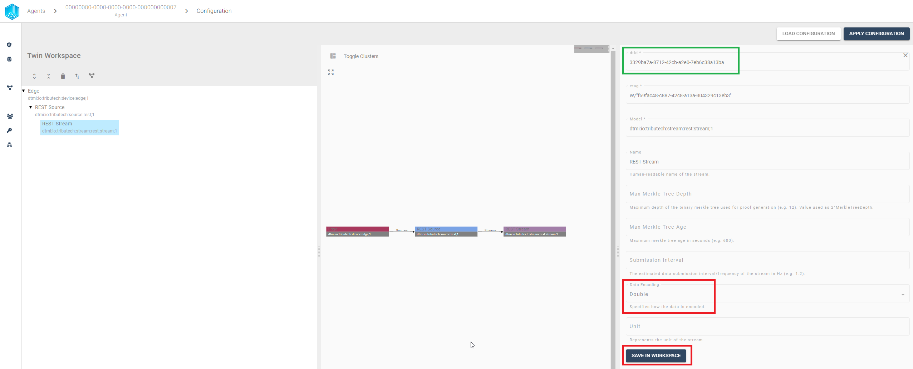
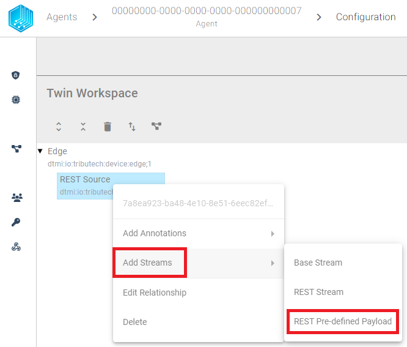
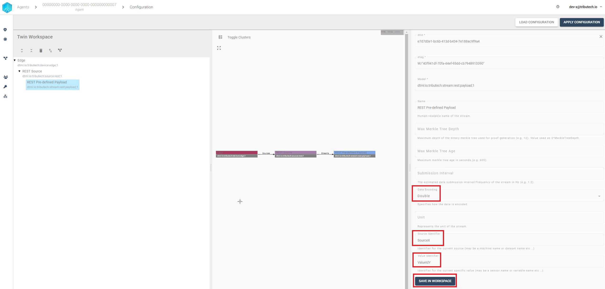
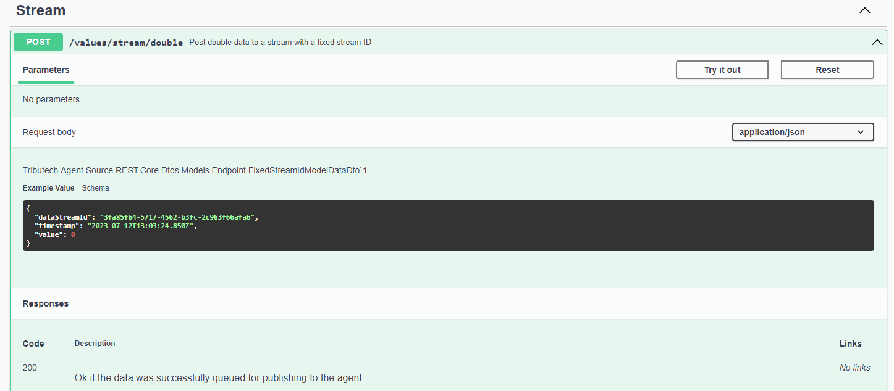
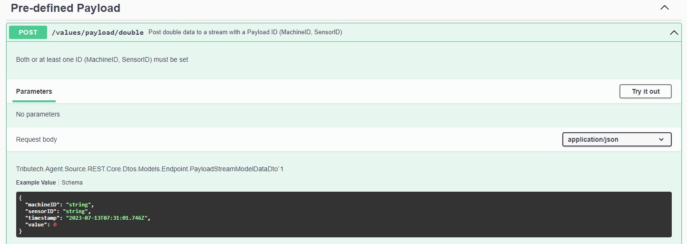
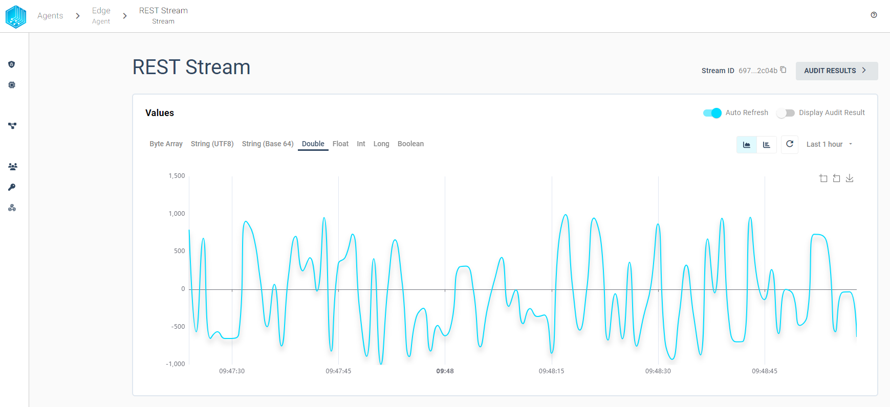
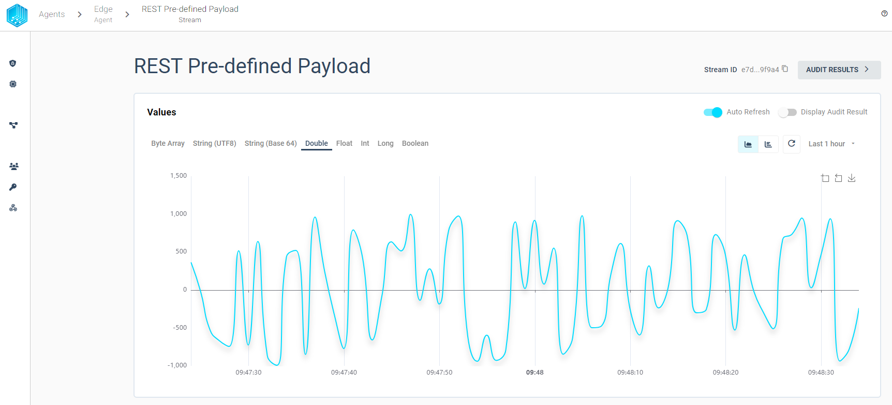

import CodeBlock from '@theme/CodeBlock';
import SourceDockerCompose from '!!raw-loader!../examples/agent-source/rest/docker-compose.yml';
import SoourceDockerComposeMock from '!!raw-loader!../examples/agent-source/rest/docker-compose.override.yml';
import EnvSample from '!!raw-loader!../examples/agent-management/agent-service-sample-values.yml';

The Tributech Agent supports the integration of external data sources using [REST](https://learn.microsoft.com/en-us/azure/architecture/best-practices/api-design#what-is-rest) with the  Tributech REST Source. The REST Source is configured via the Twin Configuration and is used to send data to the Tributech Agent via [MQTT](https://mqtt.org/).
 The data can be send to the Tributech Source either via [Swagger](https://swagger.io/specification/) or with our [Tributech REST MockClient](#mockclient).

 We currently support two types of data format for the REST Source:

- __REST Pre-defined Payload__: Data will be provided in a pre-defined format containing a unique combination of
  MachineId and SensorId to identify the DataStreamId of the Twin Configuration (see [Swagger](#rest-endpointswagger) for details)
- __REST Stream__: Data will be provided with the DataStreamId of the Twin Configuration contained in the data (see
  [Swagger](#rest-endpointswagger) for details)

We will show in [Configuration](#configuration) how to configure the REST Source to accept data for each specific stream type and provide the examples for [Swagger](#rest-endpointswagger) or the [REST MockClient](#mockclient).

The Source will return a status code [200 OK](https://developer.mozilla.org/en-US/docs/Web/HTTP/Status) if the data was successfully received and is queued to be published to the Tributech Agent. The status code does not indicate that the data was successfully transferred to the Tributech Agent or Tributech Node. Queueing the data to be published means that the Source received the data and publishes the data after applying options contained by the Twin configuration if defined, e.g. [ValueChangeOptions](#ValueChangeOptions).

## Setup
The Tributech REST Source image can be started without any dependencies but will not be functional without a valid Twin Configuration or MessageBroker connect to the Tributech Agent. The TwinConfiguration can be provided via the Tributech Node (recommended) or MessageBroker (see [Source Integration](../source_integration#twin-model)). The REST Source will automatically connect to the Tributech Agent if the Tributech Agent is running and correct MessageBroker settings are set.

In the following part we will describe the setup of a Tributech REST Source.

- Setup the ***docker-compose.yml*** file by creating a `docker-compose.yml` file with the following content (adjustments required):
<CodeBlock className="language-yml" title="docker-compose.yml">{SourceDockerCompose}</CodeBlock>

Adjust the setting for the [Tribtech Agent](../overview.md) to your environment, sample value:
<CodeBlock className="language-plain" title="env specific settings">{EnvSample}</CodeBlock>


## Configuration
After setting up the Tributech REST Source we need to activate it in the Tributech Node (see [QuickStart](../quickstart.mdx#link-agent)) and configure the TwinConfiguration. For both Streams we need first to create a new Source in the Tributech Node and then add the Streams to the Source. The following sections will show how to create a new Source and add the Streams to the Source. One Source can include multiple Streams of both types.




### REST Stream
At first we add the REST Stream to our newly created Tributech REST Source. The REST Stream will be used to send data to the Tributech Node based on an unique identifier contained in the json payload. The REST Stream can be added by right clicking the REST Source and selecting ***Add Streams***. The following dialog will appear:



After adding the REST Stream we configure the Data Encoding (in `red`) and save the changes by clicking on the `SAVE IN WORKSPACE` button in the bottom right corner. The REST Stream is now configured but can be only be used to send data to the REST Source after submitting the changes to the Tributech Source via `APPLY CONFIGURATION`. The REST Stream will only accept data that contains the DataStreamId of the REST Stream. The DataStreamId can be found on the top of the REST Stream configuration (in `green`):




After we have configured the REST Source we can apply the configuration to the Tributech Agent by clicking on the `APPLY CONFIGURATION` button in the top right corner.

### Pre-defined Payload Stream
In contrast to a generated identifier of the REST Stream we can now define a two string's used to identify the DataStreamId for the REST Source. The pre-defined payload will be added by right clicking the REST Source and selecting ***Add Streams***. The following dialog will appear:



After adding the REST Stream we configured the Data Encoding, one or both of the identifiers (Source/Value) and save the changes by clicking on the `SAVE IN WORKSPACE` button in the bottom right corner.
The Source Identifier and Value Identifier will be used to uniquely match data to the DataStreamId (not contained in payload).



After we have configured the REST Source we can apply the configuration to the Tributech Agent by clicking on the `APPLY CONFIGURATION` button in the top right corner. The REST Stream is now configured and can be used to send data to the REST Source. The REST Stream will only accept data that contains the same combination of `source identifier` and `value identifier`.

### Value Change Options
The basic handling of Value Change Options (VCO) can be found in [Source Integration](../source_integration.md). This section contains the concrete handling of the ***Step (Delta)*** for the simulated source. The following list contains the description for each supported ***Stream Data Encoding*** where ***X*** represents the value for ***Step (Delta)***:

- ***Double***, ***Int32***, ***Long***, ***Float***: defines the minimum difference between values to be submitted, the change is always compared to the last successful submitted value, e.g. if ***X***= 3 if the double values 1, 2, 5, 8, 10, 11, 14 are received by the Tributech Source only 1, 5, 8, 11, 14 will be submitted.
- ***Byte Array***: will only be submitted if the current and last submitted value are not equal
- ***String UTF 8***: will only be submitted if the current and last submitted value are not equal
- ***Boolean***: will only be submitted if the current and last submitted value are not equal


## Providing Data
In the following section we want to outline two different ways to provide data to the REST Source. The first way is to use the Swagger UI to send data and the second way is to use the Tributech REST MockClient to send data to the REST Source. The following sections will show how to send data to the REST Source for each type of Stream.

### REST Endpoint/Swagger
The REST Source provides a Swagger UI to send data to the REST Source. The Swagger UI can be accessed via the following url: `http://<host>:5080/swagger/index.html`. There are different endpoints available for each type of Stream and type of data (encoding provided values based on  [**.NET Framework BitConverter**](https://docs.microsoft.com/en-us/dotnet/api/system.bitconverter?view=net-5.0)).

#### REST Stream
The data for the REST Stream needs to be submitted in the Endpoint Group `Stream` and contain the DataStreamId (previously marked `green` in the [configuration section](#rest-stream)) of the REST Stream. The Swagger UI will only accept data that contains the same DataStreamId in the json payload as defined in the TwinConfiguration for a REST Stream.
Examples on how to submit data to the REST Source can be found in the Swagger UI under __Stream__ directly, e.g. double stream:




#### REST Pre-defined Payload
The data for the Pre-defined Payload Stream needs to be submitted in the Endpoint Group `Pre-defined Payload` and contain the same identifier combination as the TwinConfiguration (Set the previously, in the [configuration section](#pre-defined-payload-stream), i.e. defined `source identifier` value as `MachineId` and `value identifier` as `SensorId` of the json payload).
Examples on how to submit data to the REST Source can be found in the Swagger UI under __Pre-defined Payload__ directly, e.g. double stream:




### MockClient
We provide an additional `docker-compose.override.yml` to include a MockClient that can send data directly to the REST Source based on the settings of the environment variables. The MockClient is only for testing purposes and should not be used in production. The MockClient is configured via the `docker-compose.override.yml` file and needs to be in the same folder as the `docker-compose.yml` on docker-compose up. The following example shows how to setup the MockClient to send data to the REST Source for a stream double stream, the ***placeholder need to be replaced*** before starting the MockClient:

<CodeBlock className="language-yml" title="docker-compose.override.yml">{SoourceDockerComposeMock}</CodeBlock>

After starting our MockClient we need to go back to the configuration tap in the Tributech Node and apply the Tributech REST Source configuration again to be able to see the generated data. For this just click on the `APPLY CONFIGURATION` button in the configuration window.

#### Modify docker-compose.override.yml
We can adjust the data generation to our needs by modifying the docker-compose.override.yml file, see [Docker](https://docs.docker.com/compose/) for details on how to setup the environment for docker-compose.

We can send different datatypes to specified streams and modify the following `environment` variables to change the stream generation behaviour:

- __StreamEncoding__: Sets the datatype which will be generated based on a numeric value:

  | Value | Datatype |
  |----------|----------|
  | 1        | byte-array     |
  | 2        | float     |
  | 3        | double     |
  | 4        | int     |
  | 5        | long     |
  | 6        | string_utf8     |
  | 8        | boolean     |

- __Interval__: The interval in which the values are generated (in TimeSpan format, e.g. 00:00:05 for 5 seconds, see [Microsoft](https://learn.microsoft.com/en-us/dotnet/standard/base-types/standard-timespan-format-strings))
- __MinValue__ (default -1000): The minimum value that can be generated (for bytearrays and string this is the length of the array/string, default 1)
- __MaxValue__ (default 1000): The max value that can be generated (for bytearrays and string this is the length of the array/string)

In Order to add more streams the environment 'MockOptions' setting can be adjusted based on the AppSettings.json configuration capabilities, see [Microsoft](https://learn.microsoft.com/en-us/aspnet/core/fundamentals/configuration/?view=aspnetcore-7.0) for details on how to setup the environment variables.

### Fixed Streams

Fixed Streams require at least a StreamId and a StreamEncoding. The Stream Id is a Guid which represents the StreamId of
the Twin Configuration. If the StreamId is not present in the Twin Configuration, the Fixed Stream data will be rejected
by the REST endpoint.

The following example shows minimal configuration for a Fixed Stream for the rest-source-mock-client service:

````yaml
    environment:
      ...
      - MockOptions__ApiUrl=http://rest-source:8080
      - MockOptions__Streams__0__StreamEncoding=3 # double
      - MockOptions__Streams__0__StreamId=cf464c2a-929f-4ed2-8917-30a4ee2edaaa
````


This example above send per default every 10sec a value between -1000 and 1000 to the REST Source Stream with the StreamId `cf464c2a-929f-4ed2-8917-30a4ee2edaaa`.



### Payload Streams

Payload Streams require at least a MachineId or a SensorId and a StreamEncoding. The provided MachineId and SensorId
combination must be defined the same way in the REST source Twin Configuration.

The following example shows minimal configuration for a Fixed Stream for the rest-source-mock-client service:

````yaml
    environment:
      ...
      - MockOptions__ApiUrl=http://rest-source:8080
      - MockOptions__Streams__0__StreamEncoding=3 # double
      - MockOptions__Streams__0__MachineId=double
      - MockOptions__Streams__0__SensorId=xxo
````

The appropriate REST endpoint is called based on the StreamEncoding. If the defined StreamId is not present in the Twin Configuration, the data will be rejected by the REST Source.


