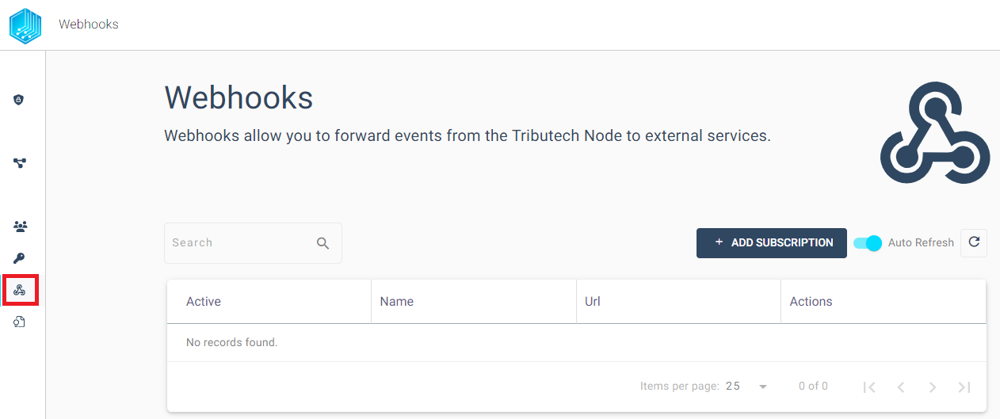
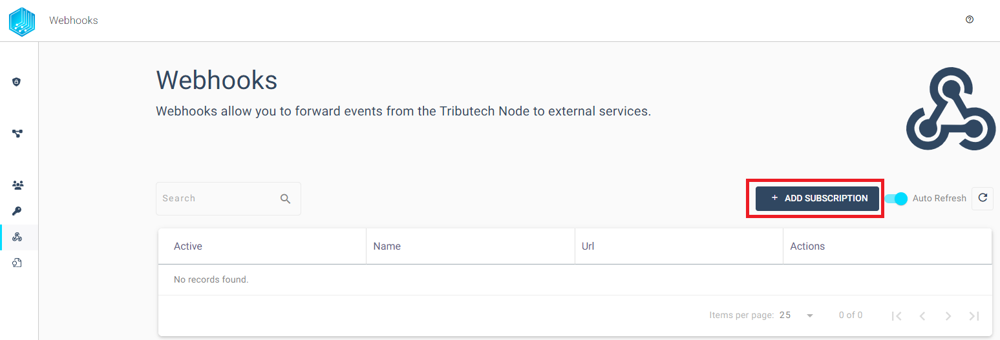
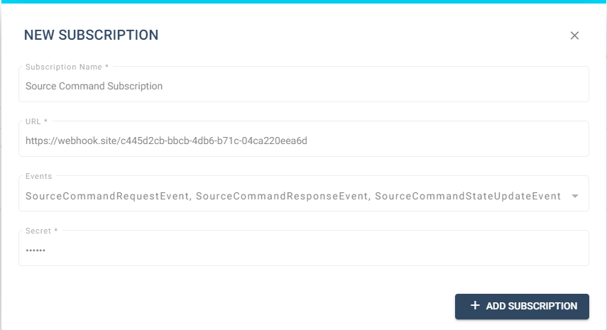
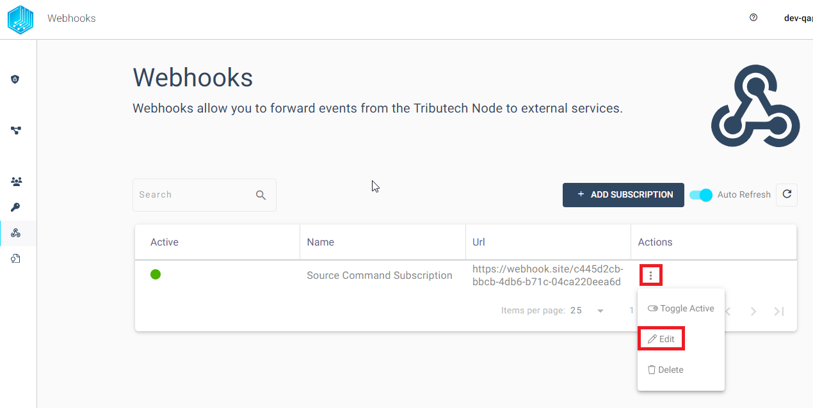
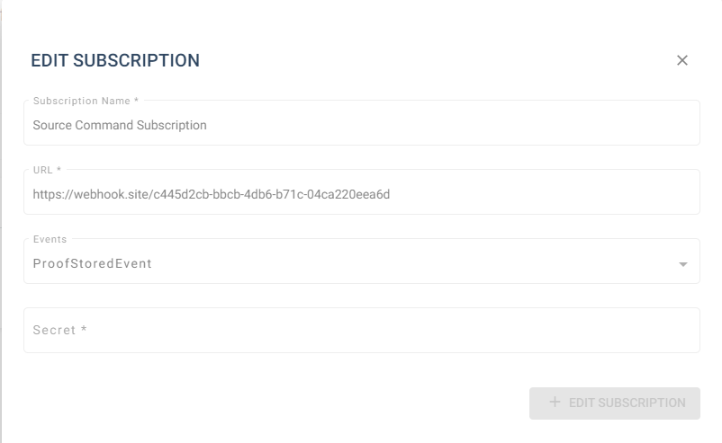
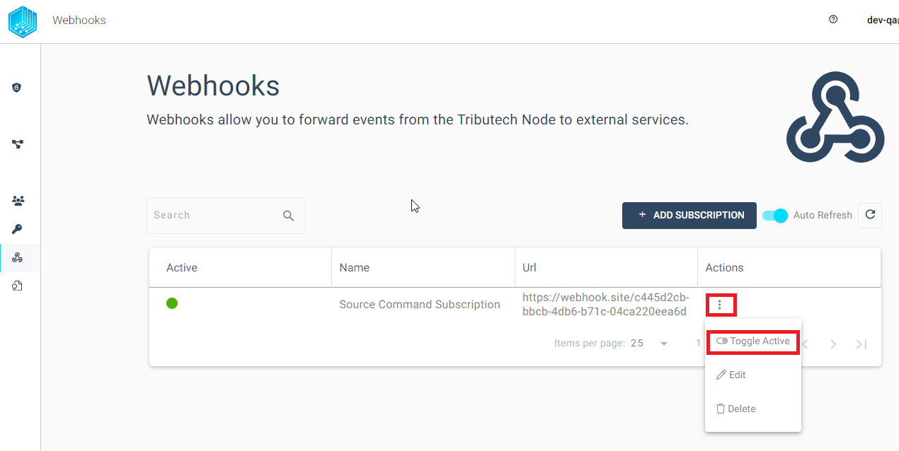
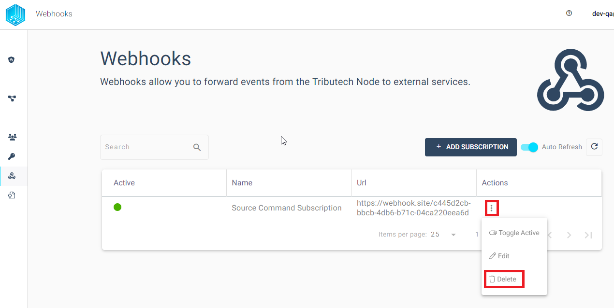
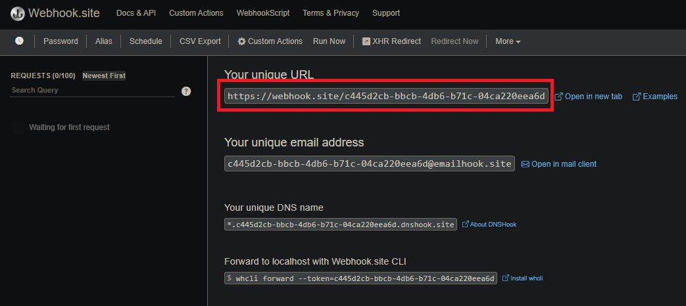
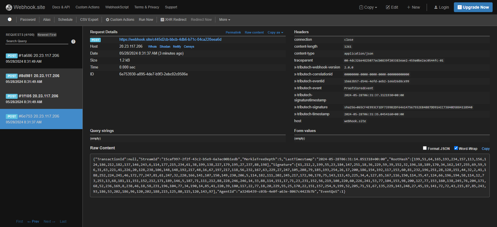

## General 

We provide within our Tributech Node the possibility for external services to receive a wide variety of notifications of internal events via [Webhooks](https://en.wikipedia.org/wiki/Webhook). A webhook is an HTTP-based callback function that enables lightweight, event-driven communication between a Tributech Node and a client that provides a unique URL endpoint to receive the Events. For example can we create a Client that will be notified when Proofs are stored into the Persistence Layer and passed into the Block Chain with the  `ProofStoredEvent` Event. In order to receive this events a clients unique URL must be defined as Subscription in the Tributech Node Webhook Section.
In the following secion we will show how to manage a sample webhook for  `ProofStoredEvent` Events and [verify](#verification) that the event data received by the Webhook client has not been tempered with.

##  Webhook Subscription Management

In Order to use Tributech Node Webhooks we first need to define a Webhook Subscription in the Tributech Node. A Subscription defines which events should be listened to and where it should be send to. The Management of the Webhooks can be found in the Webhook section of a Tributech Node.

 

In the following Section we will go step by step through all lifecycles of a Webhook with some sample data.

### Create
We can create a Subscription within the Webhooks section of the Tributech node by simple clicking the `ADD SUBSCRIPTION` button on the right side.
In the Dialog Box we add our Unique Webhook Client Url (e.g. [Webhook.site](https://webhook.site/), more details in [Verification](#verification)) and choose the desired [Event Types](#event-types). We also need to add a secret which will be used during the [Verification](#verification) example. This secret should be saved by the user because it can not be retrieved or recovered later.

 

In this example we subscribe to Events that occurs when the Proof is stored into the Persistence Layer and passed into the Block Chain. We will show how to inspect and verify the received Events in the [Verification](#verification) Section.

 

### Edit
If we want to update the settings for a Webhook subscription we can do that via the three dots in the actions column. 

 

This way the events, webhook url or secret can be adjusted for the current Subscription.

### Deactivate
We can disable the previously created Webhook by clicking the three dots in the action colum and choosing `Toggle Active` button to pause the notifications.

 

### Deletion
If we want to delete a Webhook subscription we can do that via the three dots in the actions column. 

 

## Webhook Events

### Headers
Webhooks itself are HTTP objects that contain in addition to default HTTP information Tributech specific attributes which we will discuss in the following section. The following Headers are present in the Webhook request: 

| Attribute | Description | Sample Value |
|--|--|--|
| x-tributech-correlationid |  A trace id to track the data through our node | 00000000-0000-0000-0000-000000000000 |
| x-tributech-eventid |  unique identifier through the node (guid) to identify the event |  49acaa7b-fa72-4863-ab4b-7933fedeb59a |
| x-tributech-event | event name to identify the type of event | ValueReceivedEvent |
| x-tributech-signaturetimestamp | creation timestamp utc of the signature | 06/16/2023 05:08:46 +00:00 |
| x-tributech-signature | signature of the webhook event |  sha256=0316443119ED851EE18AA6176E8281E6A28 D02A52EAF5DC85D45A6149173F412 |
| x-tributech-timestamp | event timestamp utc |  06/16/2023 05:08:43 +00:00 |

### Event Types {#event-types}
When creating a Webhook subscription we can choose different type of events. What Event each Type represents can be taken from the Tooltip.
Its important to note that each of the Event Types defines in the background a property `EventQoS` which will be transmitted with each
Payload indicating the frequency of the events. This property is used by the redelivery mechanism to know how often a event should be retried to resend
in case of an error. This value is predefined and cannot change by the user. The Webhook Events are divided into two categories : 
1. Event QOS = 1 , high frequency events (like data received)
2. Event QOS = 2, standard frequency events 

### Error Handling
In the case of an error during Webhook Event delivery we implemented an back-off redelivery mechanism. 
Commonly errors occour in the following situations:

- Network is not available
- Endpoint described within the subscription is not reachable
- Endpoint returns something else then a HTTP 200 (OK) 

If an error occours we execute retries based on the formulary  `(Attempt Count + 0,7) ^ 4 + Minimum Retry Interval`.
The `Attempt Count` is dependend on the `EventQoS` described in the previous section.
High frequency (`EventQoS` = 2) events will be retried for **four times** and then will be discarded. 
Standard Frequency (`EventQoS` = 1) events have **ten retries** till they are discarded.
 
## Verification {#verification}
In order to verify that the received Webhook Event has not been tempered with we can use either [OpenSSL](https://github.com/openssl/openssl) or [Microsoft C#](https://learn.microsoft.com/en-us/dotnet/csharp/) as show in the following section. We will use in both examples the previously created webhook with the secret `foobar` and a `ProofStoredEvent` sample event. All this examples and descriptions expect that a Tributech Agent with a active Tributech Source is connected to a Tributech Node. If you do not have currently such a setup you need to adjust your Webhook Subscription accordingly (e.g. ) or see our [QuickStarter Guide](../tributech_agent/quickstart.mdx) to meet the preconditions.

We will use in our examples the free Webhook client of [Webhook.site](https://webhook.site/) to view the events send by the Tributech Node. You can replace the uniquely URL `https://webhook.site/#!/view/c445d2cb-bbcb-4db6-b71c-04ca220eea6d` provided in all examples with your unique Url. We will use the website to inspect the received events from the Tributech Node Webhooks. Note that this URL can only receive a limited amount of requests and will be unique to you.

 

Make sure that the Webhook Subscription is configured to react to `ProofStoredEvent`. Shortly after starting the Source and activating the Webhook Subscription with one active Stream we should receive our first events:

 

On the right sight we see the Tributech Headers with the following headers (excerpt):

|Headers||
|-|-|
|x-tributech-webhook-version |	2.0.0|
|x-tributech-event |	ProofStoredEvent |
|x-tributech-signaturetimestamp |	2024-05-28T06:31:14.851318+00:00 |
|x-tributech-signature|	sha256=065CF4E993CF1DF7399B2DF64A147567552EB4BB7DD91ACC73840D5B8411B940|

The Headers contains the Tributech specific Attribute `x-tributech-signature` and `x-tributech-signaturetimestamp` which we will use in the next section to verificy that the Payload was not tempered with. 

The payload itself contains the `EventQoS` flag for Standard Frequency (`EventQoS` = 1) and some information about the Agent, Stream and the Proof.

~~~~json
{
  "TransactionId":null,
  "StreamId":"15caf997-2f2f-43c2-b5e9-6a3ac00b1edb",
  "MerkleTreeDepth":5,
  "LastTimestamp":"2024-05-28T06:31:14.851318+00:00",
  "RootHash":[199,51,64,165,193,234,157,113,156,124,186,212,182,137,146,243,6,114,177,215,234,61,38,199,138,227,179,195,27,237,88,198],
  "Signature":[61,212,2,199,55,23,184,147,251,18,36,229,59,39,152,32,196,18,189,170,34,162,147,255,69,59,56,31,63,221,41,226,20,128,238,106,148,148,192,217,48,16,67,197,217,118,56,232,167,63,229,27,247,105,208,79,185,193,254,26,17,200,186,154,192,117,153,60,81,232,196,251,28,128,151,44,32,2,41,188,252,224,241,46,172,77,247,81,61,247,32,220,166,141,107,150,149,230,206,5,114,182,111,202,245,217,172,90,178,75,143,113,43,225,34,4,127,85,167,116,150,114,35,47,124,66,196,194,58,114,12,73,253,13,68,181,11,151,152,212,171,189,146,5,187,71,111,212,88,228,246,246,14,33,88,114,151,17,71,23,231,152,56,219,108,220,60,226,241,53,77,104,153,98,200,127,77,153,160,138,245,76,204,171,68,52,236,169,8,238,46,18,58,231,196,104,77,34,190,14,85,41,220,39,180,117,22,77,18,20,229,55,25,170,22,151,157,254,9,199,52,205,71,51,67,135,229,143,248,27,45,19,141,72,72,43,215,87,85,243,93,186,53,202,186,96,120,202,188,215,125,80,115,120,143,97],
  "AgentId":"a324b439-c03b-4e0f-a63e-8067c4423b7b",
  "EventQoS":1
}
~~~~

### Openssl 

With the following [OpenSSL](https://github.com/openssl/openssl) command on a unix system we verifiy the previous example values of the `x-tributech-signature` ***HMAC SHA256*** signature:

~~~ bash
echo -n '<event-json><signature-timestamp>' | openssl dgst -sha256 -hmac "<webhook-secret>"
~~~

In order to work we need to replace the placeholders with concrete values

- `event-json` - The received raw json content from the webhook event
- `signature-timestamp` - The Header attribute `x-tributech-signaturetimestamp` value
- `webhook-secret` - the secret used to create the webhook in the Tributech Node UI

Explicit Example:
~~~ bash
echo -n '{"TransactionId":null,"StreamId":"15caf997-2f2f-43c2-b5e9-6a3ac00b1edb","MerkleTreeDepth":5,"LastTimestamp":"2024-05-28T06:31:14.851318+00:00","RootHash":[199,51,64,165,193,234,157,113,156,124,186,212,182,137,146,243,6,114,177,215,234,61,38,199,138,227,179,195,27,237,88,198],"Signature":[61,212,2,199,55,23,184,147,251,18,36,229,59,39,152,32,196,18,189,170,34,162,147,255,69,59,56,31,63,221,41,226,20,128,238,106,148,148,192,217,48,16,67,197,217,118,56,232,167,63,229,27,247,105,208,79,185,193,254,26,17,200,186,154,192,117,153,60,81,232,196,251,28,128,151,44,32,2,41,188,252,224,241,46,172,77,247,81,61,247,32,220,166,141,107,150,149,230,206,5,114,182,111,202,245,217,172,90,178,75,143,113,43,225,34,4,127,85,167,116,150,114,35,47,124,66,196,194,58,114,12,73,253,13,68,181,11,151,152,212,171,189,146,5,187,71,111,212,88,228,246,246,14,33,88,114,151,17,71,23,231,152,56,219,108,220,60,226,241,53,77,104,153,98,200,127,77,153,160,138,245,76,204,171,68,52,236,169,8,238,46,18,58,231,196,104,77,34,190,14,85,41,220,39,180,117,22,77,18,20,229,55,25,170,22,151,157,254,9,199,52,205,71,51,67,135,229,143,248,27,45,19,141,72,72,43,215,87,85,243,93,186,53,202,186,96,120,202,188,215,125,80,115,120,143,97],"AgentId":"a324b439-c03b-4e0f-a63e-8067c4423b7b","EventQoS":1}2024-05-28T06:31:37.3121930+00:00' | openssl dgst -sha256 -hmac "foobar"
~~~

We can now compare the output `SHA2-256(stdin)= 065cf4e993cf1df7399b2df64a147567552eb4bb7dd91acc73840d5b8411b940` of the command with the value of the Webhook Header attribute `x-tributech-signature` which does have matching hexadecimal values. 

###  C# Code

In the following section we use the previous example values to verifiy the ***HMAC SHA256*** signatures by using [MS C#](https://learn.microsoft.com/en-us/dotnet/csharp/)
which can be pasted into [Fiddle](https://dotnetfiddle.net/) or Locale Development Environment:

~~~ csharp
using System;
using System.Linq;
using System.Security.Cryptography;
using System.Globalization;
					
public class Program
{
	public static void Main()
	{
		Console.WriteLine(HashHMAC("foobar",@"{""TransactionId"":null,""StreamId"":""15caf997-2f2f-43c2-b5e9-6a3ac00b1edb"",""MerkleTreeDepth"":5,""LastTimestamp"":""2024-05-28T06:31:14.851318+00:00"",""RootHash"":[199,51,64,165,193,234,157,113,156,124,186,212,182,137,146,243,6,114,177,215,234,61,38,199,138,227,179,195,27,237,88,198],""Signature"":[61,212,2,199,55,23,184,147,251,18,36,229,59,39,152,32,196,18,189,170,34,162,147,255,69,59,56,31,63,221,41,226,20,128,238,106,148,148,192,217,48,16,67,197,217,118,56,232,167,63,229,27,247,105,208,79,185,193,254,26,17,200,186,154,192,117,153,60,81,232,196,251,28,128,151,44,32,2,41,188,252,224,241,46,172,77,247,81,61,247,32,220,166,141,107,150,149,230,206,5,114,182,111,202,245,217,172,90,178,75,143,113,43,225,34,4,127,85,167,116,150,114,35,47,124,66,196,194,58,114,12,73,253,13,68,181,11,151,152,212,171,189,146,5,187,71,111,212,88,228,246,246,14,33,88,114,151,17,71,23,231,152,56,219,108,220,60,226,241,53,77,104,153,98,200,127,77,153,160,138,245,76,204,171,68,52,236,169,8,238,46,18,58,231,196,104,77,34,190,14,85,41,220,39,180,117,22,77,18,20,229,55,25,170,22,151,157,254,9,199,52,205,71,51,67,135,229,143,248,27,45,19,141,72,72,43,215,87,85,243,93,186,53,202,186,96,120,202,188,215,125,80,115,120,143,97],""AgentId"":""a324b439-c03b-4e0f-a63e-8067c4423b7b"",""EventQoS"":1}", DateTimeOffset.Parse("2024-05-28T06:31:37.3121930+00:00") ));
	}
	
	public static string HashHMAC(string secret, string webHookPayloadJson, DateTimeOffset signatureTimestamp) {
		var encoding = new System.Text.ASCIIEncoding();
		var messageHash = new HMACSHA256(encoding.GetBytes(secret));
		var payload = encoding.GetBytes(webHookPayloadJson)
                              .Concat(encoding.GetBytes(signatureTimestamp.ToString(CultureInfo.InvariantCulture)))
                              .ToArray();
		var signature = messageHash.ComputeHash(payload);
		return BitConverter.ToString(signature).Replace("-", "");
	}
}
~~~

- `secret` - The webhook secret defined during the creation
- `webHookPayloadJson` - The whole received Json object
- `signature-timestamp` - The Header attribute `x-tributech-signaturetimestamp` value

This code example can be used to output the exact same signature which is present in the header (without the `sha256=` prefix, i.e. `D633514A1CE9688E816F33B2A6A48E08ED6FE621246483B0F219BB3B873C1B5E`).