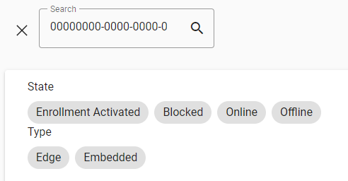
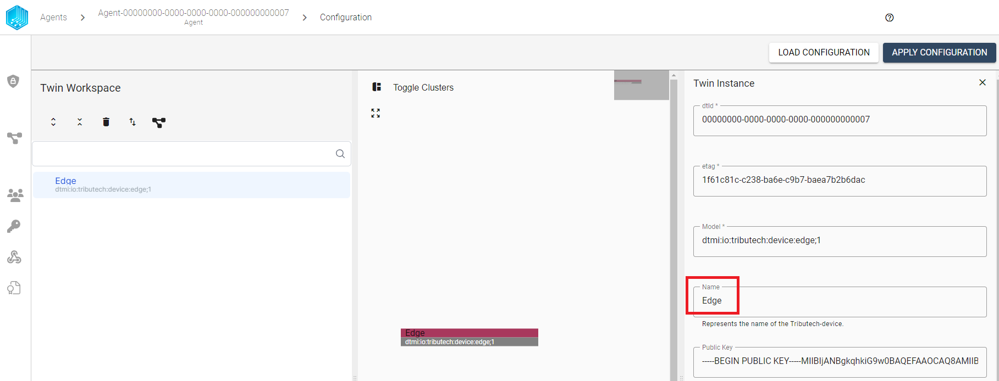
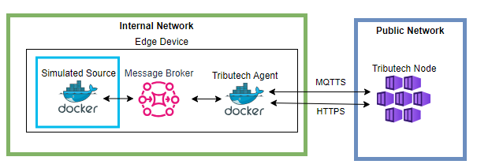

import CodeBlock from '@theme/CodeBlock';
import SourceDockerCompose from '!!raw-loader!./management/docker-compose-agent-integration.yml';
import DockerComposeVolumesExample from '!!raw-loader!./management/docker-compose-volumes-example.yml';

In the following section we describe how configure and navigate the Tributech Agent via the Tributech Node UI.
This requires an successful [Setup](../../tributech_agent/setup.mdx) (or [QuickStart](../../tributech_agent/quickstart.mdx)) and a completed [activation](../agent/access_control.mdx#activate-agent) with a [Tributech Node](../overview.md).

## Searching for an Agent

The first step is to find the correct Tributech Agent in the *Agent Section*.

In this overview we can either filter agents with the `Agents ID` (from the [Setup](../../tributech_agent/setup.mdx) ) or with a (partial) name.

Its also possible to filter agent via states or types:

## Searching for a Stream
In Order to inspect data and proofs received from a [Tributech Agent](../../tributech_agent/overview.md) we need to find the correct stream. Streams can be found in the Tributech Agent details view and filtered by name or id.

- Show filter:

- Filter by (partial) name

- Filter by StreamId

## Get the Agent Id
Agents can be referenced either by name or Id, e.g. [searching for an agent](#searching-for-an-agent). An Agent Id is a GUID (Globally Unique Identifier) that is assigned to a Tributech Agent on startup (see [Setup](../../tributech_agent/setup.mdx) (or [QuickStart](../../tributech_agent/quickstart.mdx))) and will never change. When interacting with the [Tributech Node API](../api_category/API_usage.md) its required for many operations to specify which Tributech Agent we will be interacting with and the selection is done via the Agent Id. In the following enumeration we want to show where to find the Agent Id in the Tributech UI:

- In the *Agent Section*

- In the *Agent details* (can be access by clicking the agent table entry in the *Agent Section*)

## Get a Stream Id
Collected data is always bound to a data stream which is a collection of information that can be identified by the unique StreamId, i.e. a GUID (Globally Unique Identifier). The StreamId can be used to access values and proofs via the [Tributech Node API](../api_category/API_usage.md) and map data from [Webhook Events](../Webhook_integration.md). 
We can access the StreamId either via 

agent details (can be access by clicking the agent entry in the *Agent section*) actions:

or by inspecting a specific stream

## Configuring an Agent
After activating an the Tributech Agent (see [Access Control](./access_control.mdx#activate-agent)) we can configure the settings of an Tributech Agent
by changes the Digital Twin. Those settings include properties of the Triubtech Agent like naming, merkle deepth etc or managing relationships and associated [Triubtech Sources](../../tributech_agent/source_integration.md) and Source settings. The starting point for all this operations is the 
`Twin Workspace` and we show in this section how to make changes to the Digital Twin. Details on how to configure specific Sources can be found in the corresponding [Triubtech Sources](../../tributech_agent/source_integration.md) overview. 
We can access the `Twin Workspace` either via selecting `Configure Agent` in the `actions context menu`.
    

or by simply click the entry in the `Agents` section followed by `CONFIGURE` in the Agent details

In the `Twin Workspace` we see on the right side as first fixed setting of the `Edge`(`dtmi:io:tributech:device:edge;1`) entry the [Agent Id](#get-the-agent-id) indicated by `dtId`. This field is an example for Meta data field which can not be adjusted by the Twin Workspace.

However, we can give this Tribteuch Agent a new name which will be displayed in the Agent Overview and will make finding this agent easier. 

:warning: The changes only takes effect when click `SAVE IN WORKSPACE` followed by `APPLY CONFIGURATION`.

## Adding data to an Agent
After the initial connect of an Tribtech Agent only one entry exists in the left side of the `Twin Workspace` and is named per default `Edge`(`dtmi:io:tributech:device:edge;1`). This entry represents the Tribtech Agent and should not be deleted but we can add a data ingress to this agent by adding [Triubtech Sources](../../tributech_agent/source_integration.md). We show in the following steps how to add a [Simulated Tributech Source](../../tributech_agent/sources/simulated_source.mdx) which we set up in our [QuickStart](../../tributech_agent/quickstart.mdx) and [Setup](../../tributech_agent/setup.mdx) `docker-compose.yml` sample file. By right clicking the `dtmi:io:tributech:device:edge;1` entry on the left side of the Twin Workspace we get a list of all available [Triubtech Sources](../../tributech_agent/source_integration.md) and select  [Simulated Tributech Source](../../tributech_agent/sources/simulated_source.mdx):

We now made the Tributech Agent aware of a connection between itself and a [Simulated Tributech Source](../../tributech_agent/sources/simulated_source.mdx). This enables us to manage the configuration of the Triubtech Source and receive data from it. 

To receive data from the newly added [Simulated Tributech Source](../../tributech_agent/sources/simulated_source.mdx)
we need to add a `Simulated Stream` to it by right clicking the `dtmi:io:tributech:stream:simulated;1` entry and selecting the corresponding entry.

A simulated stream is a continues flow of data that will be produced randomly by the [Simulated Tributech Source](../../tributech_agent/sources/simulated_source.mdx) with a specific type of data (double, long, integer,..). We adjust the default template properties as followed:

- **Name**: `Simulated Double Stream` is used to identify the stream in the Agent Details overview
- **Data Encoding**: `Double` used in the display of values in the Tributech Node UI
- **Type**: `Double` used to generate data.
- **Min Value**: `-100` will be the smallest generated value
- **Max Value**: `100` will be the largest generated value
- **Frequency**: `0.5` means every 2 second a new values is generated (Time interval = 1 / Data Frequency)

:warning: The changes only takes effect when click `SAVE IN WORKSPACE` followed by `APPLY CONFIGURATION`.

After successfully executing `APPLY CONFIGURATION` we can now go back to the `Agent details` by clicking the Agent Name in breadcrumbbar.

The newly created `Simulated Double Stream` is now available. For more information on how to add different sources visit [Triubtech Source Integration](../../tributech_agent/source_integration.md) or configure a [Simulated Triubtech Source](../../tributech_agent/sources/simulated_source.mdx) visit the corresponding sites.

By selecting the `Simulated Double Stream` we can directly go into the [stream verification](../agent/verification.mdx) of the received data.

