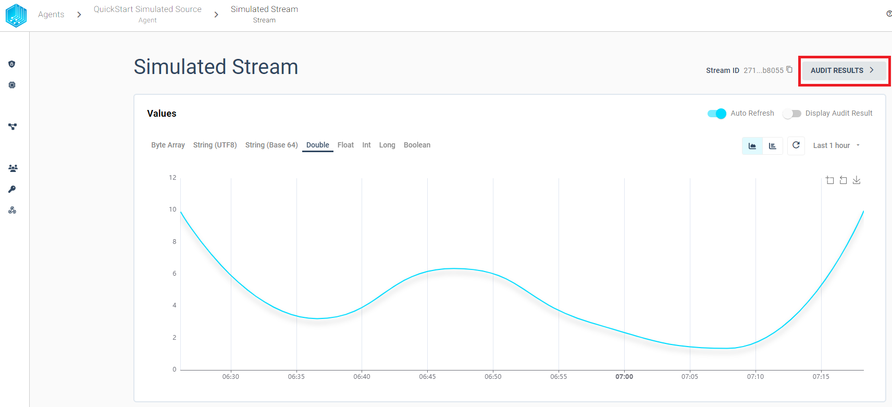
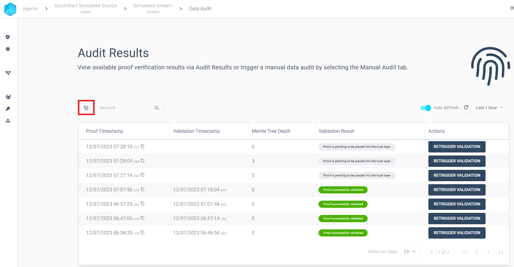
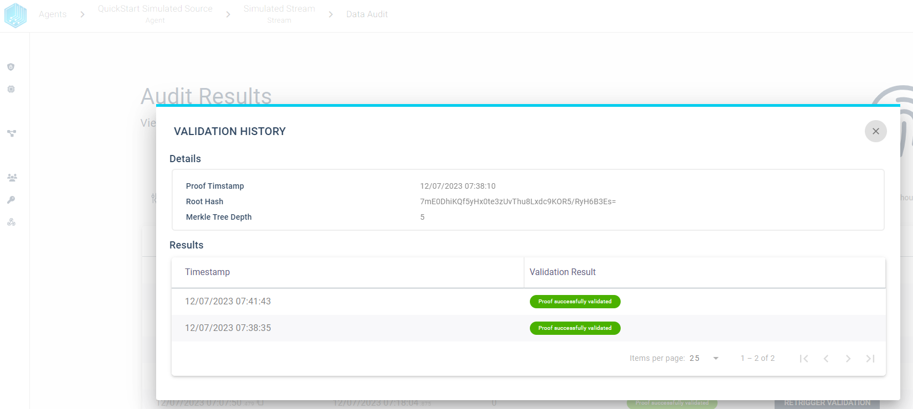

import CodeBlock from '@theme/CodeBlock';
import SourceDockerCompose from '!!raw-loader!./management/docker-compose-agent-integration.yml';
import DockerComposeVolumesExample from '!!raw-loader!./management/docker-compose-volumes-example.yml';

## Verify data
In order to detect [data tampering](https://www.tributech.io/blog/cybersecurity-threat-data-tampering) we provide the possibility to audit each stream individually and quickly find failed validations. We can either use a graph to visually find problems or a table to filter proofs with the predefined filters. We will describe both options in the following sections.

### Validation Graph
The Validation Graph can be displayed by clicking ***Display Audit Result*** and contains three different colors:

- ***gray*** - validation is pending
- ***green*** - validation was successful
- ***red*** - validation was not successful

### Validation Table

In Order to view every created proof with its validation history in table format we can use the `AUDIT RESULTS` button from the stream overview:

The audit results table view provides the possibility to filter the audit results based on the validation result. We can use the filter to quickly find failed validations and inspect the validation history for any given proof.
We want to highlight some features to quickly get started with the audit:

- Overview - Display all created proofs in timespan sorted by Proof Timestamp
    

- Filter - Limit the displayed audit results based on the validation result
    

    

- Retrigger - Validation can be triggered manually and the table view will always display the latest validation result for any proof.

    

- History - By selecting a proof row we can inspect the validation history for each proof.

    
