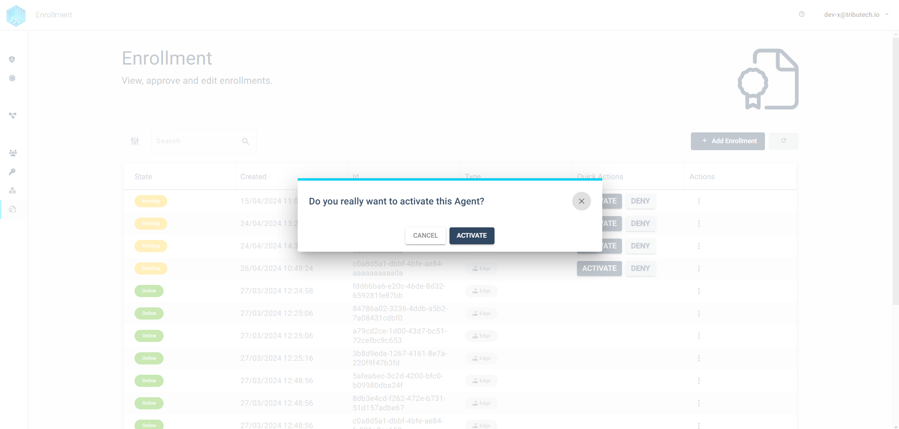
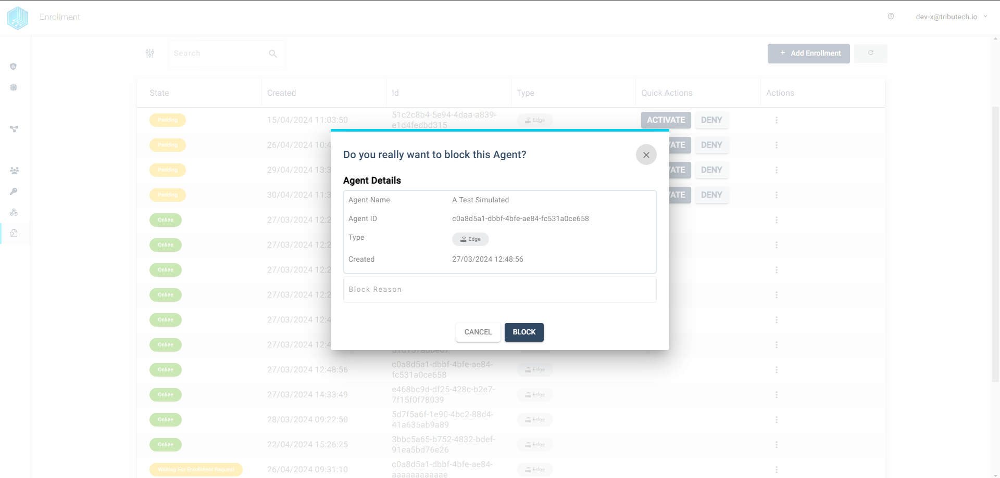
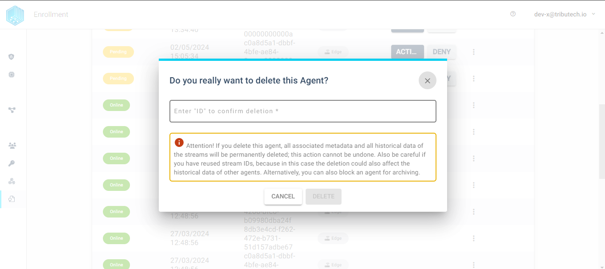

The following section details the management functions for agents which are connected to a Tributech node. Agent amangement fucntions are:

<ul>
  <li>Activate Agents</li>
  <li>Deny Agents</li>
  <li>Block Agents</li>
  <li>Unblock Agents</li>
  <li>Delete Agents</li>
</ul>

With these functoins a user is able to controll

### Agent Activating & Denying

Activating an agent is the first step that a user must take with a new agent in the Tributech user interface in order to be able to work with an agent in the Tributech node. On the other hand, the user can also deny an agent if, for example, there are security concerns about an agent trying to connect to the node, which automatically rejects all connection attempts by the agent.

#### Activate & Deny Agent

An agent can only be "activated" or "denied" if it is in the "Pending" status. All agents that are in the "Pending" status are displayed at the top of the agent list in the enrollment environment, where the user can also perform these two functions. After the agent has been activated, the normal operating states are "online" or "offline" and the user can work with the agent. If the agent is denied, it switches to the "denied" status. From this state, it is only possible to delete an agent to reconnect it to the Tributech node and accept it, otherwise the agent is simply excluded from the connection to the Tributech node.

### Agent Blocking & Unblocking
When a Tributech agent is blocked, all sources, streams and their data remain in the database, but the agent can no longer connect to the Tributech node. Another word for blocking would be archiving an agent, as all streamed data is still stored on the Tributech node, but the agent is decommissioned. The agent can be unblocked at any time, creating a fully functional agent whose data is still stored. This function can also be used if an agent has been compromised and needs to be cut off from the node.

#### Block & Unblock Agent
Blocking in the Tributech UI can be done in the Enrollment section. For this feature locate the agent got to it's action column. The burger menu of each agent should  hold the "Block" action. When clicking on this action the following window will be shown:

The user is also able to write a short "Block reason" before blocking the agent which can help other users to distinguish why an agent was blocked in the first place, but the "block reason" is optional.

Unblocking an agent runs along the same lines of blocking the agent. The "Unblock" option is only shown if the agetn is in the "Blocked" State. The option can be also found in the action menu similar to the "Block" action.

### Agent Deleting
Deleting an agent in the Tributech environment not only deletes the agent entry, but also cleans the database of all sources, data streams and data points. This process cannot be undone, so all unsaved data is lost. After a successful deletion of the agent, it is still possible to connect the agent to the node after a clean-up. If an agent is deleted with this function, it is not possible to restore the deleted data. This function is used when the data of a Tributech agent is no longer required and the agent is needed for another project.

#### Delete Agent

To delete an agent in the user interface, the user must go to the enrollment section of the Tributech user interface and search for the desired Tributech agent. There is a “Delete” option in the agent's burger menu. This action calls up the modal for deleting the agent. In this modal, the user must enter the agent ID to ensure that the correct agent is deleted. Once the agent ID has been entered, the “Delete” button is activated and the user can delete the agent from the node and the database.

