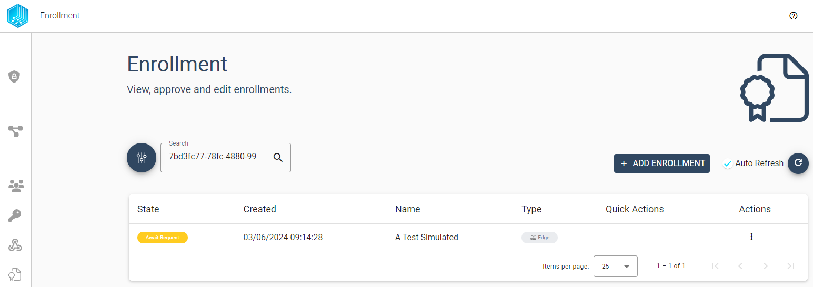
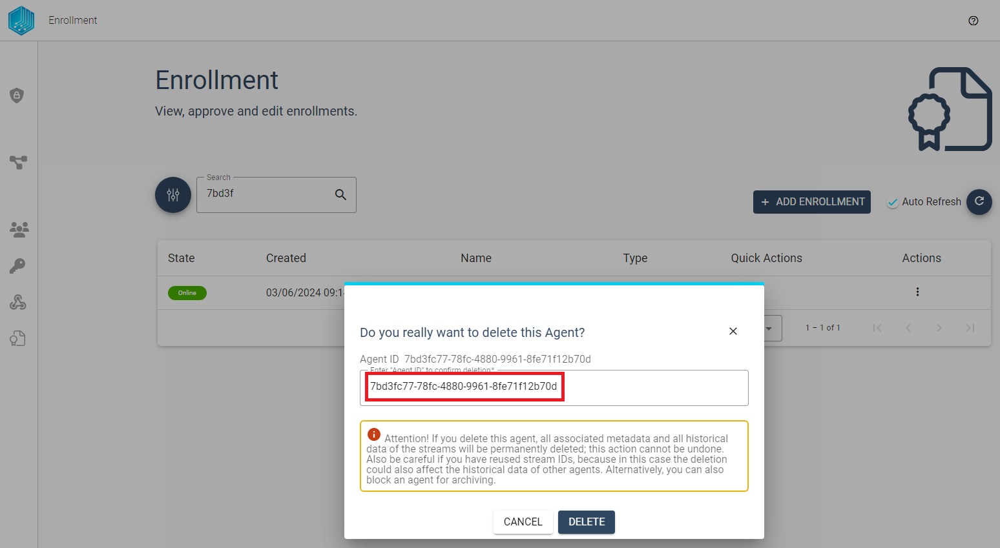

In this section we show the available management function provided by a Tributech Node UI to manage [Tributech Agents](../tributech_agent/overview.md) which try to connect to a [Tributech Node](./overview.md) or have a connection.

The first time a [Tributech Agent](../tributech_agent/overview.md) connects to a [Tributech Node](./overview.md)
is during the `enrollment process`.  Agents during the `enrollment process` are listed with the state `Pending` and two Quick Actions available:

- ***Activate*** - Permit an Agent to connect to the Tributech Node and communicate with it
- ***Deny*** - Connection to the Tributech Node is denied

For already activated [Tributech Agents](../tributech_agent/overview.md) we provide the following operations:

- ***Block*** - No further communication with the Tributech Node is allowed for this Tributech Agent
- ***Unblock*** - A blocked Tributech Agent is allowed to restart the enrollment process
- ***Delete*** - Delete all associated data with a Tributech Agent

If your Tributech Agent is not listed here then please revisit the [QuickStart](../tributech_agent/quickstart.mdx)
or [Agent Setup](../tributech_agent/setup.mdx).

## New Agents

After starting a Tributech Agent (see [QuickStart](../tributech_agent/quickstart.mdx)) a communication to the Tributech Node is not allowed per default. We can see in the ***Enrollment*** Overview all Agents that want to connect to a Tributech Node
with the State ***Pending***. We can either allow the communication with ***Activate*** or stop all future communication with ***Deny***.

### Activate Agent
If we have decided to activate an Tributech Agent it will be displayed with status ***online***/***offline*** depending on
the connection state between the Tributech Node and Tributech Agent. 

Once a Tributech Agents is in the state ***online*** 
it can be configured in the ***Agents*** Overview by selecting the entry or via the action context menu.

### Denied Agent
If we have decided to deny an Tributech Agent enrollment it will be displayed with status ***denied***.
Tributech Agents with the state ***denied*** can only be deleted via the action menu.

It is important to note that a denied Tributech Agent will start an new enrollment process after beeing deleted.
The communication is no longer blocked after the deletion and its possible to ***Activate*** or ***Deny*** this agent again.

## Activated Agents

### Blocking Agents
After granting an Tributech Agent access to a Tributech Node we can revoke this access of an active Tributech Agent at any time by ***blocking*** further communication. This option is available in the Agents Overview

or in the Enrollment Section:

During the blocking process we can add a `Block Reason` for future reference why this Tributech Agent is no longer allowed to communicate with the Tributech Node. This field is optional but we recommend to fill it out to help other users to understand why a  agents was blocked.

By blocking an Tributech Agent we ensure that no new data can be send but old data is still accessable for inspect. Another word for blocking would be archiving an agent, as all streamed data is still stored on the Tributech node but the agent is decommissioned.
The agent can be unblocked at any time, creating a fully functional agent whose data is still stored. 

### Unblocking Agents
Unblocking is only available for blocked Tributech Agents and restores an Tributech Agent to an `activated` state. 
The option can be also found in the action menu similar to the `Block` action.

After unblocking an Tributech Agent overview shows the current state as ***Await Request*** this means the Tributech Agent has not requested a new connection. 

After waiting some time or restarting the Agent it will switch into status ***online***/***offline*** again.
After comming online again it can communicate and be managed the same way as any other `activated` Tributech Agent.

## Deleting an Agent
For Tributech Agents which are no longer needed required exists the option to be deleted. 

:warning: **Deleting an Tributech Agent removes all associated configurations, data and cannot be undone**!

Deleting an agent in the Tributech environment not only deletes the agent entry, but also cleans the database of all configurations and data points. ***This process cannot be undone*** and once deteleted data cannot be recovered. 

The options to delete an Tribtuech Agent can be found in the Agents Overview

or in the Enrollment Section:

To confirm the deletion the Tributech Agent Id Guid needs to entered or copied into.

After a successful deletion a Tributech Agent can restart the enrollment process again. The previous state of 
Tributech Agent does not matter because all associated data has been deleted, i.e. a `Denied` or `Blocked` Agent
and be `Activate` or `Denied` once again.