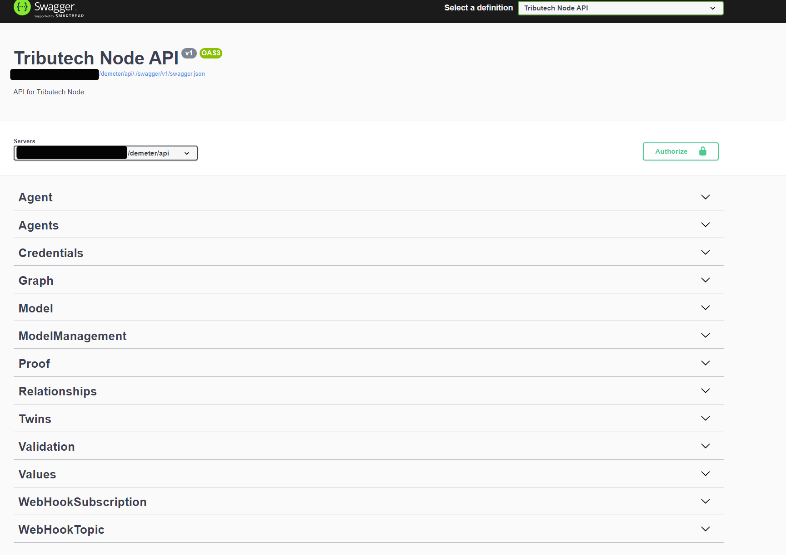
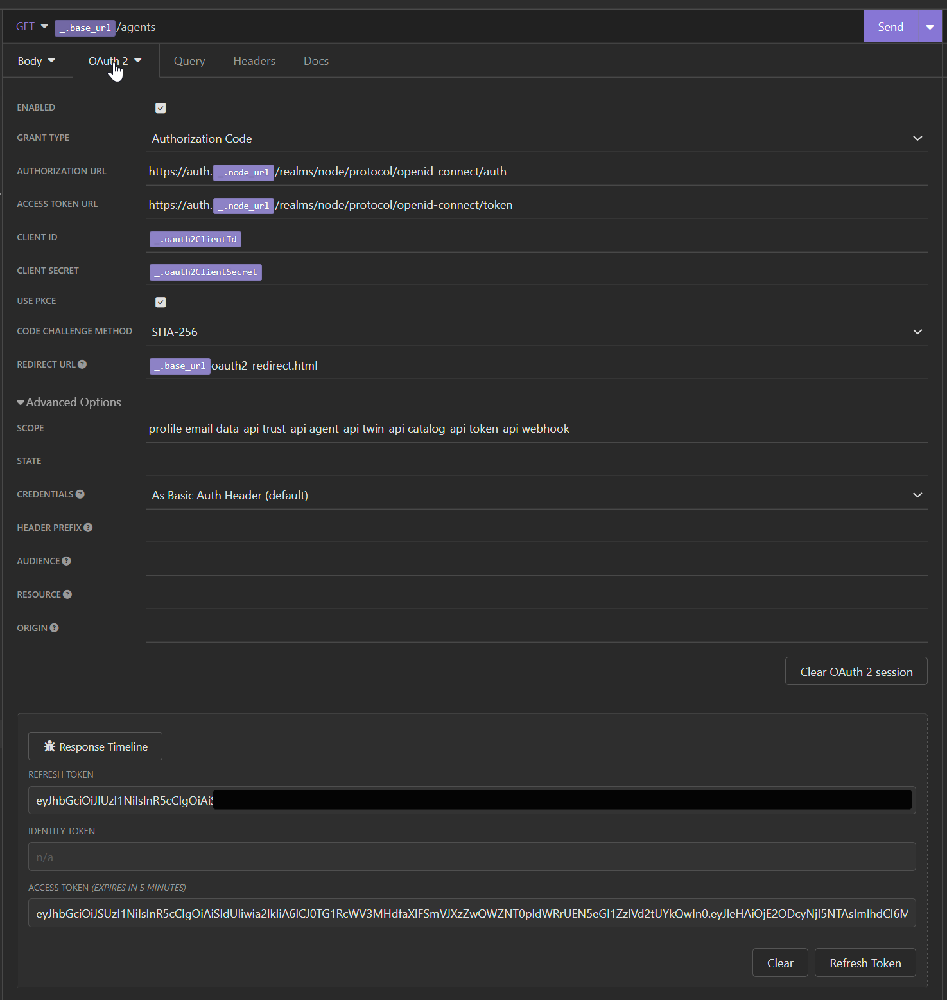

## Rest API
Our REST API provides the interfaces as [OAS V3](https://swagger.io/specification/v3/) which can be used to generate REST API clients for multiple languages. 

 

The api is generally reachable via the url `<your-node-url>/demeter/api/`  there you can find the json document and a swagger doc website with an general overview of the rest api endpoints. 

The API is structured with following "Topics" :
- ***Agent*** provides all management regarding a single Tributech Agent
- ***Agents*** for query propose of multiple agents 
- ***Credentials*** to fetch the credentials of the api, docker registry etc... 
- ***Graph*** provides the Twin Configuration Instance as graph
- ***Model*** fetching DTDL Model Information
- ***ModelManagement*** CRUD Methods for the DTDL Models
- ***Relationships*** CRUD Methods for the Relationships between DTDL Instances
- ***Twins*** CRUD Methods for DTDL Instances
- ***Validation*** Validation for DTDL Models
- ***WebHookSubscription*** CRUD Methods for Webhook related Subscriptions
- ***WebHookTopic*** Query all available Webhook Events
- ***Values*** Fetch or Insert Values from or to the Node
- ***Proofs*** Validate , insert or fetch proofs from the Node

To do some example request just visit the above url, authorize yourself *(see below)* and try it out ! 

## Authorization

Our API Authorization is handled via a Keycloak instance. We support following authorization flows : 

- [Client Crediential Flow](https://auth0.com/docs/get-started/authentication-and-authorization-flow/client-credentials-flow) (for api access)
- [Authorization Code Flow with PCKE (sha256)](https://auth0.com/docs/get-started/authentication-and-authorization-flow/authorization-code-flow-with-proof-key-for-code-exchange-pkce) (for browser)

Both can be configured within the Keycloak instance hosted on our Tributech Node Instance. 

We provide no user or group permissions for our node. 

In general following urls are used for authorization and token : 

- Authorization: `https://auth.<your-tributech-node-url>/realms/node/protocol/openid-connect/auth`
- Token: `https://auth.<your-tributech-node-url>/realms/node/protocol/openid-connect/token`

Client Id and Client Credentials can be retrieved by our Node website or on request.

Example Request done with [Insomnia](https://insomnia.rest/)

#### Authorization Flow

#### Client Credential Flow

