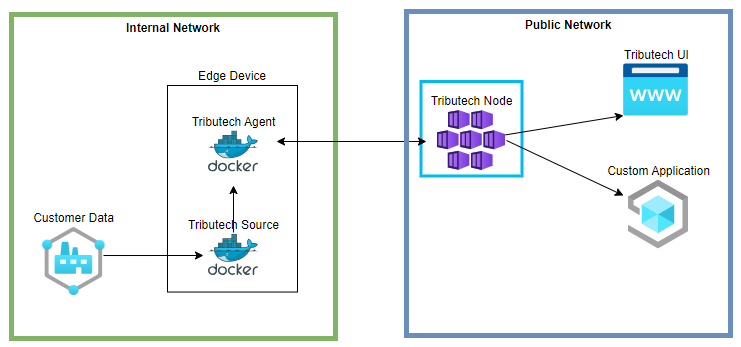
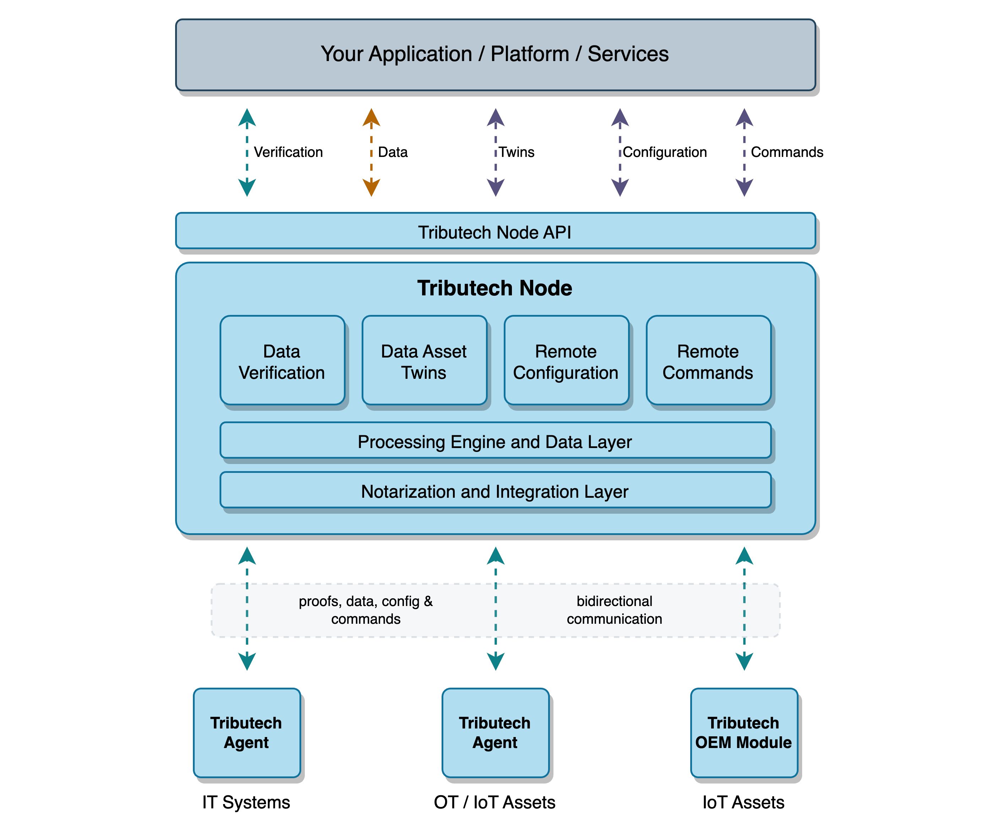

# Tributech Node 
The Tributech Node is the central layer of our Tributech Platform where every data will be collected, secured by our Tributech Agents. 

 

A Tributech Node can also be used for the following scenarios (excerpt):
- Provide external application access to read the available data to provide customized user experience, see [API Integration](../tributech_node/api_category/API_integration.md)
- Agent [access permissions](../tributech_node/agent/access_control.mdx), [configuration](../tributech_node/agent/management.mdx) or sending [commands](../tributech_agent/source_integration.md#commands) for an agent
- [Verify Data](../tributech_node/agent/verification.mdx)
- [Manage Webhooks](../tributech_node/Webhook_integration.md#webhook-subscription-management)

## Overview 
The following process overview shows how the Tributech Node interacts with the connected [Tributech Agents](../tributech_agent/overview.md)
and the configuration, data flow.

### Tributech Agents

The [Tributech Agents](../tributech_agent/overview.md) are connected to our node via an MQTT broker which is secured by TLS to provide a secure communication channel. The protocol provides us the possibility to have a near real time bidirectional communication with our agents and apply [configuration](../tributech_node/agent/management.mdx) or issue [commands](../tributech_agent/source_integration.md#commands) fast.

### REST API

The Tributech Node is built with the ***API-first approach*** in mind. So every functionality is available via our REST API which enables external parties to execute operations like ([API Integration](./api_category/API_integration.md)/[API Usage](./api_category/API_usage.md)):

- Fetching the data provided by the agents 
- Trigger the validation of their data 
- Fetching the validation results of their data
- Executing commands which will be handled by our agents
- Configure the given Tributech Agent Sources and Tributech Agents
- Manage the available DTDL Models within your Node

This operations require an [authorization process](./api_category/API_integration.md#authorization) that follows the [OAuth 2.0](https://oauth.net/2/) specification and will support the [client credential flow](https://auth0.com/docs/get-started/authentication-and-authorization-flow/client-credentials-flow) and the [authorization code flow](https://auth0.com/docs/get-started/authentication-and-authorization-flow/authorization-code-flow-with-proof-key-for-code-exchange-pkce). 

:warning: Currently we don't support any user/group permissions and will only handle authorization against our REST API.   

### Webhooks
We also provide a push-based notification system via [Webhooks](Webhook_integration.md). External actors are able to subscribe to predefined events and add their url where the events should be sent to. To prevent spoofing attacks we attach a HMAC signature to our events within the [HTTP Headers](./Webhook_integration.md#headers).

The list of events types can be found [here](Webhook_integration.md#event-types) or received via the [API](./api_category/API_usage.md).
The [API](./api_category/API_usage.md) also allows the customer to subscribe and manage webhooks.
This enables external parties to implement a push-based system, within their application, to react to certain events in our node. 

### DTDL Configuration
To configure our Tributech Agents we currently use the [Digital Twins Definition Language Version 2](https://github.com/Azure/opendigitaltwins-dtdl/blob/master/DTDL/v2/DTDL.v2.md) which is an open standard to describe real world applications or things. This enables us the have a semantic description and configuration of our agents (e.g. [configure Agent](./agent/management.mdx#configuring-an-agent)).  

There is also the possibility that customers may upload their own customized models *(via our [REST API](./api_category/API_usage.md))* to create a context between the ingested data and their application to unlock analytics or machine learning capabilities.  

:arrow_right: See our [current DTDL Models](https://github.com/tributech-solutions/data-asset-twin-v2) on Github.

### Deployment

Our Tributech node is using [Kubernetes](https://kubernetes.io/) as orchestration platform, where we provide several components to enable the full functionality of our Tributech Node. 

We provide an [HELM Chart](https://helm.sh/) to ease the setup of our configuration. It is not publicly available so please contact our support team for further Information.  