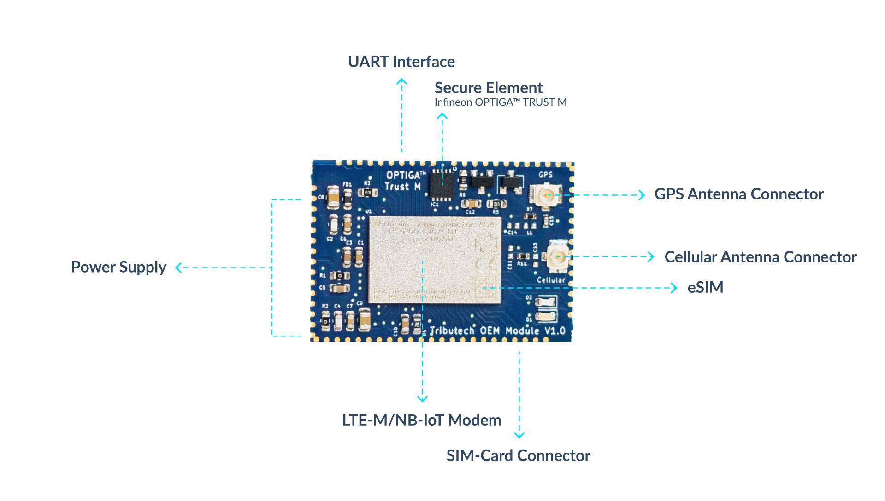
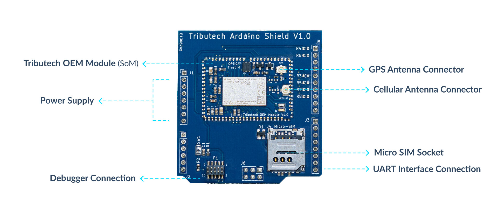
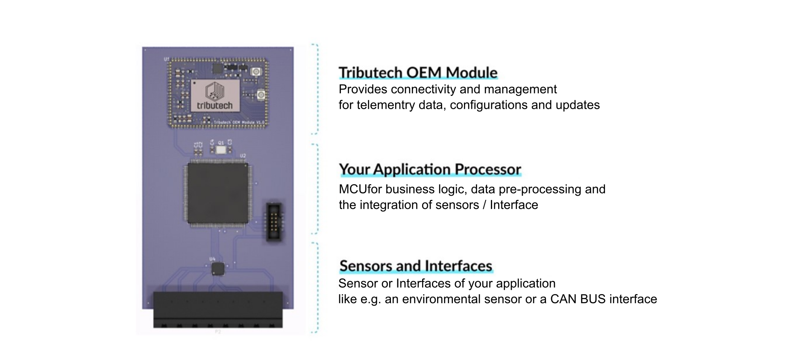

# Hardware Options

:::caution
This Tributech OEM module documentation is deprecated and only works with Tributech DSK version 3.6, which is no longer actively maintained.
:::

For the development of embedded IoT devices we offer two hardware variants. The Tributech OEM Module itself, which can be directly integrated into the PCB hardware design as a SoM and an Arduino Shield for prototyping. The shield can be used with all popular hardware development platforms like Arduino Uno, STM32 Nucelo, Infineon XMC Relax Kit and more.

## Tributech OEM Module

The Tributech OEM module is packaged as a system-on-module (SoM) to allow an easy integration into the hardware design of embedded devices.

|Hardware Specification ||
|----|----|
| Dimensions  (H x W x D) | 32 x 22 x 3mm |
| Operation temperature range | -25°C to 85°C |
| Power supply | +3.3V to +5.5V |
| Humidity (at 40°C) | 93% (none-condensing) |
| Chip/Processor | Nordic nRF9160/64 MHz ARM&copy; Cortex&copy;-M33  1MB flash + 256kB RAM |
| Security & Root-of-Trust  | Infineon OPTIGATM Trust M  ARM Trust Zone  ARM CryptoCell-300 |
| Connectivity | Multimode LTE-M /NB-IoT modem with GPS  700-2200MHz LTE band support  Certified for global operation  eSIM or external SIM-card socket |
| Antenna connector type | U.FL-R-SMT-1(10) |
| Module Interface | UART device interface protocol for telemetry  data, configurations and updates |

## Tributech Arduino Shield 

|Hardware Specification||
|---|---|
| Dimensions (H x W x D) | 57 x 53 x 20mm |
| Operation temperature range | -25°C to 85°C |
| Power supply | +3.3V to +5.5V |
| Humidity (at 40°C) | 93% (none-condensing) |
| Chip/Processor | Tributech OEm Module (SoM) |
| Connectivity | LTE-M / NB-IoT |
| SIM | Micro SIM-card socket |

## Hardware Design

An embedded IoT device that integrates the Tributech OEM Module into its hardware design typically consists of three parts. Part 1: the Tributech OEM Module which takes care of connectivity, data management, configurations, updates, and security. Part 2: the application-specific micro-controller which takes care of data pre-processing and business logic. Part 3: the sensors and interfaces needed for the application.

