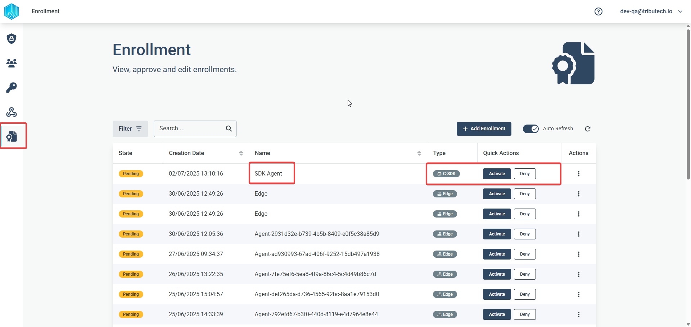
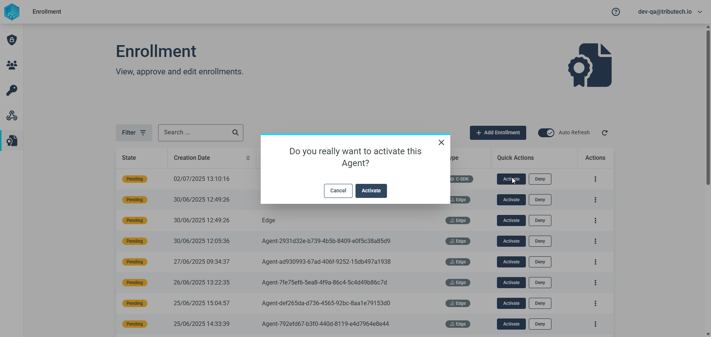
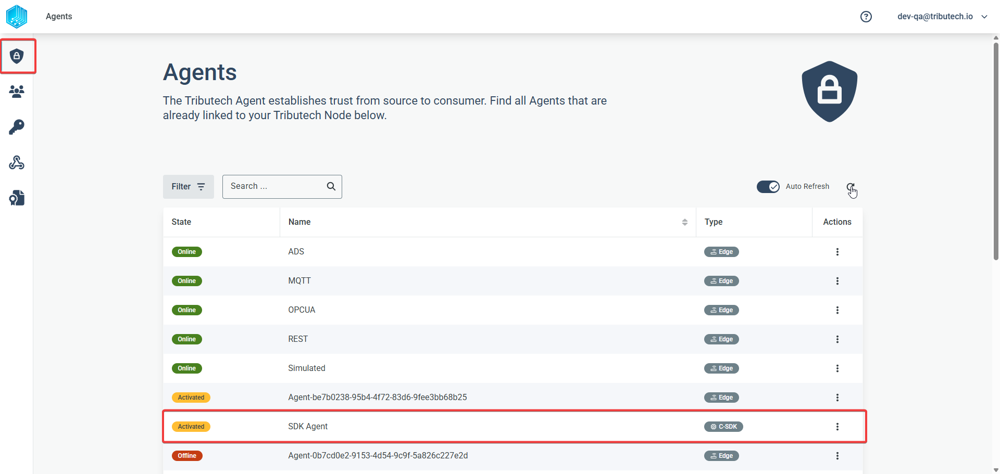
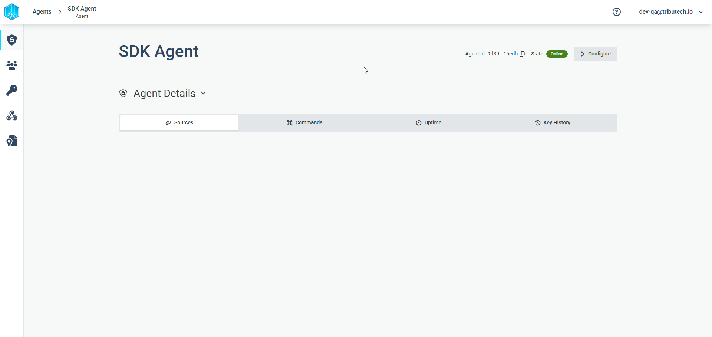
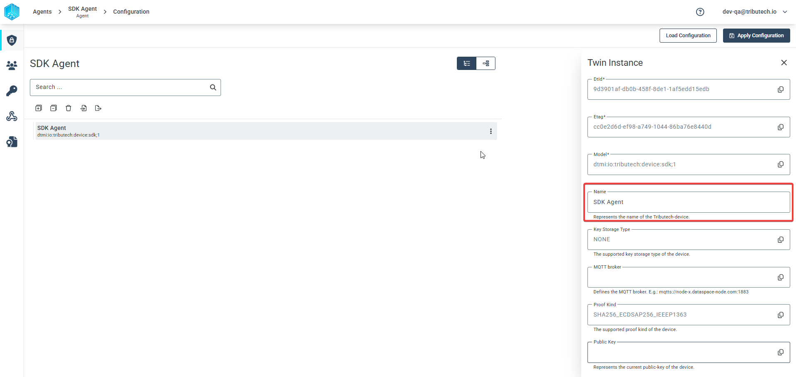
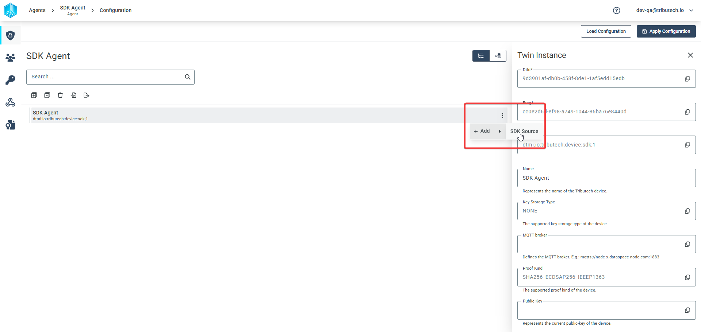
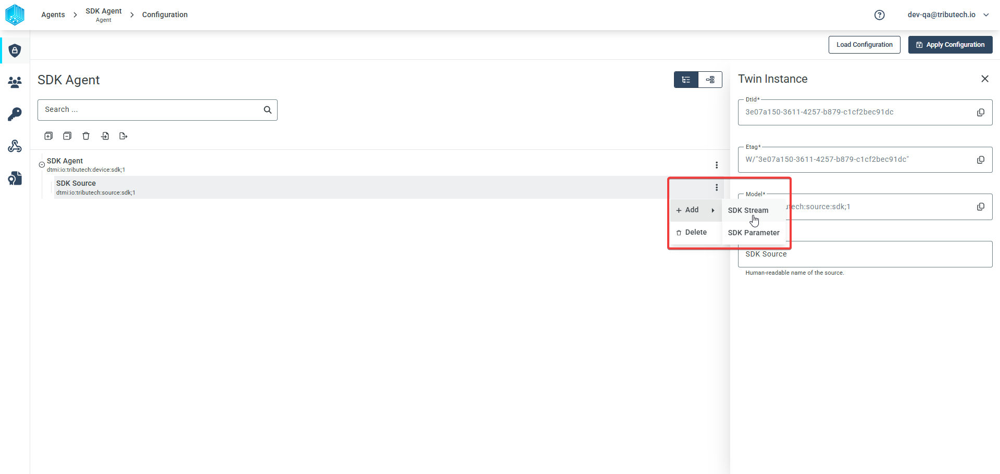
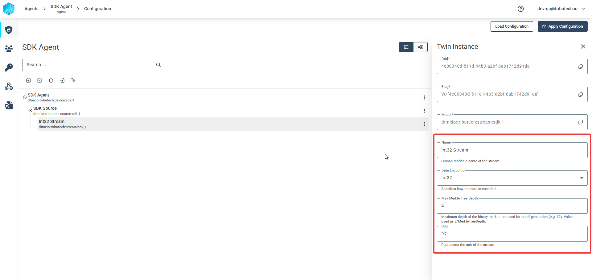
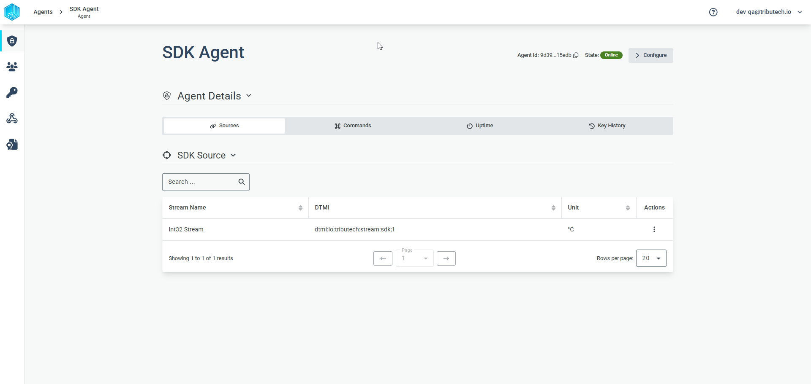
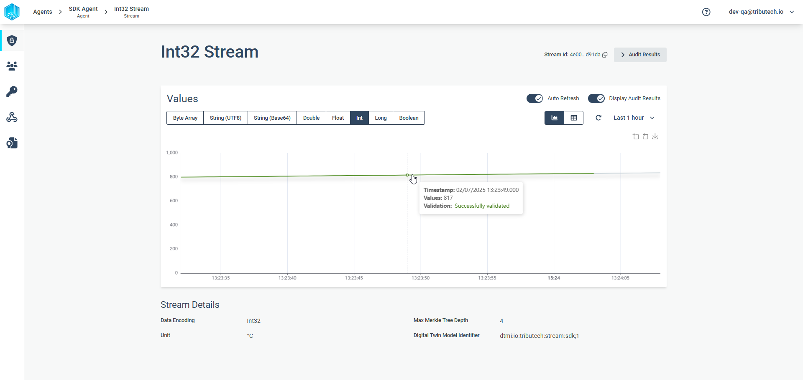

# Integration Guide

This guide provides a high-level technical overview for integrating the Tributech C SDK into embedded and IoT systems, as well as into the Tributech Platform. It explains the SDK's plugins in broad strokes and the steps needed to integrate an SDK-enabled device into the Tributech Platform.

## Plugin System Overview

The Tributech C SDK is designed for **portability** and **hardware abstraction**. All platform-specific functionality is encapsulated in a set of plugins. Each plugin implements a well-defined interface, allowing the SDK core to remain platform-agnostic.

**Key Points:**
- Plugins are required for all platform-dependent features.
- Each plugin is a C struct with function pointers for its operations.
- The SDK will not function without all mandatory plugins.

### Plugin Descriptions

The Tributech C SDK relies on a set of mandatory plugins to abstract platform-specific functionality. Each plugin must be implemented for your target platform:

### Heap Plugin

- **Purpose:** Dynamic memory allocation and deallocation.
- **Details:** Serves as an RTOS abstraction layer. Since each RTOS handles memory differently, standard memory allocation functions cannot be used directly. You must provide functions for safe allocation and deallocation of memory used by the SDK.

### FlashFS Plugin

- **Purpose:** Persistent file storage for configuration, keys, and other data.
- **Details:** Enables the device to retain information after power loss. SDK configuration, device identity, and stream information are stored here. Keys and certificates can be saved in device flash, but using a hardware security module is recommended for added security.

### Crypt Plugin

- **Purpose:** Cryptographic operations, key management, signing, and random number generation.
- **Details:** Essential for generating device identity, running the data notarization engine, and managing certificates.  
- **Note:** For production, use a hardware security module (HSM) or secure element for this plugin.

### Socket Plugin

- **Purpose:** TCP/IP networking, DNS resolution, and data transmission.
- **Details:** Required for internet connectivity and secure data notarization. Secure communication is handled by the SDK internally. For proper certificate management, the SDK must also have access to accurate date and time, which can be obtained via an SNTP server.

### RTC Plugin

- **Purpose:** Access to a real-time clock for timestamping data points.
- **Details:** Required for monitoring certificate expiration and ensuring secure connections to the Tributech platform.

### RTOS Plugin

- **Purpose:** Task/thread creation, sleep, and mutexes.
- **Details:** Most RTOS systems provide these features. The plugin must relay these functions to the SDK, enabling multitasking where supported.

## Integration Steps

1. **Implement all mandatory plugins** for your platform, following the provided interfaces.
2. **Test each plugin independently** to ensure correct operation.
3. **Link your plugin implementations** with the Tributech C SDK core.
4. **Initialize the SDK** and verify correct operation on your hardware.
5. **Generate the enrollment certificates** and add them to the device.
6. **Activate and configure the agent** in the Tributech Platform.

## Tributech Platform Integration

Once the plugins are correctly implemented and the appropriate enrollment certificates are provided to the SDK, the device will be able to connect to the specified Tributech Platform instance after initialization.  
After logging into the Tributech Platform, the newly registered device will appear in the enrollment section. All newly connected devices must be activated to gain full access to the platform and its features.

> **Note:**  
> Enrollment certificates must be generated in the Tributech Platform before being added to your device. Without these certificates, the device will not be able to establish a secure connection to the platform.  
> For detailed instructions on generating enrollment certificates, see [Authentication Certificates (Enrollment)](../tributech_agent/setup.mdx#authentication-certificates-enrollment).

### Agent Activation

Agents in the Tributech enrollment section are sorted by creation date and timestamp, so the newly registered agent should appear at the top of the list. The agent should be named **SDK Agent** (the standard naming convention), and in the "Type" column, it should be identified as a **C-SDK agent**.  
To complete the enrollment process, activate the agent in the enrollment window.

Activating the agent triggers background processes that send a message to the activated agent, allowing it to access the Tributech Platform environment. The agent will initially be displayed with the status **"Activated"**. Once the agent successfully connects to the platform, its status will change to **"Online"**.  
The agent will also appear in the standard agent listing of the platform:

### Agent Configuration

After the agent status changes to **"Online"**, you can click on the agent to open its detail page, which should initially be blank for a newly added agent.

Click the **"Configure"** button in the upper right corner to customize the agent configuration as needed.

In this view, a newly added agent will display its device identity, including the device name, unique device ID, and connection endpoints for the MQTTS connection. You can also change the device name and other settings in this configuration section.

To add a stream that can receive and notarize data points, you first need to add a **source** to the device. In complex setups, sources can help differentiate between multiple streams from different sensors connected to the C-SDK device.

Next, add a stream to the configuration by clicking the action menu of the source and selecting **"Add → SDK Stream"**.

Finally, configure the stream. The most important setting is the data type that will be sent to the stream, as this affects how data points are displayed and processed. The stream name is used as a reference in the SDK for sending data, so it should be unique to avoid confusion.  
Here is an example stream configuration:

The final step is to apply the configuration to the agent by clicking the **"Apply Configuration"** button in the upper right corner of the configuration window. Upon success, a small pop-up at the bottom of the page will notify you that the configuration was applied successfully. After a successful configuration, the stream will also appear in the general agent detail page.

### Agent Stream Values

Once the configuration is successful and the C-SDK agent is set up to send data to the stream you created in the [Agent Configuration](#agent-configuration) section, the received data can be viewed on the Stream Detail page.  
To access this page, simply click on the configured stream in the Agent Detail page.

The Stream Detail page displays the stream name, stream type, and a graph of the received data points. When you hover over the graph, each data point will show its timestamp and a status indicator—showing whether it is already notarized, still pending notarization, or if the value was manipulated.

**Questions?**  
For integration support, contact the Tributech team at hello@tributech.io.
