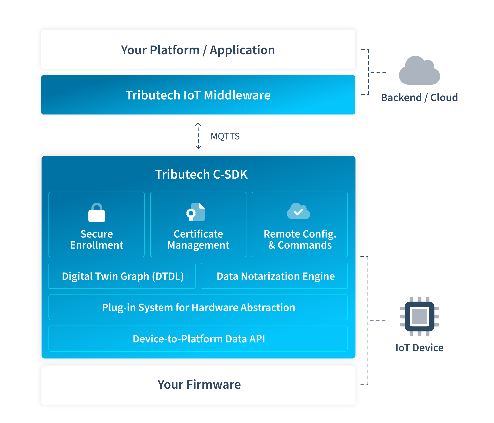

# Overview

The **Tributech C SDK** is a portable, modular software development kit for secure, scalable, and interoperable IoT solutions on resource-constrained embedded devices.  
It provides a standardized way to collect, notarize, and transmit data from embedded systems, ensuring data integrity and authenticity from the point of origin.  
The SDK abstracts hardware and RTOS differences, enabling developers to integrate secure device identity, certificate management, and remote configuration into a wide range of microcontroller-based applications.  
By offering a unified interface and robust security features, the SDK simplifies the development of trustworthy IoT devices and accelerates integration with modern data platforms.

## Key Features

- **Plug-in System for Hardware Abstraction:**  
  Modular architecture for isolating platform-specific code, enabling reuse across different microcontrollers and RTOS types.

- **Secure Enrollment:**  
  Uses X.509 certificates to provide device authentication and secure onboarding.

- **Automated Certificate Management:**  
  Manages provisioning, renewal, and replacement of certificates over secure MQTTS/TLS.

- **Data Notarization Engine:**  
  Cryptographically signs data at the source to ensure integrity and tamper-evidence.

- **Digital Twin Graph (DTDL):**  
  Supports Digital Twin Definition Language for structured data mapping and integration.

- **Remote Configuration & Commands:**  
  Allows secure remote maintenance, configuration, and command execution.

- **Device-to-Platform Data API:**  
  Provides a simple API for sending data over secure MQTTS, compatible with Tributech middleware and other platforms.

