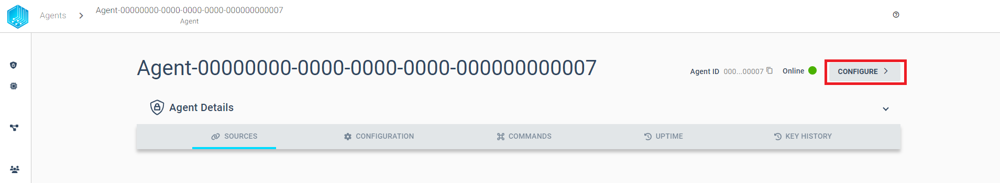
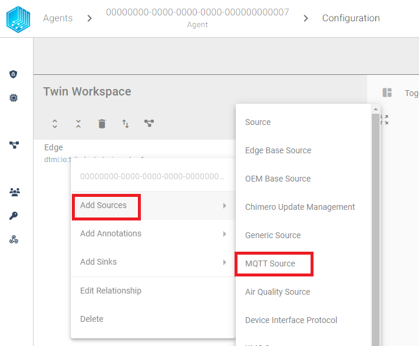
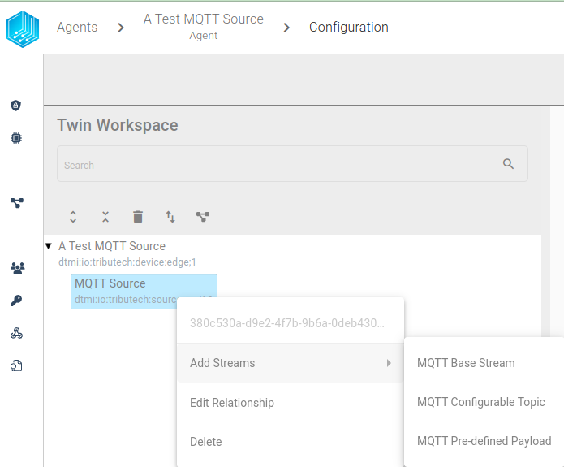
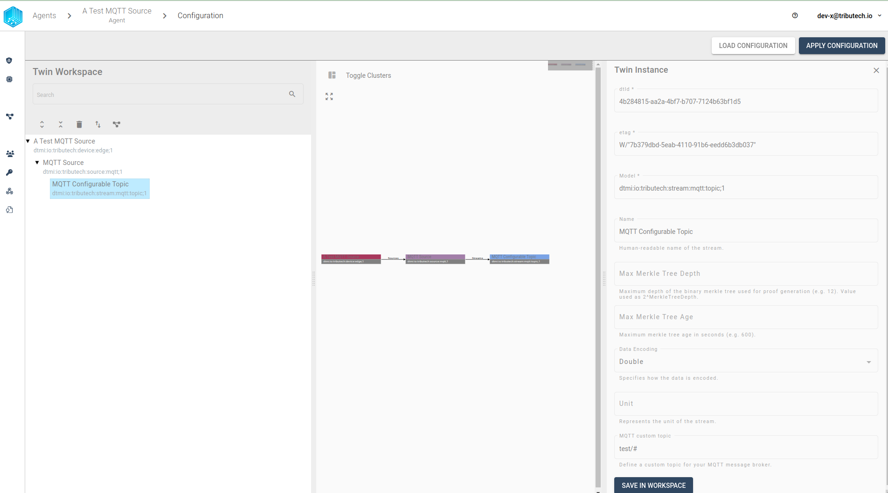
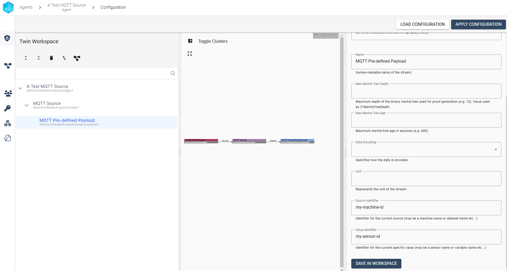
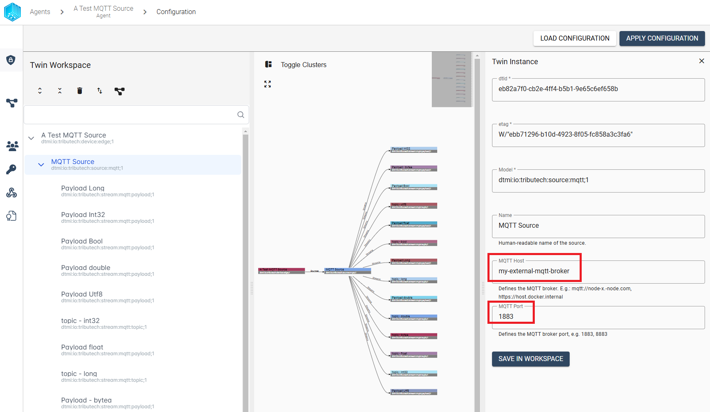
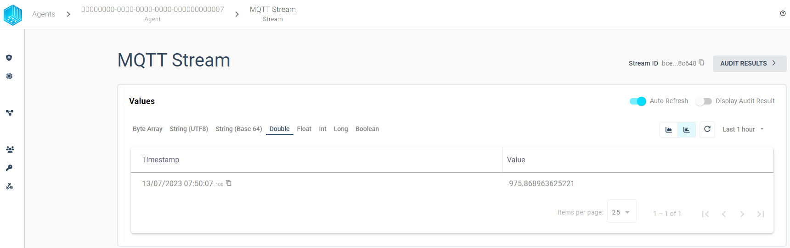

import CodeBlock from '@theme/CodeBlock';
import SourceDockerCompose from '!!raw-loader!../examples/agent-source/mqtt/docker-compose.yml';
import EnvSample from '!!raw-loader!../examples/agent-management/agent-service-sample-values.yml';

The Tributech Agent supports the integration of external data sources using the [**MQTT messaging protocol**](https://mqtt.org/) with the  Tributech MQTT Source. The MQTT Source itself is configured via the Twin Configuration and will be described in the following sections.

## Setup
The Tributech MQTT Source image can be started without any dependencies but will not be functional without a valid Twin Configuration or MessageBroker connect to the Tributech Agent. The TwinConfiguration can be provided via the Tributech Node (recommended) or MessageBroker (see [Source Integration](../source_integration#twin-model)). The MQTT Source will automatically connect to the Tributech Agent if the Tributech Agent is running and the MQTT Source is configured with the correct MessageBroker settings.

In the following part we will describe the setup of a Tributech MQTT Source.

- Create a `docker-compose.yml` file with the following content (adjustments required):
<CodeBlock className="language-yml" title="docker-compose.yml">{SourceDockerCompose}</CodeBlock>

Adjust the setting for the [Tributech Agent](../overview.md) to your environment, sample value:
<CodeBlock className="language-plain" title="env specific settings">{EnvSample}</CodeBlock>

## Configuration
After setting up the Tributech MQTT Source we need to activate it in the Tributech Node (see [Agent Management](../../tributech_node/agent/agent_management.mdx#activate-agent)) and configure the TwinConfiguration.



We can now add by right clicking the Device Edge entry a new MQTT Source.



After right clicking on the MQTT Source entry we can add a new MQTT Stream.




We have two possible choice
- **MQTT Configurable Topic Stream**: A stream with a custom topic that supports wildcards for the MQTT Topic, e.g. `test/#` or `test/+/TEMP`
- **MQTT Pre-defined Payload**: A stream with a predefined payload keypair that will be used as an identifier and be sent to a common MQTT Topic

### Configurable Topic Stream

In this section we configure a Stream that is linked to a freely customizable MQTT Topic. The following example shows how to setup a stream for a double value with the display name MQTT Stream and the MQTT Topic `xxo`. For custom topics, two wildcards are supported:

- A `#` character represents a complete sub-tree of the hierarchy and thus must be the last character in a subscription topic string, such as `test/#`. This will match any topic starting with `test/`, such as `test/1/TEMP` and `test/2/HUMIDITY`.

- A `+` character represents a single level of the hierarchy and is used between delimiters. For example, `test/+/TEMP` will match `test/1/TEMP` and `test/2/TEMP`.


The following example shows an example for the wildcard `#`. After changes to the `MQTT custom topic` we need to 
save the settings by clicking on the `SAVE IN WORKSPACE` button in the bottom.



We can repeat this process for all required streams for the MQTT Source. An important note is that the MQTT Source will only work when there are no overlapping topics, i.e. `test/#` and `test/+/TEMP` are not allowed to be configured for the same MQTT Source.

After we have configured the MQTT Source we can apply the configuration to the Tributech Agent by clicking on the `APPLY CONFIGURATION` button in the top right corner.

This completes the configuration of the MQTT Source and we can now send data to the MQTT Source via an MQTT Client Application like [MQTTX](https://mqttx.app/) or [MQTT Explorer](http://mqtt-explorer.com/).


### Pre-defined Payload Stream

In this section we configure a Stream that is linked to a predefined payload keypair. The difference to the Topic Stream is that this Stream will not be linked to a custom MQTT Topic but to a common MQTT Topic. The following example shows how to setup a stream for a double value with the keypair `my-machine-id` and `my-sensor-id` as stream identifier. The MQTT Topic is set per default to `edge/+/value/GenericValueSource`. For payload streams, two identifier are supported and need to be unique for each stream. The following keypairs are:



We can now send data to the MQTT Source via an MQTT Client Application like [MQTTX](https://mqttx.app/) or [MQTT Explorer](http://mqtt-explorer.com/) to the common MQTT Topic `edge/+/value/GenericValueSource`.


### Value Change Options
The basic handling of Value Change Options (VCO) can be found in [Source Integration](../source_integration.md#value-change-options). This section contains the concrete handling of the ***Step (Delta)*** for the simulated source. The following list contains the description for each supported ***Stream Data Encoding*** where ***X*** represents the value for ***Step (Delta)***:

- ***Double***, ***Int32***, ***Long***, ***Float***: defines the minimum difference between values to be submitted, the change is always compared to the last successful submitted value, e.g. if ***X***= 3 if the double values 1, 2, 5, 8, 10, 11, 14 are received by the Tributech Source only 1, 5, 8, 11, 14 will be submitted.
- ***Byte Array***: will only be submitted if the current and last submitted value are not equal
- ***String UTF 8***: will only be submitted if the current and last submitted value are not equal
- ***Boolean***: will only be submitted if the current and last submitted value are not equal

### Configurable MessageBroker (Optional)
In this section we show how an additional MessageBroker can be configured to collect data from a different MessageBroker than the one defined in the `docker-compose.yml` (i.e. `source-mqtt`). This configuration is optional and does not replace the initial `source-mqtt` connection. Its only needed if the MQTT Source should be configured to use a different MessageBroker for data collection. Configuration updates and publishing values to the Tributech Node will still be done via the `source-mqtt` service.

The following example shows how to setup the MessageBroker for the MQTT Source with a different host and port:




We can save the settings by clicking on the `SAVE IN WORKSPACE` button in the bottom and apply the changes by clicking `APPLY CONFIGURATION`.
If the MQTT Source is not able to connect to the MessageBroker the MQTT Source will not be able to receive any data.
However, the MQTT Source will `fallback` to the default MessageBroker settings (aka the MessageBroker from the `docker-compose.yml`) if the `MQTT Host` is empty or the `MQTT Port` is set to 0.

## Providing Data
In the following section we describe how to provide data to the MQTT Source using the [**MQTT Explorer**](http://mqtt-explorer.com/). In our example we can access the MQTT MessageBroker on port 1883 (need to match your `mosquitto-server-mqtt` service in the [`docker-compose.yml`](../examples/agent-source/mqtt/docker-compose.yml)).

### MQTT Explorer
The [**MQTT Explorer**](http://mqtt-explorer.com/) supports the interact and monitoring of a MQTT MessageBroker via a simple UI.
We can use the [**MQTT Explorer**](http://mqtt-explorer.com/) to connect to the `mosquitto-server-mqtt` service in the `docker-compose.yml`
on port 1883 and manually submit data to MQTT Source via the MessageBroker.
The MQTT Source will send received data after process via the Tributech Agent to the Tributech Node.


The data of the previously defined Streams can be viewed in the Tributech Node by clicking on the corresponding `MQTT Stream`.
Per default we will show the data directly in the `Stream Data Encoding` defined datatype tab.




#### Sending Configurable Topic Stream Example
The example will submit the following payload data to the MQTT Source previously configured in [Setup](#setup) :

```json
    {
        "Timestamp":"2023-07-13T05:50:07.1003104+00:00",
        "Value":432
    }
```

**Note that double or float values support only a `.` as a decimal separator**

The timestamp can also be changed to fit all specific time zones, this can be done with the last part in the timestamp, here the time difference can be added, for example: `"Timestamp":"2023-07-13T05:50:07.1003104+02:00"`. It is important that the timestamp also contains microseconds. These can be zeros, but the microseconds are crucial for the timestamp to be processed by the system.

We can post the data to the MQTT Source by clicking on the `Publish` button in the top right corner.


#### Sending Pre-defined Payload Stream Example
The example will submit the following payload data to the MQTT Source previously configured in [Setup](#setup) :

```json
    {
        "MachineID": "my-machine-id",
        "SensorID": "my-sensor-id",
        "Timestamp":"2023-07-13T05:50:07.1003104+00:00",
        "Value": 147
    }
```


