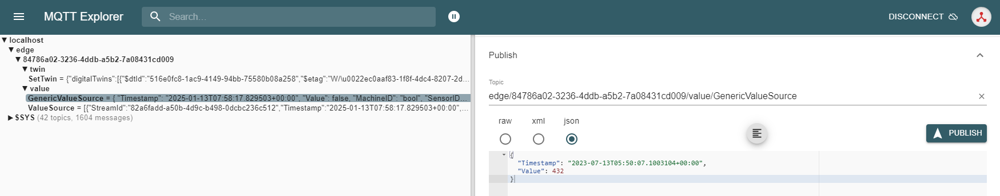
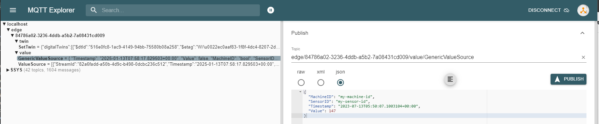

import CodeBlock from '@theme/CodeBlock';
import SourceDockerCompose from '!!raw-loader!../examples/agent-source/mqtt/docker-compose.yml';
import EnvSample from '!!raw-loader!../examples/agent-management/agent-service-sample-values-source.yml';
import ThemedImage from '@theme/ThemedImage';
import NodeAgentConfigurationLight from '../img/node-agent-configure-light.png';
import NodeAgentConfigurationDark from '../img/node-agent-configure-dark.png';
import NodeMQTTAddSourceLight from '../img/node-source-mqtt-add-light.png';
import NodeMQTTAddSourceDark from '../img/node-source-mqtt-add-dark.png';
import NodeMQTTAddStreamLight from '../img/node-source-mqtt-add-streams-light.png';
import NodeMQTTAddStreamDark from '../img/node-source-mqtt-add-streams-dark.png';
import NodeConfigTopicStreamLight from '../img/node-source-mqtt-config-topic-stream-light.png';
import NodeConfigTopicStreamDark from '../img/node-source-mqtt-config-topic-stream-dark.png';
import NodeConfigPayloadStreamLight from '../img/node-source-mqtt-config-payload-stream-light.png';
import NodeConfigPayloadStreamDark from '../img/node-source-mqtt-config-payload-stream-dark.png';
import NodeConfigJsonPathCollectionStreamLight from '../img/node-source-mqtt-jsonpath-collection-stream-light.png';
import NodeConfigJsonPathCollectionStreamDark from '../img/node-source-mqtt-jsonpath-collection-stream-dark.png';
import NodeMQTTSourceBrokerLight from '../img/node-source-mqtt-additional-broker-light.png';
import NodeMQTTSourceBrokerDark from '../img/node-source-mqtt-additional-broker-dark.png';
import NodeMQTTStreamValueDoubleLight from '../img/node-source-mqtt-stream-value-double-light.png';
import NodeMQTTStreamValueDoubleDark from '../img/node-source-mqtt-stream-value-double-dark.png';


The Tributech Agent supports the integration of external data sources using the [**MQTT messaging protocol**](https://mqtt.org/) with the  Tributech MQTT Source. The MQTT Source itself is configured via the Twin Configuration and will be described in the following sections.

## Setup
The Tributech MQTT Source image can be started without any dependencies but will not be functional without a valid Twin Configuration or MessageBroker connect to the Tributech Agent. The TwinConfiguration can be provided via the Tributech Node (recommended) or MessageBroker (see [Source Integration](../source_integration#twin-model)). The MQTT Source will automatically connect to the Tributech Agent if the Tributech Agent is running and the MQTT Source is configured with the correct MessageBroker settings.

In the following part we will describe the setup of a Tributech MQTT Source.

- Create a `docker-compose.yml` file with the following content (adjustments required):
<CodeBlock className="language-yml" title="docker-compose.yml">{SourceDockerCompose}</CodeBlock>

Adjust the setting for the [Tributech Agent](../overview.md) to your environment, sample value:
<CodeBlock className="language-plain" title="env specific settings">{EnvSample}</CodeBlock>

The Tributech Agent authenticates with the Tributech Node using enrollment certificates provided through a local `enrollment` folder mounted into the container (the `./enrollment:/app/enrollment` volume in the `docker-compose.yml` above). See [Authentication Certificates (Enrollment)](../setup.mdx#authentication-certificates-enrollment) and [Docker volumes](../setup.mdx#docker-volumes) in the Setup guide for how to create and provide it. If no Agent ID is configured, the agent generates a random one on first start.

## Configuration
After setting up the Tributech MQTT Source we need to activate it in the Tributech Node (see [Agent Management](../../tributech_node/agent/agent_management.mdx#activate-agent)) and configure the TwinConfiguration.

<ThemedImage
  alt="Tributech Agent Configuration"
  sources={{ light: NodeAgentConfigurationLight, dark: NodeAgentConfigurationDark }}
/>

We can now add a new MQTT Source.

<ThemedImage
  alt="Configuration Add MQTT source"
  sources={{ light: NodeMQTTAddSourceLight, dark: NodeMQTTAddSourceDark }}
/>

After right clicking on the MQTT Source entry we can add a new MQTT Stream.


<ThemedImage
  alt="Configuration Add MQTT stream"
  sources={{ light: NodeMQTTAddStreamLight, dark: NodeMQTTAddStreamDark }}
/>

We have the following three options for MQTT streams:
- **[MQTT Configurable Topic Stream](#configurable-topic-stream)**: A single stream bound to a custom MQTT Topic, whose payload is a simple JSON object carrying the reading in a `Value` field and a `Timestamp`. The topic can use wildcards (`#`, `+`), e.g. `test/#` or `test/+/TEMP`, so one stream definition can capture values arriving on many matching topics. Best suited when every sensor or value is published on its own dedicated topic.
- **[MQTT Pre-defined Payload Stream](#pre-defined-payload-stream)**: A stream that listens on one common, shared MQTT Topic and is identified by a unique keypair carried inside the payload (for example `MachineID` and `SensorID`) rather than by the topic. Best suited when several values are published to the same common topic and have to be told apart by the identifiers in each message instead of by separate topics.
- **[MQTT JSONPath Collection](#jsonpath-collection)**: A group of streams that all share a single MQTT Topic, where each stream extracts one value (and a timestamp) from the incoming JSON payload using a JSONPath expression. Best suited when a single JSON message bundles several values together, such as a power monitor reporting voltage, power and frequency in one message.

### Configurable Topic Stream

A Configurable Topic Stream binds a single stream to a freely chosen MQTT Topic. Each message published to that topic is a simple JSON object that carries the reading in a `Value` field and a `Timestamp` (see [Sending Configurable Topic Stream Example](#sending-configurable-topic-stream-example)). This stream type is the right choice when every sensor or value has its own dedicated topic, and it can additionally use wildcards to subscribe to several related topics with a single stream definition. The following example shows how to setup a stream for a double value with the display name MQTT Stream and the MQTT Topic `xxo`. For custom topics, two wildcards are supported:

- A `#` character represents a complete sub-tree of the hierarchy and thus must be the last character in a subscription topic string, such as `test/#`. This will match any topic starting with `test/`, such as `test/1/TEMP` and `test/2/HUMIDITY`.

- A `+` character represents a single level of the hierarchy and is used between delimiters. For example, `test/+/TEMP` will match `test/1/TEMP` and `test/2/TEMP`.


The following example shows an example for the wildcard `#`.

<ThemedImage
  alt="Configurable Topic Stream"
  sources={{ light: NodeConfigTopicStreamLight, dark: NodeConfigTopicStreamDark }}
/>

We can repeat this process for all required streams for the MQTT Source. An important note is that the MQTT Source will only work when there are no overlapping topics, i.e. `test/#` and `test/+/TEMP` are not allowed to be configured for the same MQTT Source.

After we have configured the MQTT Source we can apply the configuration to the Tributech Agent by clicking on the `APPLY CONFIGURATION` button in the top right corner.

This completes the configuration of the MQTT Source and we can now send data to the MQTT Source via an MQTT Client Application like [MQTTX](https://mqttx.app/) or [MQTT Explorer](http://mqtt-explorer.com/).


### Pre-defined Payload Stream

A Pre-defined Payload Stream is not bound to a custom topic; instead it listens on a common MQTT Topic that is shared by many streams and defaults to `edge/+/value/GenericValueSource`. Because all messages arrive on the same topic, each stream is identified by a unique keypair contained in the payload itself — two identifiers that together must be unique for every stream. In addition to those identifiers, the payload carries the reading in a `Value` field and a `Timestamp` (see [Sending Pre-defined Payload Stream Example](#sending-pre-defined-payload-stream-example)). This stream type is the right choice when several values are published to the same common topic and are distinguished by the identifiers in each message instead of by separate topics. The following example shows how to setup a stream for a double value with the keypair `my-machine-id` and `my-sensor-id` as stream identifier:

<ThemedImage
  alt="Pre-defined Payload Stream"
  sources={{ light: NodeConfigPayloadStreamLight, dark: NodeConfigPayloadStreamDark }}
/>

We can now send data to the MQTT Source via an MQTT Client Application like [MQTTX](https://mqttx.app/) or [MQTT Explorer](http://mqtt-explorer.com/) to the common MQTT Topic `edge/+/value/GenericValueSource`.

### JSONPath Collection

In this section, we configure a JSONPath Collection that groups multiple streams under one shared MQTT Topic. This stream type is the right choice when a single JSON message bundles several readings together — for example a power monitor that publishes voltage, power and frequency in one message. Enter the exact MQTT Topic on which the JSON object is published, for example `factory/power-monitor`. Each stream in the collection then uses a [JSONPath](https://goessner.net/articles/JsonPath/) expression to extract an individual value and a timestamp from the received payload.

For example, a collection using the MQTT Topic `factory/power-monitor` could contain the following streams:

- Voltage L1: `$.voltage_V.L1`
- Total Power: `$.power_W.total`
- Frequency L1: `$.frequency_Hz.L1`
- Timestamp: `$.timestamp`

All streams in the collection process the same incoming MQTT message but extract different values from its JSON payload. After configuring all required streams, apply the configuration and publish JSON messages to the configured MQTT Topic using an MQTT client such as [MQTTX](https://mqttx.app/) or [MQTT Explorer](http://mqtt-explorer.com/).

<ThemedImage
  alt="JsonPath Collection Stream"
  sources={{ light: NodeConfigJsonPathCollectionStreamLight, dark: NodeConfigJsonPathCollectionStreamDark }}
/>

For the MQTT Topic field, enter the actual topic used by the publishing device or application, such as:

`factory/power-monitor`

Note that this field expects an exact MQTT Topic — it is not a JSONPath expression.

### Value Change Options
The basic handling of Value Change Options (VCO) can be found in [Source Integration](../source_integration.md#value-change-options). This section contains the concrete handling of the ***Step (Delta)*** for the simulated source. The following list contains the description for each supported ***Stream Data Encoding*** where ***X*** represents the value for ***Step (Delta)***:

- ***Double***, ***Int32***, ***Long***, ***Float***: defines the minimum difference between values to be submitted, the change is always compared to the last successful submitted value, e.g. if ***X***= 3 if the double values 1, 2, 5, 8, 10, 11, 14 are received by the Tributech Source only 1, 5, 8, 11, 14 will be submitted.
- ***Byte Array***: will only be submitted if the current and last submitted value are not equal
- ***String UTF 8***: will only be submitted if the current and last submitted value are not equal
- ***Boolean***: will only be submitted if the current and last submitted value are not equal

### Configurable MessageBroker (Optional)
In this section we show how an additional MessageBroker can be configured to collect data from a different MessageBroker than the one defined in the `docker-compose.yml` (i.e. `source-mqtt`). This configuration is optional and does not replace the initial `source-mqtt` connection. Its only needed if the MQTT Source should be configured to use a different MessageBroker for data collection. Configuration updates and publishing values to the Tributech Node will still be done via the `source-mqtt` service.

The following example shows how to setup the MessageBroker for the MQTT Source with a different host and port:

<ThemedImage
  alt="Additional MQTT Broker Configuration"
  sources={{ light: NodeMQTTSourceBrokerLight, dark: NodeMQTTSourceBrokerDark }}
/>

We can apply the changes by clicking `APPLY CONFIGURATION`.
If the MQTT Source is not able to connect to the MessageBroker the MQTT Source will not be able to receive any data.
However, the MQTT Source will `fallback` to the default MessageBroker settings (aka the MessageBroker from the `docker-compose.yml`) if the `MQTT Host` is empty or the `MQTT Port` is set to 0.

## Providing Data
In the following section we describe how to provide data to the MQTT Source using the [**MQTT Explorer**](http://mqtt-explorer.com/). In our example we can access the MQTT MessageBroker on port 1883 (need to match your `mosquitto-server-mqtt` service in the [`docker-compose.yml`](../examples/agent-source/mqtt/docker-compose.yml)).

### MQTT Explorer
The [**MQTT Explorer**](http://mqtt-explorer.com/) supports the interact and monitoring of a MQTT MessageBroker via a simple UI.
We can use the [**MQTT Explorer**](http://mqtt-explorer.com/) to connect to the `mosquitto-server-mqtt` service in the `docker-compose.yml`
on port 1883 and manually submit data to MQTT Source via the MessageBroker.
The MQTT Source will send received data after process via the Tributech Agent to the Tributech Node.


The data of the previously defined Streams can be viewed in the Tributech Node by clicking on the corresponding `MQTT Stream`.
Per default we will show the data directly in the `Stream Data Encoding` defined datatype tab.

<ThemedImage
  alt="Mqtt Explorer publish"
  sources={{ light: NodeMQTTStreamValueDoubleLight, dark: NodeMQTTStreamValueDoubleDark }}
/>


#### Sending Configurable Topic Stream Example
The example will submit the following payload data to the MQTT Source previously configured in [Setup](#setup) :

```json
    {
        "Timestamp":"2023-07-13T05:50:07.1003104+00:00",
        "Value":432
    }
```

**Note that double or float values support only a `.` as a decimal separator**

The timestamp can also be changed to fit all specific time zones, this can be done with the last part in the timestamp, here the time difference can be added, for example: `"Timestamp":"2023-07-13T05:50:07.1003104+02:00"`. It is important that the timestamp also contains microseconds. These can be zeros, but the microseconds are crucial for the timestamp to be processed by the system.

We can post the data to the MQTT Source by clicking on the `Publish` button in the top right corner.



#### Sending Pre-defined Payload Stream Example
The example will submit the following payload data to the MQTT Source previously configured in [Setup](#setup) :

```json
    {
        "MachineID": "my-machine-id",
        "SensorID": "my-sensor-id",
        "Timestamp":"2023-07-13T05:50:07.1003104+00:00",
        "Value": 147
    }
```



