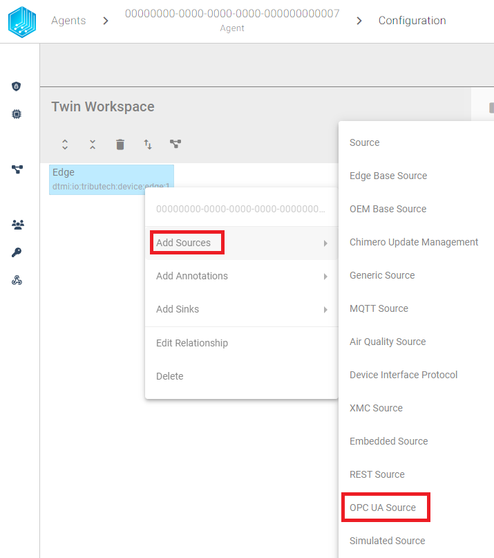
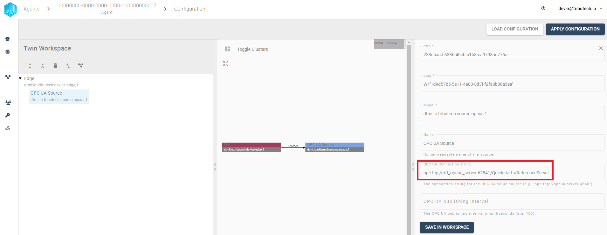
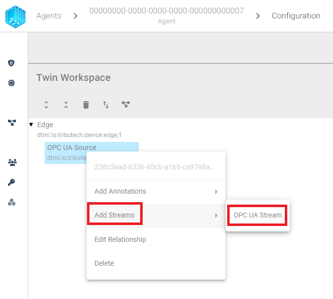
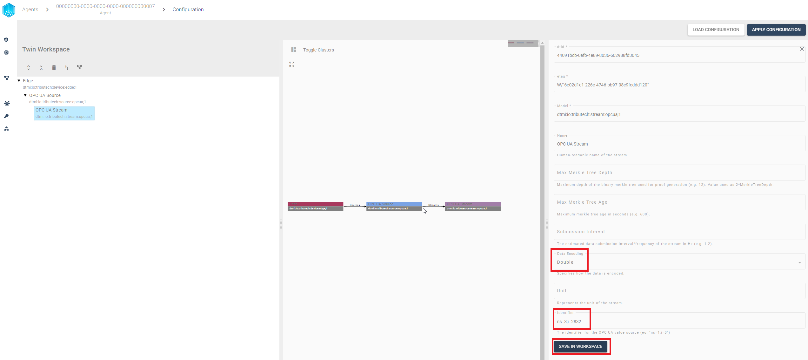

import CodeBlock from '@theme/CodeBlock';
import SourceDockerCompose from '!!raw-loader!../examples/agent-source/opcua/docker-compose.yml';
import EnvSample from '!!raw-loader!../examples/agent-management/agent-service-sample-values.yml';

The Tributech OPC-UA Source allows to connect to an [**OPC Unified Architecture (UA)**](https://opcfoundation.org/about/opc-technologies/opc-ua/) server and receive data.  The Tributech OPC-UA Source acts like a OPC-UA Client in a docker environment and enables the forwarding of the data to a Tributech Agent stream.

## Setup
The Tributech OPC-UA Source image can be started without any dependencies but will not be functional without a valid Twin Configuration or MessageBroker connect to the Tributech Agent. The TwinConfiguration can be provided via the Tributech Node (recommended) or MessageBroker (see [Source Integration](../source_integration#twin-model)). The OPC-UA Source will automatically connect to the Tributech Agent if the Tributech Agent is running and correct MessageBroker settings are set. In the following part we will describe the setup of a Tributech OPC-UA Source:

- Create a `docker-compose.yml` file with the following content (adjustments required):
<CodeBlock className="language-yml" title="docker-compose.yml">{SourceDockerCompose}</CodeBlock>

Adjust the setting for the [Tributech Agent](../overview.md) to your environment, sample value:
<CodeBlock className="language-plain" title="env specific settings">{EnvSample}</CodeBlock>

## Configuration

After setting up the Tributech OPC-UA Source we need to activate it in the Tributech Node (see [Agent Management](../../tributech_node/agent/agent_management.mdx#activate-agent)) and configure the TwinConfiguration.

We can save the settings by clicking on the `SAVE IN WORKSPACE` button in the bottom right corner and add a new OPC-UA Stream by right clicking on the OPC-UA Source entry:

In order to connect to the OPC-UA Server we need to configure the OPC-UA Server settings. The following screenshot shows the description for each setting (an example server endpoint is `opc.tcp://<host>:62541/Quickstarts/ReferenceServer`):

Next we can add a new OPC-UA Stream by clicking on the `Add Streams` and `OPC UA Stream`:

The OPC-UA Stream can be configured with the following settings (the Identifier shown is an example):

We can save the settings by clicking on the `SAVE IN WORKSPACE` button in the bottom right corner and continue adding every Identifier we want to read from the OPC-UA Server.

After all streams have been configured, we can apply the configuration to the Tributech Agent by clicking on the `APPLY CONFIGURATION` button in the top right corner.

`
Without a running OPC-UA Server we will not receive any data on the Tributech Node.
`

### Value Change Options
The basic handling of Value Change Options (VCO) can be found in [Source Integration](../source_integration.md). This section contains the concrete handling of the ***Step (Delta)*** for the simulated source. The following list contains the description for each supported ***Stream Data Encoding*** where ***X*** represents the value for ***Step (Delta)***:

- ***Double***, ***Int32***, ***Long***, ***Float***: defines the minimum difference between values to be submitted, the change is always compared to the last successful submitted value, e.g. if ***X***= 3 if the double values 1, 2, 5, 8, 10, 11, 14 are received by the Tributech Source only 1, 5, 8, 11, 14 will be submitted.
- ***Byte Array***: will only be submitted if the current and last submitted value are not equal
- ***String UTF 8***: will only be submitted if the current and last submitted value are not equal
- ***Boolean***: will only be submitted if the current and last submitted value are not equal

## Providing Data
If an OPC-UA Server is used as a source, no specific settings are required — only the settings described in [Configuration](#configuration).

The following table lists example Identifier paths and their data types:

| Identifier | DataType |
| --- | --- |
| `ns=3;i=2822` | Boolean |
| `ns=3;i=2824` | Byte Array |
| `ns=3;i=2832` | Double |
| `ns=3;i=2831` | Float |
| `ns=3;i=2827` | Integer |
| `ns=3;i=2829` | Long |
| `ns=3;i=2833` | UTF8 String |
