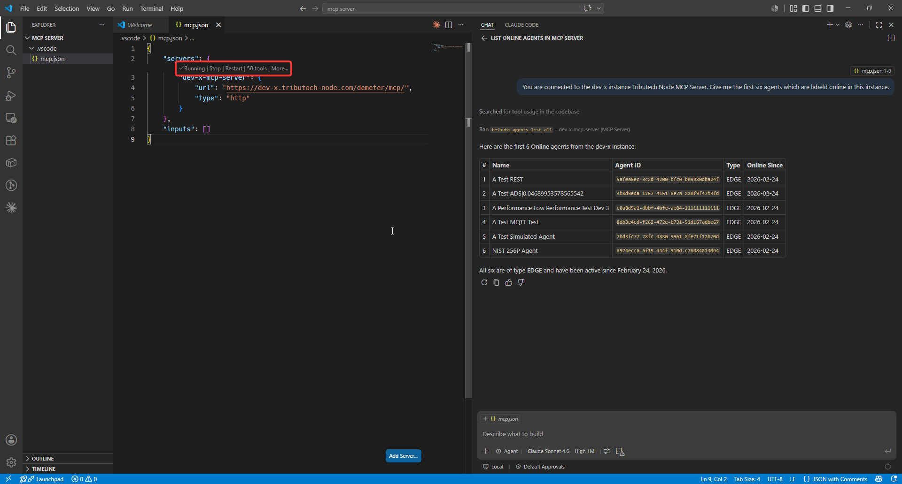
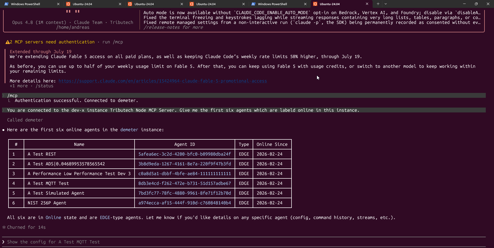

import ThemedImage from '@theme/ThemedImage';
import McpArchLight from './img/mcp-connection-overview-light.png';
import McpArchDark from './img/mcp-connection-overview-dark.png';

The Tributech Node can be accessed in three ways: the [REST API](./api_category/API_integration.md), [Webhooks](./Webhook_integration.md), and — described here — the **Model Context Protocol (MCP)** server. The MCP server lets AI assistants and MCP-capable tools interact with your Tributech Node through a standardized interface.

:::info
The MCP Server is currently an **opt-in Beta feature**. It has to be enabled for your Tributech Node by the Tributech team before it can be reached — please contact Tributech to request access.
:::

## Overview

[Model Context Protocol](https://modelcontextprotocol.io/) (MCP) is an open standard that lets AI clients discover and call the tools and resources a server exposes. The Tributech MCP server runs in the Tributech backend and exposes Node operations — such as listing agents, reading stream data and proofs, and managing the Digital Twin configuration — as MCP tools, so an MCP-capable client can query and operate your Node in natural language.

<ThemedImage
  alt="MCP Connection Overview"
  sources={{ light: McpArchLight, dark: McpArchDark }}
/>

## Prerequisites

- A running [Tributech Node](./overview.md) with the MCP server **enabled** (see the Beta note above).
- The MCP endpoint URL for your environment (provided by Tributech).
- An MCP-capable client — this guide covers **VS Code** and **Claude Code**.

## Connection details

The MCP server uses **HTTP transport** with **OAuth 2.0** authentication (handled by the Tributech Keycloak instance). The same values are used for every client:

| Setting | Value |
| --- | --- |
| URL | `https://<host>/demeter/mcp/` |
| Transport | HTTP |
| Authentication | OAuth 2.0 (Keycloak) |
| Client ID | `demeter-mcp` |
| Client secret | *none* |
| Scopes | `mcp:resources`, `mcp:tools` |

Replace `<host>` with your environment's hostname (e.g. `dev-x.tributech-node.com`). On the first connection your client opens a browser window for the OAuth login; after authenticating, the server is registered and ready to use.

## Connecting a client

There are several clients that can work with the MCP server. We provide guidance for two common ones below; this section may change as those clients are updated.

### VS Code

1. Open the command palette (`F1`) and run **`MCP: Add Server`**.
2. Choose **HTTP** and enter the URL `https://<host>/demeter/mcp/`.
3. When prompted, set the **Client ID** to `demeter-mcp` and leave the **Client secret** empty.
4. Allow the connection and sign in with your Tributech Node user name and password.
5. After the redirect, the server should show as **Running**.



### Claude Code

Claude Code connects to the MCP server from the terminal (requires Node.js 18+ and Claude Code installed).

Run the following in your terminal, replacing `<host>` with your environment's hostname:

```bash
claude mcp add --transport http --client-id demeter-mcp --callback-port 8080 --scope user demeter https://<host>/demeter/mcp/
```

On first connection Claude Code opens a browser to complete the OAuth login. The `--callback-port 8080` option fixes the OAuth redirect to `http://localhost:8080/callback`, which is already registered in Keycloak — so no extra Keycloak configuration is required.

Verify the connection from inside the Claude Code console:

```
/mcp
```

The `demeter` server should be listed as **connected**, and its tools and resources are then available to Claude.



## Available tools

The MCP server exposes the Node's operations grouped by area:

| Area | Examples |
| --- | --- |
| Agents | list agents, get agent, activate / block / delete, get & update configuration, command & enrollment history |
| Enrollment groups | list, create, update, activate / deactivate, delete |
| Streams & proofs | read latest & historical stream data, list & validate proofs |
| Digital Twin (DTDL) | read & update the twin graph, add / update / delete instances, models and relationships |

The exact set of available tools may change as the feature evolves.
