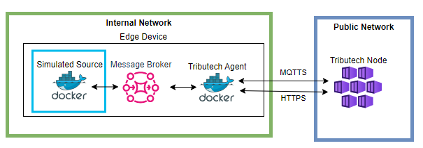

import CodeBlock from '@theme/CodeBlock';
import SourceDockerCompose from '!!raw-loader!./management/docker-compose-agent-integration.yml';
import DockerComposeVolumesExample from '!!raw-loader!./management/docker-compose-volumes-example.yml';
import ThemedImage from '@theme/ThemedImage';
import AgentSectionLight from './img/agent-section-light.png';
import AgentSectionDark from './img/agent-section-dark.png';
import FilterTypeStateLight from './img/agent-overview-filter-type-state-light.png';
import FilterTypeStateDark from './img/agent-overview-filter-type-state-dark.png';
import FilterPropertyValuesLight from './img/agent-property-filter-values-light.png';
import FilterPropertyValuesDark from './img/agent-property-filter-values-dark.png';
import ShowFilterLight from './img/agent-details-show-filter-light.png';
import ShowFilterDark from './img/agent-details-show-filter-dark.png';
import StreamFilterNameLight from './img/agent-details-stream-filter-name-light.png';
import StreamFilterNameDark from './img/agent-details-stream-filter-name-dark.png';
import StreamFilterIdLight from './img/agent-details-stream-filter-id-light.png';
import StreamFilterIdDark from './img/agent-details-stream-filter-id-dark.png';
import OverviewGetIdLight from './img/agents-overview-getid-light.png';
import OverviewGetIdDark from './img/agents-overview-getid-dark.png';
import DetailsGetIdLight from './img/agents-details-getid-light.png';
import DetailsGetIdDark from './img/agents-details-getid-dark.png';
import DetailsGetStreamIdLight from './img/agent-details-get-stream-id-light.png';
import DetailsGetStreamIdDark from './img/agent-details-get-stream-id-dark.png';
import StreamGetStreamIdLight from './img/agent-stream-get-stream-id-light.png';
import StreamGetStreamIdDark from './img/agent-stream-get-stream-id-dark.png';
import BondAgentsOverviewLight from './img/agent-bond-agents-overview-light.png';
import BondAgentsOverviewDark from './img/agent-bond-agents-overview-dark.png';
import DetailsConfigureLight from './img/agent-details-configure-light.png';
import DetailsConfigureDark from './img/agent-details-configure-dark.png';
import ConfigAgentIdLight from './img/agent-bond-config-agent-id-light.png';
import ConfigAgentIdDark from './img/agent-bond-config-agent-id-dark.png';
import ConfigNameLight from './img/agent-bond-config-name-light.png';
import ConfigNameDark from './img/agent-bond-config-name-dark.png';
import ConfigApplyLight from './img/agent-bond-config-save-workspace-light.png';
import ConfigApplyDark from './img/agent-bond-config-save-workspace-dark.png';
import AddSourceMenuLight from './img/agent-bond-add-simulated-1-light.png';
import AddSourceMenuDark from './img/agent-bond-add-simulated-1-dark.png';
import AddSourceDialogLight from './img/agent-bond-add-simulated-2-light.png';
import AddSourceDialogDark from './img/agent-bond-add-simulated-2-dark.png';
import AddStreamMenuLight from './img/agent-bond-add-stream-1-light.png';
import AddStreamMenuDark from './img/agent-bond-add-stream-1-dark.png';
import AddStreamDialogLight from './img/agent-bond-add-stream-2-light.png';
import AddStreamDialogDark from './img/agent-bond-add-stream-2-dark.png';
import StreamConfigLight from './img/agent-bond-simulated-stream-config-light.png';
import StreamConfigDark from './img/agent-bond-simulated-stream-config-dark.png';
import ConfigToDetailsLight from './img/agent-bond-config-to-agent-details-light.png';
import ConfigToDetailsDark from './img/agent-bond-config-to-agent-details-dark.png';
import DetailsOneStreamLight from './img/agent-bond-details-view-one-stream-light.png';
import DetailsOneStreamDark from './img/agent-bond-details-view-one-stream-dark.png';
import ViewToggleLight from './img/agent-twin-view-toggle-light.png';
import ViewToggleDark from './img/agent-twin-view-toggle-dark.png';
import VersionsButtonLight from './img/agent-twin-versions-button-light.png';
import VersionsButtonDark from './img/agent-twin-versions-button-dark.png';
import VersionsAvailableLight from './img/agent-twin-versions-available-updates-light.png';
import VersionsAvailableDark from './img/agent-twin-versions-available-updates-dark.png';
import VersionsReviewImpactLight from './img/agent-twin-versions-review-impact-light.png';
import VersionsReviewImpactDark from './img/agent-twin-versions-review-impact-dark.png';
import VersionsSummaryLight from './img/agent-twin-versions-summary-light.png';
import VersionsSummaryDark from './img/agent-twin-versions-summary-dark.png';
import VersionsResultLight from './img/agent-twin-versions-result-light.png';
import VersionsResultDark from './img/agent-twin-versions-result-dark.png';

In the following section we describe how configure and navigate the Tributech Agent via the Tributech Node UI.
This requires an successful [Setup](../../tributech_agent/setup.mdx) (or [QuickStart](../../tributech_agent/quickstart.mdx)) and a completed [activation](../agent/agent_management.mdx#activate-agent) with a [Tributech Node](../overview.md).

## Searching for an Agent

The first step is to find the correct Tributech Agent in the *Agent Section*. In this overview we can filter agents either by their `Agent ID` (from the [Setup](../../tributech_agent/setup.mdx)) or by a (partial) name.

<ThemedImage
  alt="Online Tributech Agent"
  sources={{ light: AgentSectionLight, dark: AgentSectionDark }}
/>

Its also possible to filter agent via states or types:

<ThemedImage
  alt="Online Tributech Agent"
  sources={{ light: FilterTypeStateLight, dark: FilterTypeStateDark }}
/>

<ThemedImage
  alt="Online Tributech Agent"
  sources={{ light: FilterPropertyValuesLight, dark: FilterPropertyValuesDark }}
/>

## Searching for a Stream
In Order to inspect data and proofs received from a [Tributech Agent](../../tributech_agent/overview.md) we need to find the correct stream. Streams can be found in the Tributech Agent details view and filtered by name or id.

**Show filter:**

<ThemedImage
  alt="Online Tributech Agent"
  sources={{ light: ShowFilterLight, dark: ShowFilterDark }}
/>

**Filter by (partial) name:**

<ThemedImage
  alt="Online Tributech Agent"
  sources={{ light: StreamFilterNameLight, dark: StreamFilterNameDark }}
/>

**Filter by StreamId:**

<ThemedImage
  alt="Online Tributech Agent"
  sources={{ light: StreamFilterIdLight, dark: StreamFilterIdDark }}
/>

## Get the Agent Id
Agents can be referenced either by name or Id, e.g. [searching for an agent](#searching-for-an-agent). An Agent Id is a GUID (Globally Unique Identifier) that is assigned to a Tributech Agent on startup (see [Setup](../../tributech_agent/setup.mdx) (or [QuickStart](../../tributech_agent/quickstart.mdx))) and will never change. When interacting with the [Tributech Node API](../api_category/API_usage.md) its required for many operations to specify which Tributech Agent we will be interacting with and the selection is done via the Agent Id. In the following enumeration we want to show where to find the Agent Id in the Tributech UI:

**In the *Agent Section*:**

<ThemedImage
  alt="Online Tributech Agent overview get id"
  sources={{ light: OverviewGetIdLight, dark: OverviewGetIdDark }}
/>

**In the Agent details** (can be accessed by clicking the agent table entry in the *Agent Section*):

<ThemedImage
  alt="Online Tributech Agent details get id"
  sources={{ light: DetailsGetIdLight, dark: DetailsGetIdDark }}
/>

## Get a Stream Id
Collected data is always bound to a data stream which is a collection of information that can be identified by the unique StreamId, i.e. a GUID (Globally Unique Identifier). The StreamId can be used to access values and proofs via the [Tributech Node API](../api_category/API_usage.md) and map data from [Webhook Events](../Webhook_integration.md).
We can access the StreamId either via

agent details (can be access by clicking the agent entry in the *Agent section*) actions:

<ThemedImage
  alt="Online Tributech Agent details get stream id"
  sources={{ light: DetailsGetStreamIdLight, dark: DetailsGetStreamIdDark }}
/>

or by inspecting a specific stream

<ThemedImage
  alt="Online Tributech Agent details get stream id"
  sources={{ light: StreamGetStreamIdLight, dark: StreamGetStreamIdDark }}
/>

## Configuring an Agent
After activating an the Tributech Agent (see [Agent Management](./agent_management.mdx#activate-agent)) we can configure the settings of an Tributech Agent
by changes the Digital Twin. Those settings include properties of the Tributech Agent like naming, merkle depth etc or managing relationships and associated [Tributech Sources](../../tributech_agent/source_integration.md) and Source settings. The starting point for all this operations is the
`Twin Workspace` and we show in this section how to make changes to the Digital Twin. Details on how to configure specific Sources can be found in the corresponding [Tributech Sources](../../tributech_agent/source_integration.md) overview.
We can access the `Twin Workspace` either via selecting `Configure Agent` in the `actions context menu`.

<ThemedImage
  alt="Online Tributech Agent"
  sources={{ light: BondAgentsOverviewLight, dark: BondAgentsOverviewDark }}
/>

or by simply click the entry in the `Agents` section followed by `CONFIGURE` in the Agent details

<ThemedImage
  alt="Online Tributech Agent"
  sources={{ light: DetailsConfigureLight, dark: DetailsConfigureDark }}
/>

In the `Twin Workspace` we see on the right side, as the first fixed setting of the device entry (`dtmi:io:tributech:device:edge;2`), the [Agent Id](#get-the-agent-id) indicated by `dtId`. This field is an example for Meta data field which can not be adjusted by the Twin Workspace.

<ThemedImage
  alt="Tributech Agent Id"
  sources={{ light: ConfigAgentIdLight, dark: ConfigAgentIdDark }}
/>

However, we can give this Tributech Agent a new name which will be displayed in the Agent Overview and will make finding this agent easier.

<ThemedImage
  alt="Tributech Agent Config Name"
  sources={{ light: ConfigNameLight, dark: ConfigNameDark }}
/>

:warning: The changes only take effect when you click `APPLY CONFIGURATION`.

<ThemedImage
  alt="Apply the Tributech Agent Configuration"
  sources={{ light: ConfigApplyLight, dark: ConfigApplyDark }}
/>

### Switching between List and Graph view

By default the `Twin Workspace` shows the Digital Twin as a **list**. Using the view icons in the **upper-right corner** of the workspace (highlighted below) you can switch the display: click the **graph icon** to show the diagram view, and the **list icon** next to it to return to the default list view. These icons are available in both the list and the graph view.

<ThemedImage
  alt="Switching between the list and graph view in the Twin Workspace"
  sources={{ light: ViewToggleLight, dark: ViewToggleDark }}
/>

## Adding data to an Agent
After the initial connect of a Tributech Agent only one entry exists on the left side of the `Twin Workspace`: the device entry `dtmi:io:tributech:device:edge;<version>` (by default version `2`). This entry represents the Tributech Agent and should not be deleted, but we can add a data ingress to this agent by adding [Tributech Sources](../../tributech_agent/source_integration.md). We show in the following steps how to add a [Simulated Tributech Source](../../tributech_agent/sources/simulated_source.mdx) which we set up in our [QuickStart](../../tributech_agent/quickstart.mdx) and [Setup](../../tributech_agent/setup.mdx) `docker-compose.yml` sample file.

To add a source, click the **⋮ (three-dot) menu** at the end of the device entry line and select **`+ Add`**:

<ThemedImage
  alt="Add a Source via the three-dot menu"
  sources={{ light: AddSourceMenuLight, dark: AddSourceMenuDark }}
/>

A pop-up window opens where we can search for the desired source and select the required version. Select the [Simulated Tributech Source](../../tributech_agent/sources/simulated_source.mdx) and click the **`Confirm`** button in the lower-right corner of the window:

<ThemedImage
  alt="Select the Source and version in the pop-up window"
  sources={{ light: AddSourceDialogLight, dark: AddSourceDialogDark }}
/>

We now made the Tributech Agent aware of a connection between itself and a [Simulated Tributech Source](../../tributech_agent/sources/simulated_source.mdx). This enables us to manage the configuration of the Tributech Source and receive data from it.

To receive data from the newly added [Simulated Tributech Source](../../tributech_agent/sources/simulated_source.mdx) we need to add a `Simulated Stream` to it. Click the **⋮ (three-dot) menu** at the end of the source entry line to open a dropdown with **`+ Add`** and **`Delete`** (which would remove the source), then select **`+ Add`**:

<ThemedImage
  alt="Add a Stream via the three-dot menu"
  sources={{ light: AddStreamMenuLight, dark: AddStreamMenuDark }}
/>

A pop-up window opens listing the streams available for this source. Select the desired stream and click the **`Confirm`** button in the lower-right corner of the window:

<ThemedImage
  alt="Select the Stream in the pop-up window"
  sources={{ light: AddStreamDialogLight, dark: AddStreamDialogDark }}
/>

A simulated stream is a continuous flow of data that will be produced randomly by the [Simulated Tributech Source](../../tributech_agent/sources/simulated_source.mdx) with a specific type of data (double, long, integer,..). We adjust the default template properties as followed:

- **Name**: `Simulated Double Stream` is used to identify the stream in the Agent Details overview
- **Data Encoding**: `Double` used in the display of values in the Tributech Node UI
- **Type**: `Double` used to generate data.
- **Min Value**: `-100` will be the smallest generated value
- **Max Value**: `100` will be the largest generated value
- **Frequency**: `0.5` means every 2 second a new values is generated (Time interval = 1 / Data Frequency)

:warning: The changes only take effect when you click `APPLY CONFIGURATION`.

<ThemedImage
  alt="Tributech Agent Simulated Double Stream"
  sources={{ light: StreamConfigLight, dark: StreamConfigDark }}
/>

After successfully executing `APPLY CONFIGURATION` we can now go back to the `Agent details` by clicking the Agent Name in breadcrumbbar.

<ThemedImage
  alt="Tributech Agent Simulated Double Stream"
  sources={{ light: ConfigToDetailsLight, dark: ConfigToDetailsDark }}
/>

The newly created `Simulated Double Stream` is now available. For more information on how to add different sources visit [Tributech Source Integration](../../tributech_agent/source_integration.md) or configure a [Simulated Tributech Source](../../tributech_agent/sources/simulated_source.mdx) visit the corresponding sites.

By selecting the `Simulated Double Stream` we can directly go into the [stream verification](../agent/verification.mdx) of the received data.

<ThemedImage
  alt="Tributech Agent Simulated Double Stream"
  sources={{ light: DetailsOneStreamLight, dark: DetailsOneStreamDark }}
/>

## Digital Twin Versions (Upgrade / Downgrade)

Every entry in the Twin Workspace — the device, its sources and their streams — is based on a versioned Digital Twin model, identified by its `dtmi` (for example `dtmi:io:tributech:device:edge;1`). Newer model versions can add or remove properties and relationships. With the **Update Twin Models** feature you can upgrade or downgrade these model versions directly from the agent configuration view. The versions of the device, sources and streams have to stay compatible with each other — the wizard validates this and prevents combinations that would break a relationship.

Open the wizard with the **`Update Twin Models`** button in the top-right of the configuration view (next to `Preview JSON`, `Load Configuration` and `Apply Configuration`). In this example the agent starts on version `1` for the device, source and stream.

<ThemedImage
  alt="Update Twin Models button in the agent configuration view"
  sources={{ light: VersionsButtonLight, dark: VersionsButtonDark }}
/>

### 1. Available Updates

The wizard lists every model in the current configuration that can be changed, showing its `Current` version and an `Update to` dropdown (the newest version is pre-selected). Select the models you want to change — the checkbox in the table header selects all of them — and click **`Review Impact`**.

<ThemedImage
  alt="Available Updates window"
  sources={{ light: VersionsAvailableLight, dark: VersionsAvailableDark }}
/>

### 2. Review Impact

For each selected model the version change is shown (e.g. `edge;1 → edge;3`). The **Update Instances** column lets you choose which instances of that model are affected, and the **Impact** column shows exactly what the change adds or removes (properties and relationships). Click **`Confirm`** to continue.

<ThemedImage
  alt="Review Impact window"
  sources={{ light: VersionsReviewImpactLight, dark: VersionsReviewImpactDark }}
/>

### 3. Summary

A final overview lists the models that will be updated and how many instances each change targets; any instances you deselected appear under *Not Changed*. Click **`Apply Updates`** to apply the changes.

<ThemedImage
  alt="Update summary window"
  sources={{ light: VersionsSummaryLight, dark: VersionsSummaryDark }}
/>

The wizard closes and the new versions appear in the Twin Workspace — in this example the device is now `dtmi:io:tributech:device:edge;3`, the source `dtmi:io:tributech:source:simulated;3` and the stream `dtmi:io:tributech:stream:simulated;2`. Added or changed fields are highlighted with a **yellow marker** in the list and a yellow border in the detail view.

<ThemedImage
  alt="Updated Twin model versions highlighted in the workspace"
  sources={{ light: VersionsResultLight, dark: VersionsResultDark }}
/>

:warning: At this point the new versions are only shown in the UI. To actually send the updated configuration to the Tributech Agent you still have to click `APPLY CONFIGURATION`.
