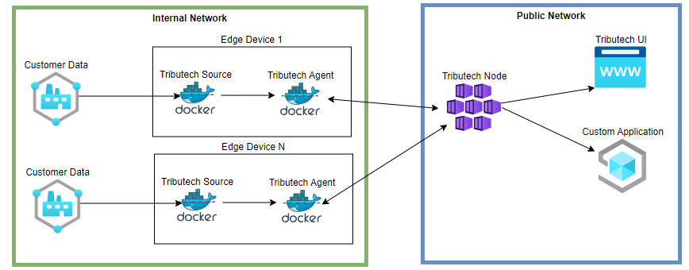

import ThemedImage from '@theme/ThemedImage';
import EnrollmentOverviewLight from '../img/node-agent-management-overview-light.png';
import EnrollmentOverviewDark from '../img/node-agent-management-overview-dark.png';
import AgentActivationLight from '../img/node-agent-management-agent-activation-light.png';
import AgentActivationDark from '../img/node-agent-management-agent-activation-dark.png';
import AgentOverviewLight from '../img/node-agent-management-agent-overview-light.png';
import AgentOverviewDark from '../img/node-agent-management-agent-overview-dark.png';
import DeleteDeniedAgentLight from '../img/node-agent-management-delete-denied-agent-light.png';
import DeleteDeniedAgentDark from '../img/node-agent-management-delete-denied-agent-dark.png';
import BlockAgentOverviewLight from '../img/node-agent-management-block-agent-overview-light.png';
import BlockAgentOverviewDark from '../img/node-agent-management-block-agent-overview-dark.png';
import BlockEnrollmentOverviewLight from '../img/node-agent-management-block-enrollment-overview-light.png';
import BlockEnrollmentOverviewDark from '../img/node-agent-management-block-enrollment-overview-dark.png';
import BlockAgentLight from '../img/node-agent-management-block-agent-light.png';
import BlockAgentDark from '../img/node-agent-management-block-agent-dark.png';
import UnblockSampleLight from '../img/node-agent-management-unblock-sample-light.png';
import UnblockSampleDark from '../img/node-agent-management-unblock-sample-dark.png';
import UnblockAwaitLight from '../img/node-agent-management-unblock-sample-await-light.png';
import UnblockAwaitDark from '../img/node-agent-management-unblock-sample-await-dark.png';
import UnblockOnlineLight from '../img/node-agent-management-unblock-sample-online-light.png';
import UnblockOnlineDark from '../img/node-agent-management-unblock-sample-online-dark.png';
import DeleteFromAgentsLight from '../img/node-agent-management-delete-from-agents-light.png';
import DeleteFromAgentsDark from '../img/node-agent-management-delete-from-agents-dark.png';
import DeleteFromEnrollmentLight from '../img/node-agent-management-delete-from-enrollment-light.png';
import DeleteFromEnrollmentDark from '../img/node-agent-management-delete-from-enrollment-dark.png';
import UiDeleteLight from '../img/node-agent-management-ui-delete-light.png';
import UiDeleteDark from '../img/node-agent-management-ui-delete-dark.png';

In this section we show the available management functions, provided by the Tributech Node UI, to manage [Tributech Agents](../../tributech_agent/overview.md).
All of this examples assume that the [Tributech Node](../overview.md) is available and a [Tributech Agent](../../tributech_agent/setup.mdx) has established a connection to it.

:arrow_right: All those operations can also be executed via the [Tributech Node REST API](../api_category/API_usage.md)

The first time a [Tributech Agent](../../tributech_agent/overview.md) connects to a [Tributech Node](../overview.md)
is during the `enrollment process` and the Tributech Agent will be listed with the state `Pending` in the `enrollment section`.
In this state the User has two Quick Actions available in the Tributech UI:

- ***Activate*** - Permit an Agent to connect to the Tributech Node and communicate with it
- ***Deny*** - The agent is not allowed to communicate further with the Tributech Node

<ThemedImage
  alt="Enrollment Overview"
  sources={{
    light: EnrollmentOverviewLight,
    dark: EnrollmentOverviewDark,
  }}
/>

For an already activated [Tributech Agents](../../tributech_agent/overview.md) we provide the following operations, via the `Actions` context menu:

- ***Block*** - No further communication with the Tributech Node is allowed for this Tributech Agent
- ***Unblock*** - A blocked Tributech Agent is allowed to restart the enrollment process
- ***Delete*** - Delete all associated data with a Tributech Agent

If your Tributech Agent is not listed in the `enrollment section` then please revisit the [QuickStart](../../tributech_agent/quickstart.mdx)
or [Agent Setup](../../tributech_agent/setup.mdx).

In the following section we will give a short overview how the states relate to a Tributech Agent and where the states can be changed.

## New Agents

After starting a Tributech Agent (see [QuickStart](../../tributech_agent/quickstart.mdx)/[Setup](../../tributech_agent/setup.mdx)) the communication to the Tributech Node is per default not allowed. Only after activating a Tributech Agent the full communication is permitted. In the ***Enrollment*** Overview we can see all Agents that requires activation with the State ***Pending***. If we ***Deny*** the request then the agent cannot be configured and will not be able send, receive any data. 

### Activate Agent
When we decide to activate an Tributech Agent it will be displayed with status ***online***/***offline*** depending on
the network connection between the Tributech Node and Tributech Agent. 

<ThemedImage
  alt="Tributech UI Agent Activation"
  sources={{ light: AgentActivationLight, dark: AgentActivationDark }}
/>

Once a Tributech Agents is in the state ***online*** 
it can be configured in the ***Agents*** Overview by selecting the entry or via the action context menu ([Agent Configuration](./agent_configuration.mdx)).

<ThemedImage
  alt="Tributech UI Agent Overview"
  sources={{ light: AgentOverviewLight, dark: AgentOverviewDark }}
/>

### Denied Agent
If we have decided to deny a Tributech Agent enrollment it will be displayed with status ***denied***.
Tributech Agents with the state ***denied*** can only be deleted via the action menu.

<ThemedImage
  alt="Enrollment Delete Denied Agent"
  sources={{ light: DeleteDeniedAgentLight, dark: DeleteDeniedAgentDark }}
/>

It is important to note that a denied Tributech Agent will start a new enrollment process after being deleted.
The communication is no longer blocked after the deletion and its possible to ***Activate*** or ***Deny*** this agent again.

## Activated Agents

### Blocking Agents
After granting a Tributech Agent access to a Tributech Node we can revoke this access of an active Tributech Agent at any time by ***blocking*** further communication. This option is available in the Agents Overview

<ThemedImage
  alt="Block a Tributech Agent via Agents Overview"
  sources={{ light: BlockAgentOverviewLight, dark: BlockAgentOverviewDark }}
/>

or in the Enrollment Section:

<ThemedImage
  alt="Block a Tributech Agent via Enrollment Section"
  sources={{ light: BlockEnrollmentOverviewLight, dark: BlockEnrollmentOverviewDark }}
/>

During the blocking process we can add a `Block Reason` for future reference why this Tributech Agent is no longer allowed to communicate with the Tributech Node. This field is optional but we recommend to fill it out, to help other users to understand why a  agents was blocked.

<ThemedImage
  alt="Block a Tributech Agent via UI"
  sources={{ light: BlockAgentLight, dark: BlockAgentDark }}
/>

By blocking a Tributech Agent we ensure that no new data can be send. The existing data will still be accessible for inspection in the *Agent Overview* (see [Delete an Agent](#deleting-an-agent) to remove current data). 
Another word for blocking would be archiving an agent, as all streamed data is still stored on the Tributech node but the agent is decommissioned.
The agent can be unblocked at any time, creating a fully functional agent whose data is still stored. 

### Unblocking Agents
Unblocking is only available for blocked Tributech Agents and restores an Tributech Agent to an `activated` state. 
The option can be also found in the action menu similar to the `Block` action.

<ThemedImage
  alt="Unblock a Tributech Agent via UI"
  sources={{ light: UnblockSampleLight, dark: UnblockSampleDark }}
/>

After unblocking an Tributech Agent overview shows the current state as ***Await Request*** this means the Tributech Agent has not requested a new connection. 

<ThemedImage
  alt="Unblock Wait a Tributech Agent via UI"
  sources={{ light: UnblockAwaitLight, dark: UnblockAwaitDark }}
/>

After waiting some time or restarting the Agent it will switch into status ***online***/***offline*** again.
Once it is back online, it can communicate and be managed in the same way as any other `activated` Tributech Agent.

<ThemedImage
  alt="Unblock Online a Tributech Agent via UI"
  sources={{ light: UnblockOnlineLight, dark: UnblockOnlineDark }}
/>

## Deleting an Agent

If a Tributech Agents is no longer needed and the existing data and configuration is also no longer needed
it can be deleted as shown in this section.

:warning: **Deleting an Tributech Agent removes all associated configurations, data and cannot be undone**!

The options to delete a Tributech Agent can be found in the *Agents Overview*

<ThemedImage
  alt="Delete a Tributech Agent via Agents"
  sources={{ light: DeleteFromAgentsLight, dark: DeleteFromAgentsDark }}
/>

or in the *Enrollment Section*:

<ThemedImage
  alt="Delete a Tributech Agent via Enrollments"
  sources={{ light: DeleteFromEnrollmentLight, dark: DeleteFromEnrollmentDark }}
/>

To confirm the deletion the Tributech Agent Id is required (can be used from the Dialogbox or via [Get Agent Id](./agent_configuration.mdx#get-the-agent-id))

<ThemedImage
  alt="Delete a Tributech Agent via UI"
  sources={{ light: UiDeleteLight, dark: UiDeleteDark }}
/>

After the successful deletion, a Tributech Agent can restart the enrollment process again. The previous state of 
Tributech Agent does not matter because all associated data has been deleted, i.e. a `Denied` or `Blocked` Agent
and be `Activate` or `Denied` once again.